# OpenInsure — Technical Overview

> **Audience:** CTO, VP of Engineering, Solutions Architect, Technical Evaluator
> **Version:** 1.0 — March 2026
> **License:** AGPL-3.0 (core) / Commercial (enterprise features)

---

## Table of Contents

1. [Platform Overview](#1-platform-overview)
2. [Technology Stack](#2-technology-stack)
3. [Architecture](#3-architecture)
4. [AI Agent Architecture](#4-ai-agent-architecture)
5. [Domain Model](#5-domain-model)
6. [API Surface](#6-api-surface)
7. [Security & Compliance](#7-security--compliance)
8. [Insurance Operations](#8-insurance-operations)
9. [Deployment Model](#9-deployment-model)
10. [Integration Architecture](#10-integration-architecture)
11. [Testing & Quality](#11-testing--quality)
12. [Current Metrics](#12-current-metrics)

---

## 1. Platform Overview

OpenInsure is an **AI-native, open-source core insurance platform** built on Microsoft Azure and Azure AI Foundry. It provides end-to-end policy administration — from submission intake through underwriting, binding, claims management, billing, reinsurance, and compliance — with every process designed to be operated by AI agents under human oversight. Where traditional insurance platforms bolt AI onto legacy workflows, OpenInsure inverts the model: agents drive the default path, humans supervise exceptions.

### Key Differentiators

| Differentiator | Description |
|---|---|
| **AI-Native** | 10 prompt agents on Azure AI Foundry (GPT-5.2) with Azure AI Search knowledge retrieval, function calling, and confidence-based escalation. Every decision produces an immutable EU AI Act–compliant record. |
| **Open Source** | AGPL-3.0 core with full source access. No vendor lock-in on the application layer. |
| **White-Label** | Deploy as your own branded platform. Not hosted SaaS — you own the infrastructure, data, and agent configuration. |
| **Carrier + MGA** | Single codebase supports both carrier (full suite with reinsurance, actuarial, MGA oversight) and MGA (streamlined subset with delegated authority) deployment modes. |
| **Compliance-by-Design** | EU AI Act (Art. 9–15), GDPR, Solvency II, and NAIC alignment built into the architecture — not bolted on after the fact. |
| **Knowledge-Driven** | Insurance intelligence lives in a structured knowledge graph (Cosmos DB → AI Search), not in model weights. Carriers update guidelines, rating factors, and regulatory rules without retraining models. |

### Architecture at a Glance

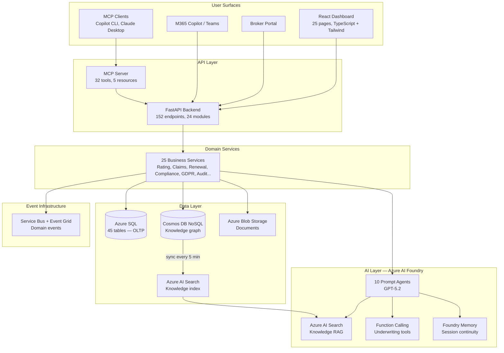

---

## 2. Technology Stack

| Layer | Technology | Details |
|---|---|---|
| **Backend** | Python 3.12, FastAPI, Pydantic v2 | Async/await throughout, OpenAPI auto-generated, strict typing |
| **Frontend** | React 19, TypeScript 5.9, Tailwind CSS 4, Vite 7 | 25 dashboard pages, Recharts, React Query, react-router-dom |
| **Database (OLTP)** | Azure SQL Database | 45 tables across 21 migrations, Entra-only auth, TDE encryption |
| **Database (Knowledge)** | Azure Cosmos DB (NoSQL API) | Knowledge graph documents, serverless (dev), session consistency |
| **AI Platform** | Azure AI Foundry, GPT-5.2 | 10 prompt agents, AI Search tools, function calling, memory |
| **Search** | Azure AI Search | Knowledge RAG — guidelines, rating factors, compliance rules, precedents |
| **Storage** | Azure Blob Storage | Documents, policy files, claim evidence. Soft delete, versioning, Entra-only |
| **Events** | Azure Service Bus + Event Grid | Domain event pub/sub, dead-letter queues, at-least-once delivery |
| **Document AI** | Azure Document Intelligence | ACORD form parsing, OCR extraction, classification |
| **Identity** | Azure Entra ID | Managed Identity for service-to-service, RBAC for users |
| **Observability** | Azure Monitor, Application Insights, OpenTelemetry | Structured logging (structlog), distributed tracing |
| **Infrastructure** | Azure Container Apps (VNet-integrated), Bicep IaC | 9 Bicep modules, auto-scaling, blue-green deployments |
| **CI/CD** | GitHub Actions, Azure Container Registry | ruff → mypy → bandit → pytest → Docker build → ACR push → deploy |
| **MCP** | Model Context Protocol (FastMCP SDK) | 32 tools + 5 resources for AI agent consumption |
| **Resilience** | tenacity | Retry with exponential backoff on all Azure service calls |

### Key Dependencies

```
fastapi>=0.115.0          pydantic>=2.10.0          azure-identity>=1.19.0
azure-cosmos>=4.9.0       azure-storage-blob>=12.24  azure-search-documents>=11.6
azure-servicebus>=7.13    azure-eventgrid>=4.20      azure-ai-projects>=2.0
httpx>=0.28.0             structlog>=24.4.0          tenacity>=9.0.0
mcp>=1.0.0                pyyaml>=6.0                pyodbc>=5.2.0
```

---

## 3. Architecture

### Component Architecture

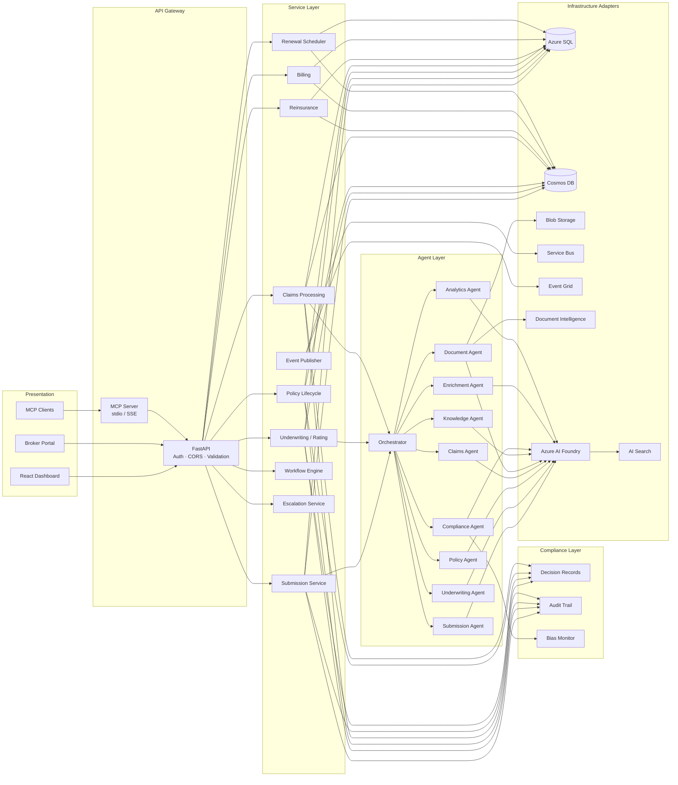

**Key design principle:** API endpoints are thin delegators (~10-25 LOC). All business logic — Foundry agent invocations, rating calculations, authority checks, escalation, compliance recording, event publishing — lives in the **Service Layer**. This ensures testability (services can be unit-tested without HTTP), reusability (MCP tools and CLI can call services directly), and maintainability (business rules change in one place).

### DDD Aggregate Boundaries

The domain model enforces **aggregate boundaries** (Evans DDD Ch.6): each aggregate root owns its state transitions, validates invariants before mutating, and emits domain events. Aggregates never directly modify another aggregate — cross-aggregate communication happens via domain events.

| Aggregate Root | Location | State Transitions | Events Emitted |
|---|---|---|---|
| **SubmissionAggregate** | `domain/aggregates/submission.py` | receive → triage → quote → bind / decline | `SubmissionReceived`, `SubmissionTriaged`, `SubmissionQuoted`, `SubmissionBound`, `SubmissionDeclined` |
| **PolicyAggregate** | `domain/aggregates/policy.py` | activate → endorse / cancel / renew | `PolicyActivated`, `PolicyBound`, `PolicyEndorsed`, `PolicyCancelled`, `PolicyRenewed` |
| **ClaimAggregate** | `domain/aggregates/claim.py` | report → investigate → reserve → pay → close / deny | `ClaimReported`, `ClaimReserved`, `ClaimPaid`, `ClaimClosed`, `ClaimDenied` |

**Bind flow (event-driven):** When `SubmissionService.bind()` is called, the `SubmissionAggregate` validates the transition and emits a `SubmissionBound` event. Three handlers respond synchronously:
1. **PolicyCreationHandler** — creates the policy record (within transaction)
2. **BillingHandler** — creates the billing account (within transaction)
3. **ReinsuranceHandler** — calculates cessions (best-effort, outside transaction)

### Data-Driven Workflow Templates

Workflow definitions are stored in the `workflow_templates` / `workflow_steps` tables (migration 025), enabling per-product customisation without code changes. The `WorkflowRegistry` resolves templates in order: product-specific → default → hardcoded fallback.

```python
# Product-specific workflow (e.g., cyber product skips enrichment)
definition = await get_workflow_for_product(product_id="cyber-smb", workflow_type="new_business")

# Default workflow (no product specified — uses hardcoded definitions)
definition = await get_workflow_for_product(product_id=None, workflow_type="new_business")
```

### Data Flow: Submission → Triage → Quote → Bind → Policy

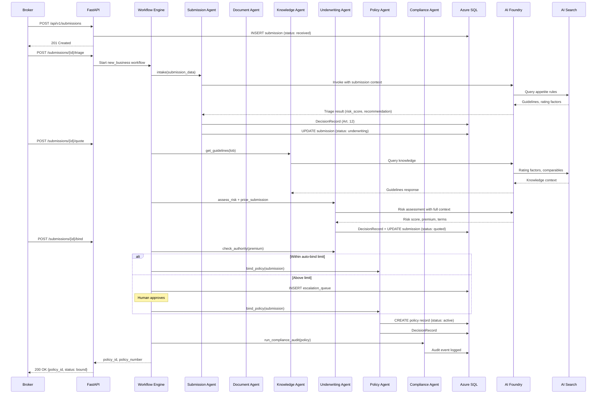

### Transaction Management

Multi-step operations use explicit database transactions via `DatabaseAdapter.transaction()` to guarantee atomicity. The `TransactionContext` provides async-safe query methods (`async_execute_query`, `async_fetch_one`, `async_fetch_all`) that offload work to the thread-pool executor while sharing a single pyodbc connection.

SQL repository `create()` / `update()` methods accept an optional `txn: TransactionContext` keyword argument. When provided, the query runs on the transaction's connection; otherwise, a pooled connection is acquired and auto-committed as before.

**Transaction boundaries:**

| Operation | Scope | Rollback trigger |
|-----------|-------|------------------|
| **Bind** | INSERT policy + INSERT billing_account + UPDATE submission status | Any core step failure rolls back all three |
| **Cessions** | All INSERT reinsurance_cessions for a single bind | Separate transaction — partial cessions never committed, but cession failure does not roll back the core bind |
| **Quote** | UPDATE submission (status → quoted, premium) | Single-statement transaction for consistency |

**Excluded from transactions** (non-critical, fail-open):
- Foundry agent invocations (AI review, document generation)
- Domain event publishing (Event Grid / Service Bus)
- Compliance decision recording (Cosmos DB)
- Treaty capacity in-memory updates

```python
# Example: bind transaction using aggregate root + event handlers
from openinsure.domain.aggregates.submission import SubmissionAggregate
from openinsure.services.bind_handlers import dispatch_bind_events

aggregate = SubmissionAggregate(record)
aggregate.bind(policy_id=policy_id, policy_number=policy_number, premium=premium)
bind_events = aggregate.clear_events()

db = get_database_adapter()
if db:
    async with db.transaction() as txn:
        # Event handlers create policy + billing within the transaction
        await dispatch_bind_events(bind_events, handler_ctx)
        await submission_repo.update(sid, {"status": "bound"}, txn=txn)
# Non-critical ops run after commit
await publish_domain_event("policy.bound", ...)
```

### Agent Invocation Pattern

Every AI agent follows the same execution model:

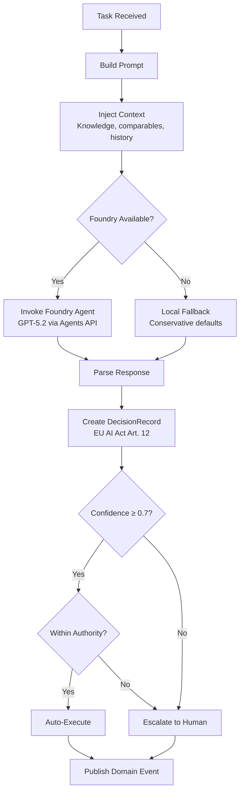

### Knowledge Pipeline

Insurance knowledge flows from YAML source files through Cosmos DB into AI Search, where it becomes available to all Foundry agents for autonomous retrieval:

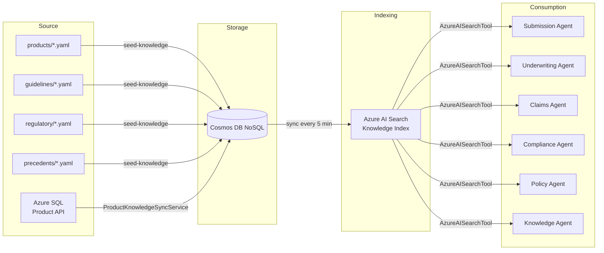

**Product sync pipeline (v95):** When products are created, updated, or retired via the Product API (Azure SQL), the `ProductKnowledgeSyncService` pushes changes to Cosmos DB and AI Search asynchronously. Retired products are removed from the search index so agents no longer reference them. The pipeline is fail-open — product CRUD still works if Cosmos or Search is unavailable.

**Knowledge categories indexed:**
- Underwriting guidelines (per LOB, jurisdiction)
- Rating factors and industry multipliers
- Coverage options and exclusions
- Claims precedents and settlement patterns
- Regulatory and compliance rules (EU AI Act, GDPR, NAIC, state-specific)
- Industry risk profiles (SIC/NAICS-based)
- Jurisdiction-specific rules

### Private Networking

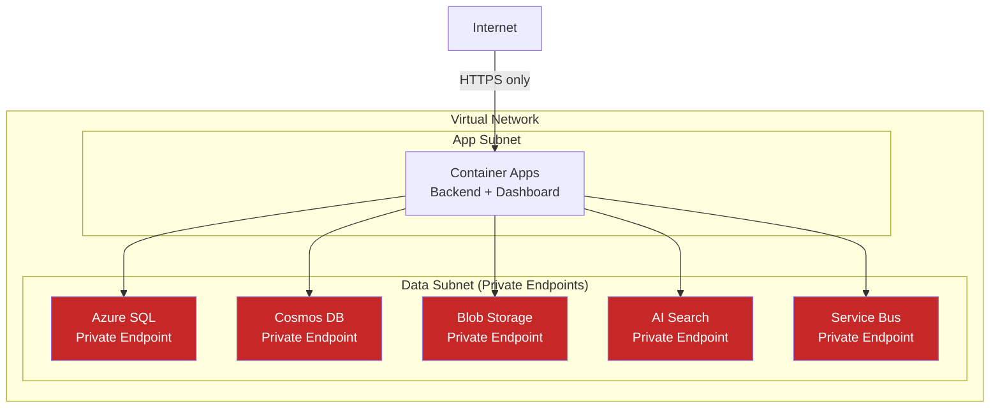

All data services use **private endpoints** — no public network access. Container Apps are VNet-integrated. Authentication is Entra-only (no connection strings or shared keys in production). Managed Identity with least-privilege RBAC assignments.

---

## 4. AI Agent Architecture

### 10 Foundry Agents

| # | Agent | Purpose | Authority Limit | Auto-Execute | Key Capabilities |
|---|---|---|---|---|---|
| 1 | **Orchestrator** | Multi-agent workflow coordination | Delegates | — | new_business_workflow, claims_workflow, renewal_workflow |
| 2 | **Submission** | Intake, classification, triage | $0 (recommend only) | No | intake, classify_documents, extract_data, validate_completeness, triage |
| 3 | **Underwriting** | Risk assessment, pricing, terms | $1,000,000 | Yes (within limit) | assess_risk, price_submission, generate_terms, check_authority |
| 4 | **Policy** | Bind, endorse, renew, cancel, documents | $5,000,000 | Yes | bind_policy, endorse_policy, renew_policy, cancel_policy, generate_documents |
| 5 | **Claims** | FNOL, coverage verification, reserves | $250,000 | Yes (within limit) | intake_fnol, verify_coverage, set_reserves, triage_claim, subrogation_analysis |
| 6 | **Compliance** | EU AI Act audit, bias monitoring | $0 (audit only) | No | check_compliance, generate_audit_report, check_bias, eu_ai_act_documentation |
| 7 | **Document** | Classification, extraction, generation | $0 (read only) | No | classify_document, extract_data, generate_document |
| 8 | **Knowledge** | Query insurance knowledge graph | $0 (read only) | — | query_guidelines, query_rating_factors, query_coverage_options, query_regulatory_rules |
| 9 | **Enrichment** | External risk data synthesis | $0 (advisory) | No | enrich_company_data, enrich_cyber_data, validate_security_posture |
| 10 | **Analytics** | Portfolio insights, decision accuracy | $0 (advisory) | No | portfolio_analysis, decision_accuracy, trend_analysis |

### Foundry Integration

All agents are deployed as **prompt agents** on Azure AI Foundry with GPT-5.2. Each agent has:

- **Azure AI Search tool** — autonomous knowledge retrieval from the indexed knowledge base
- **System prompt** — agent-specific instructions with dynamic context injection via the `agents/prompts/` package (13 modules, split from a single `prompts.py` in v95)
- **DecisionRecord output** — every invocation produces an immutable compliance record

The `agents/prompts/` package contains focused prompt builders per domain: `_triage.py`, `_underwriting.py`, `_claims.py`, `_policy.py`, `_compliance.py`, `_document.py`, `_enrichment.py`, `_knowledge.py`, `_analytics.py`, `_billing.py`, `_comparable.py`, `_orchestrator.py`. The `__init__.py` re-exports all public symbols for backward compatibility.

The Underwriting Agent additionally has:
- **Function calling** — `get_rating_factors`, `get_comparable_accounts` (agent decides when to call)
- **Foundry Memory** — session continuity across multi-turn interactions
- **Web Search** — real-time company research (Enrichment Agent)

### Rating (3-Tier Fallback)

Premium calculation uses a cascading strategy:

1. **Foundry agent** — invokes the underwriting agent for AI-driven pricing with full context
2. **CyberRatingEngine** — local rating engine (`services/rating.py`) with factor-based calculation
3. **LOB minimum premium** — per-line-of-business floor (e.g., Cyber $5K, D&O $7.5K, PI $3K)

This ensures every submission receives a quote even when upstream services are unavailable.

**Rating factor version history (#181):** `rating_factor_tables` uses `effective_date`/`expiration_date` to track factor versions. When a factor is updated, the old row is expired and a new row is inserted (never UPDATE). `RatingEngine.calculate(as_of_date="YYYY-MM-DD")` loads only factors effective at that date, enabling historical quote reproduction for regulatory audit. `GET /products/{id}/rate?as_of=` exposes this via REST.

### Authority Limits (Centralized)

All authority, reserve, and premium thresholds are centralized in `domain/limits.py`:

- `QuoteAuthorityLimits` — per-role quoting authority
- `BindAuthorityLimits` — per-role binding authority
- `SettlementAuthorityLimits` — per-role claims settlement authority
- `ReserveAuthorityLimits` — reserve setting limits by severity tier
- `AuthorityLimitsConfig` — unified configuration consumed by the authority engine

### Agent Configuration

```python
AgentConfig(
    agent_id="underwriting-agent",
    version="1.0.0",
    model_deployment="gpt-5.2",     # Foundry model deployment name
    temperature=0.1,                 # Low temperature for consistency
    max_tokens=4096,
    authority_limit=1_000_000,       # USD — auto-execute up to this
    auto_execute=True,
    escalation_threshold=0.7,        # Confidence below this → human
)
```

### Decision Records (EU AI Act Art. 12)

Every AI decision produces an immutable `DecisionRecord`:

```python
DecisionRecord(
    decision_id="dr-8f3a1b2c",
    timestamp="2026-03-25T14:30:00Z",
    agent_id="underwriting-agent",
    agent_version="1.0.0",
    model_used="gpt-5.2",
    decision_type="quote",
    input_summary="Cyber liability, $22M revenue, 180 employees, tech/robotics",
    data_sources_used=["knowledge_graph", "ai_search", "comparable_accounts"],
    knowledge_graph_queries=["rating_factors/cyber", "industry_profiles/technology"],
    output={"premium": 18617, "risk_score": 6.0, "coverages": [...]},
    reasoning="Risk score 6.0/10 based on industry (elevated), revenue ($22M)...",
    confidence=0.85,
    fairness_metrics={"demographic_parity": 0.92, "equalized_odds": 0.88},
    human_oversight="auto_execute — within authority limit",
    execution_time_ms=284,
)
```

### Confidence-Based Routing and Escalation

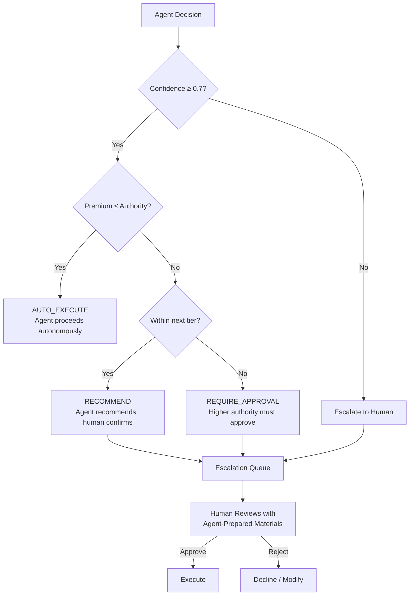

**Authority tiers (Underwriting):**

| Tier | Quote Limit | Bind Limit | Role |
|---|---|---|---|
| Auto | $50,000 | $25,000 | Agent autonomous |
| L1 | $100,000 | $100,000 | Senior Underwriter |
| L2 | $250,000 | $250,000 | Senior Underwriter |
| L3 | $1,000,000 | $500,000 | LOB Head |
| L4 | $10,000,000 | $5,000,000 | CUO |

**Authority tiers (Claims):**

| Tier | Settlement Limit | Reserve Limit | Role |
|---|---|---|---|
| Auto | $25,000 | $25,000 | Agent autonomous |
| L1 | $25,000 | $100,000 | Claims Adjuster |
| L2 | $250,000 | $250,000 | Claims Manager / CCO |
| L3 | $1,000,000 | — | CUO |

### Learning Loop and Comparable Accounts

The **Decision Learning Loop** tracks every AI decision against real-world outcomes:

1. **Decision made** — agent produces quote, reserve, or triage recommendation
2. **Outcome observed** — claim filed, policy renewed, cancellation, loss ratio computed
3. **Accuracy computed** — predicted vs. actual for each decision type
4. **Feedback injected** — accuracy metrics fed back into agent prompts as calibration context

**Comparable Account Retrieval** surfaces similar past submissions at underwriting time:
- Match by industry (SIC/NAICS), revenue tier, employee count, security profile
- Show historical pricing, loss ratios, claim frequency for similar risks
- Agent uses comparables as additional pricing signal alongside rating engine

### Referral Triggers

The system automatically refers submissions to human review when any of these conditions are met:

| Trigger | Threshold |
|---|---|
| Risk score | ≥ 8 (out of 10) |
| Prior cyber claims | Any claim in past 3 years |
| Ransomware history | Any prior ransom payment |
| Revenue | > $25,000,000 |
| PCI-DSS | Non-compliant |
| MFA | Not implemented |
| PHI handling | Healthcare with protected health information |
| International | Operations outside US |

### Policy Transaction History (#173)

Every policy mutation creates an immutable transaction record in `policy_transactions`:

| Transaction Type | Trigger | Data Captured |
|---|---|---|
| `new_business` | `bind_policy()` | Full coverage list, premium, effective/expiration dates |
| `endorsement` | `endorse_policy()` | Coverage snapshot (post-change), premium delta, description |
| `renewal` | `renew_policy()` | Renewal coverage, new dates, premium |
| `cancellation` | `cancel_policy()` | Cancellation date, return premium (negative premium_change) |
| `reinstatement` | `reinstate_policy()` | Reinstatement date, restored unearned premium |

**Time-travel queries:** `GET /api/v1/policies/{id}/transactions` returns chronological transaction history. The current state of a policy is the cumulative effect of all its transactions. Snapshots in `coverages_snapshot` (JSON) enable answering "what coverage limits were in effect on March 1?"

### Polymorphic Documents (#175)

The `documents` table provides unified document tracking across all entity types, replacing per-entity document tables (`submission_documents`):

- **entity_type** — `submission`, `policy`, `claim`, `endorsement`, or any future entity
- **Soft-delete** — `deleted_at` column; deleted records excluded from default queries
- **Classification** — `classification_confidence` and `extracted_data` from Document Intelligence
- **CRUD API** — `POST/GET/PUT/DELETE /api/v1/documents/records` with filtering

Existing `submission_documents` data is migrated automatically (migration 021). The old table is retained for backward compatibility.

### Work Items & Inbox (#176)

Structured task tracking replaces ad-hoc notification patterns:

- **Inbox** — `GET /api/v1/work-items?assigned_to=X` returns open/in_progress items for a user
- **SLA tracking** — `sla_hours` auto-computes `due_date` on creation
- **Priority** — `low`, `medium`, `high`, `urgent`
- **Escalation integration** — Every escalation auto-creates a `work_type=escalation_review` work item with `priority=high` and 24h SLA

---

## 5. Domain Model

### Core Entities

```mermaid
erDiagram
    PARTY ||--o{ SUBMISSION : "submits"
    PARTY ||--o{ POLICY : "insured_on"
    PARTY ||--o{ CLAIM : "files"
    PRODUCT ||--o{ SUBMISSION : "applied_for"
    PRODUCT ||--o{ POLICY : "covers"
    SUBMISSION ||--o| POLICY : "binds_to"
    POLICY ||--o{ CLAIM : "claim_against"
    POLICY ||--o{ ENDORSEMENT : "modified_by"
    POLICY ||--o{ COVERAGE : "includes"
    POLICY ||--o{ POLICY_TRANSACTION : "history"
    POLICY ||--o{ BILLING_ACCOUNT : "billed_via"
    POLICY ||--o{ REINSURANCE_CESSION : "ceded_under"
    CLAIM ||--o{ RESERVE : "reserved_for"
    CLAIM ||--o{ PAYMENT : "paid_via"
    REINSURANCE_TREATY ||--o{ REINSURANCE_CESSION : "governs"
    REINSURANCE_TREATY ||--o{ REINSURANCE_RECOVERY : "recovers"
    BILLING_ACCOUNT ||--o{ INVOICE : "generates"
    MGA_CONTRACT ||--o{ MGA_PERFORMANCE : "tracked_by"

    PARTY {
        uuid id PK
        string name
        enum party_type "individual | organization"
        string tax_id
        string registration_number
        json contact_info
        enum kyc_status
    }

    SUBMISSION {
        uuid id PK
        string submission_number "SUB-YYYY-XXXX"
        uuid applicant_id FK
        uuid broker_id FK
        uuid product_id FK
        enum status
        enum channel "portal | api | broker | email | agent"
        string line_of_business
        decimal annual_revenue
        int employee_count
        string industry
        float security_score
        int prior_incidents
        float risk_score
        decimal quoted_premium
        json cyber_risk_data
        json documents
        json triage_result
    }

    POLICY {
        uuid id PK
        string policy_number "POL-YYYY-XXXXXX"
        uuid insured_id FK
        uuid broker_id FK
        uuid product_id FK
        enum status
        datetime effective_date
        datetime expiration_date
        decimal written_premium
        decimal earned_premium
        decimal unearned_premium
    }

    CLAIM {
        uuid id PK
        string claim_number "CLM-XXXXXXXX"
        uuid policy_id FK
        uuid claimant_id FK
        enum status
        enum claim_type
        string cause_of_loss
        date loss_date
        datetime reported_date
        enum severity
        float fraud_score
        decimal total_incurred "computed"
    }

    PRODUCT {
        uuid id PK
        string product_code
        string product_name
        enum line_of_business
        enum status "draft | published | archived"
        int version
        json coverages "DEPRECATED — use product_coverages"
        json underwriting_guidelines
        json rating_factors "DEPRECATED — use rating_factor_tables"
    }

    PRODUCT_COVERAGE {
        uuid id PK
        uuid product_id FK
        string coverage_code
        string coverage_name
        decimal default_limit
        decimal max_limit
        decimal default_deductible
        bit is_optional
        int sort_order
    }

    RATING_FACTOR_TABLE {
        uuid id PK
        uuid product_id FK
        string factor_category
        string factor_key
        decimal factor_value
        int sort_order
    }

    PRODUCT_APPETITE_RULE {
        uuid id PK
        uuid product_id FK
        string rule_name
        string field_name
        string operator
        string value_type
        decimal numeric_value
        int sort_order
    }

    PRODUCT ||--o{ PRODUCT_COVERAGE : "defines"
    PRODUCT ||--o{ RATING_FACTOR_TABLE : "rated_by"
    PRODUCT ||--o{ PRODUCT_APPETITE_RULE : "constrained_by"

    COVERAGE_DEDUCTIBLE {
        uuid id PK
        uuid coverage_id FK
        string deductible_name
        decimal deductible_amount
        int sort_order
    }

    PRODUCT_AUTHORITY_LIMIT {
        uuid id PK
        uuid product_id FK
        string role
        decimal max_premium
        decimal max_aggregate
    }

    PRODUCT_TERRITORY {
        uuid id PK
        uuid product_id FK
        string territory_code
        string territory_name
        bit is_admitted
    }

    PRODUCT_FORM {
        uuid id PK
        uuid product_id FK
        string form_number
        string form_name
        bit is_required
    }

    PRODUCT_PRICING {
        uuid id PK
        uuid product_id FK
        decimal min_premium
        decimal max_premium
        decimal base_rate
    }

    POLICY_TRANSACTION {
        uuid id PK
        uuid policy_id FK
        enum transaction_type "new_business | endorsement | renewal | cancellation | reinstatement | audit"
        date effective_date
        date expiration_date
        decimal premium_change
        nvarchar description
        nvarchar coverages_snapshot "JSON"
        nvarchar terms_snapshot "JSON"
        string created_by
        datetime2 created_at
        int version
    }

    DOCUMENT {
        uuid id PK
        string entity_type "submission | policy | claim | endorsement"
        uuid entity_id
        string document_type
        string filename
        string storage_url
        string content_type
        bigint file_size_bytes
        nvarchar extracted_data "JSON"
        float classification_confidence
        string uploaded_by
        datetime2 uploaded_at
        datetime2 deleted_at "soft delete"
    }

    WORK_ITEM {
        uuid id PK
        string entity_type
        uuid entity_id
        string work_type
        string title
        nvarchar description
        string assigned_to
        string assigned_role
        enum priority "low | medium | high | urgent"
        enum status "open | in_progress | completed | cancelled | escalated"
        datetime2 due_date
        int sla_hours
        datetime2 completed_at
        string completed_by
        datetime2 created_at
    }

    CHANGE_LOG {
        bigint id PK
        string entity_type
        uuid entity_id
        string action "INSERT | UPDATE | DELETE"
        string actor
        nvarchar changes_json
        datetime2 created_at
    }

    CONSENT_RECORD {
        uuid id PK
        uuid party_id FK
        string purpose
        datetime2 granted_at
        datetime2 revoked_at
        string evidence
    }

    RETENTION_POLICY {
        int id PK
        string entity_type UK
        int retention_days
        string action "anonymize | delete | archive"
    }

    PRODUCT_COVERAGE ||--o{ COVERAGE_DEDUCTIBLE : "offers"
    PRODUCT ||--o{ PRODUCT_AUTHORITY_LIMIT : "authorized_by"
    PRODUCT ||--o{ PRODUCT_TERRITORY : "sold_in"
    PRODUCT ||--o{ PRODUCT_FORM : "requires"
    PRODUCT ||--o{ PRODUCT_PRICING : "priced_at"
    PARTY ||--o{ CONSENT_RECORD : "consents"
```

### State Machines

> **v95 note:** All states (`referred`, `reinstated`, `reported`, etc.) are now defined in `domain/state_machine.py` enums, ensuring the Mermaid diagrams below match the runtime-enforced transitions exactly.

#### Submission Lifecycle

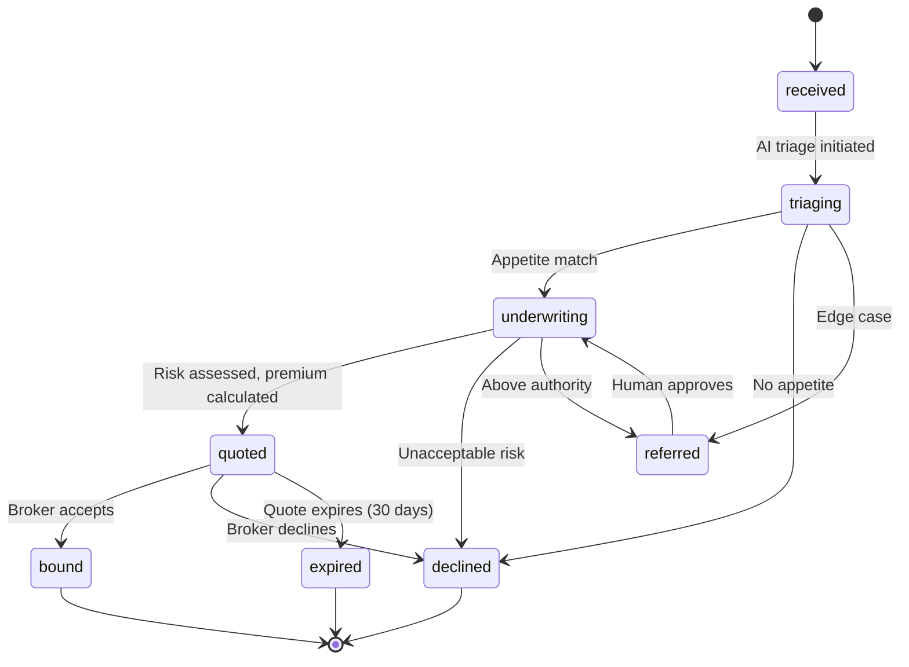

#### Policy Lifecycle

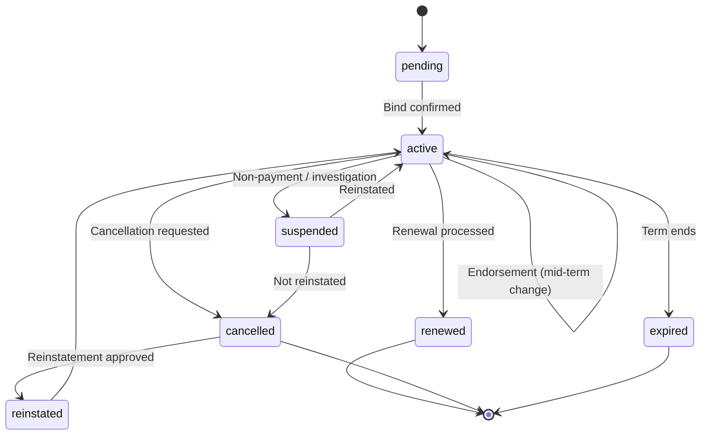

#### Claim Lifecycle

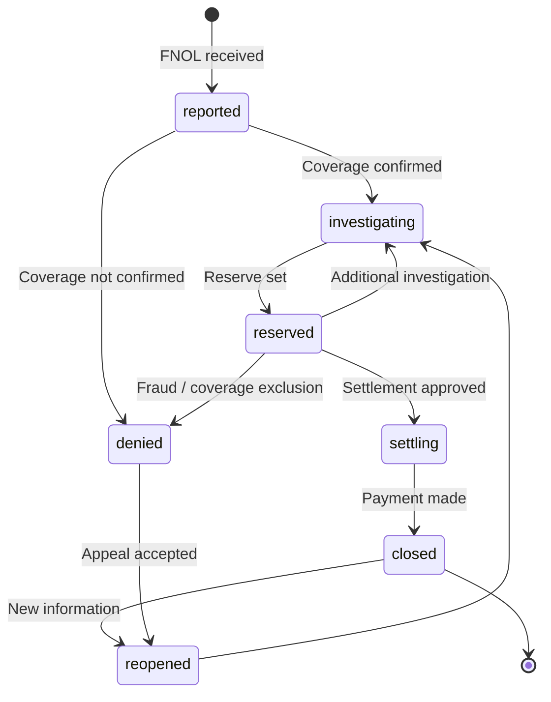

#### Invoice Lifecycle

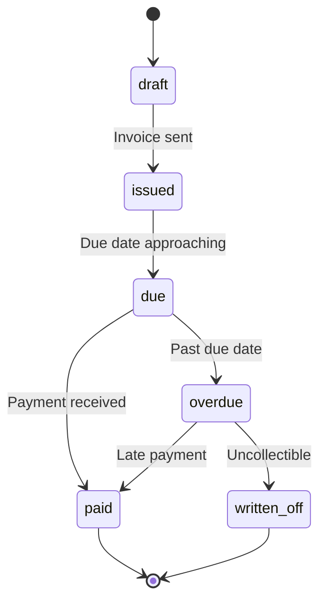

### Database Schema (45 Tables)

| Module | Tables | Purpose |
|---|---|---|
| **Parties** | `parties`, `party_roles`, `party_addresses`, `party_contacts` | Insured, brokers, claimants, agents |
| **Products** | `products`, `product_coverages`, `coverage_deductibles`, `product_rating_factors`, `rating_factor_tables`, `product_appetite_rules`, `product_authority_limits`, `product_territories`, `product_forms`, `product_pricing` | LOB definitions; 9 normalised relational tables since v106; `parent_product_id` + `is_template` for template inheritance (#177); `currency` column (#174) |
| **Submissions** | `submissions`, `submission_documents` | Applications, extracted data, triage results; `currency` and `rated_with_snapshot_id` columns (#174, #181) |
| **Policies** | `policies`, `policy_coverages`, `policy_endorsements`, `policy_transactions` | Active coverage, terms, mid-term changes; transaction-based history (#173); `currency` column (#174) |
| **Claims** | `claims`, `claim_reserves`, `claim_payments` | Loss records, reserves, settlements; `currency` column on all three tables (#174) |
| **Billing** | `billing_accounts`, `invoices` | Premium invoicing, payment tracking; `currency` column (#174) |
| **Reinsurance** | `reinsurance_treaties`, `reinsurance_cessions`, `reinsurance_recoveries` | Treaty management, capacity, recoveries; `currency` column on all three tables (#174) |
| **Currency** | `exchange_rates` | Currency conversion reference with `from_currency`, `to_currency`, `rate`, `effective_date` (#174) |
| **Actuarial** | `actuarial_triangles`, `actuarial_reserves`, `loss_development_analysis` | Loss triangles, IBNR, reserve adequacy |
| **Renewals** | `renewal_records` | Renewal terms, rate changes |
| **MGA** | `mga_contracts`, `mga_performance` | Delegated authority, performance tracking |
| **Documents** | `documents` | Polymorphic document tracking for any entity type; replaces per-entity tables (#175) |
| **Work Items** | `work_items` | Structured task tracking with assignee, priority, SLA, due dates (#176) |
| **Compliance** | `decision_records`, `audit_events`, `change_log`, `consent_records`, `retention_policies` | AI decision audit trail, EU AI Act records, data-level change log, GDPR consent tracking, data retention policies |

---

## 6. API Surface

### Overview

- **182 REST API endpoints** across **32 modules**
- All endpoints under `/api/v1/` with OpenAPI documentation at `/docs`
- Pydantic v2 request/response validation on every endpoint
- Consistent error format with correlation IDs
- **Thin handlers** — API endpoints extract request params, delegate to service-layer methods, and format the response. No business logic in the API layer (enforced since v105, #137).

### Authentication

| Mode | Header | Use Case |
|---|---|---|
| **Dev Mode** (default) | `X-User-Role: <role>` | Local development — no credentials required, override role |
| **API Key** | `X-API-Key: <key>` | Service-to-service, CI/CD, demo |
| **JWT Bearer** | `Authorization: Bearer <token>` | Production — Azure Entra ID tokens |

### Endpoint Groups

| Module | Endpoints | Key Operations |
|---|---|---|
| **Submissions** | 15 | `POST` create, `GET` list/get, `POST` triage, quote, bind, process, enrich, refer, decline |
| **Policies** | 13 | `POST` create, `GET` list/get/documents/transactions, `POST` endorse, cancel, reinstate, renew |
| **Claims** | 15 | `POST` file, `GET` list/get, `PUT` update, `POST` reserve, payment, close, reopen, notify, subrogation |
| **Knowledge** | 17 | `GET` sync-status, search, guidelines, rating-factors, coverage-options, products, precedents, compliance-rules, industry-profiles, jurisdiction-rules; `PUT` update |
| **Reinsurance** | 10 | Treaties (CRUD, utilization, capacity), cessions, recoveries, bordereaux |
| **Products** | 9 | CRUD, publish, versions, performance, rate, coverages |
| **Billing** | 7 | Accounts, payments, invoices, ledger |
| **Renewals** | 7 | Upcoming, scheduler, queue, terms generation, processing, records |
| **Escalations** | 6 | Count, list, get, create, approve, reject |
| **Analytics** | 5 | Underwriting, claims, AI insights, decision accuracy, decision outcome |
| **Compliance** | 5 | Decisions, audit trail, bias report, system inventory |
| **Actuarial** | 6 | Reserves, triangles, rate adequacy, IBNR |
| **MGA Oversight** | 6 | Authorities, bordereaux, performance scoring |
| **Finance** | 5 | Summary, cash flow, commissions, reconciliation, bordereaux/generate |
| **Metrics** | 5 | Summary, pipeline, agents, premium trend, executive |
| **Workflows** | 5 | New business, claims, renewal, history, execution details |
| **Documents** | 8 | Upload (with OCR), list, download; records CRUD (create, list, get, update, soft-delete) |
| **Broker** | 3 | Broker-filtered submissions, policies, claims |
| **Agent Traces** | 2 | List traces, summary |
| **Admin** | 3 | Deploy agents, seed knowledge, sync knowledge |
| **Demo** | 1 | Full lifecycle workflow (submission → claim in one call) |
| **Health** | 3 | Root, health check, readiness probe |
| **Events** | 1 | Recent domain events |
| **Underwriter** | 1 | Queue (pending review items) |
| **Work Items** | 4 | `POST` create, `GET` list/get (with inbox filtering by `assigned_to`), `POST` complete |
| **GDPR** | 6 | Consent grant/revoke/list, right to erasure, data portability, retention policies |
| **Audit** | 2 | Change log queries, entity audit history |
| **Parties** | 3 | Party CRUD, party search for deduplication |
| **Regulatory** | 7 | Filing creation, status tracking, state compliance |

### Example: Submission Lifecycle

```bash
# Create submission
curl -X POST /api/v1/submissions \
  -H "Content-Type: application/json" \
  -d '{
    "applicant_name": "NexGen Robotics Inc",
    "line_of_business": "cyber",
    "annual_revenue": 22000000,
    "employee_count": 180,
    "industry": "Technology",
    "security_score": 0.6
  }'
# → 201 {"id": "9ffa...", "submission_number": "SUB-2026-EBF3", "status": "received"}

# AI-driven triage
curl -X POST /api/v1/submissions/{id}/triage
# → 200 {"risk_score": 6.0, "recommendation": "proceed_to_quote", "status": "underwriting"}

# Generate quote
curl -X POST /api/v1/submissions/{id}/quote
# → 200 {"premium": 18617, "coverages": [...], "authority": {"decision": "auto_execute"}}

# Bind policy
curl -X POST /api/v1/submissions/{id}/bind
# → 200 {"policy_id": "3068...", "policy_number": "POL-2026-1190B6", "status": "bound"}
```

### MCP Server

The MCP server exposes OpenInsure as a tool provider for AI agents (GitHub Copilot CLI, Claude Desktop, custom orchestrators).

**Transport:** stdio (default) or SSE
**Entry point:** `python -m openinsure.mcp`

**32 Tools:**

| Category | Tools | Operations |
|---|---|---|
| **Submissions** | 7 | create, get, list, triage, quote, bind, enrich |
| **Claims** | 6 | file, get, list, set_reserve, detect_subrogation, assess |
| **Policies** | 2 | get, list |
| **Billing** | 3 | create_invoice, record_payment, get_billing_status |
| **Documents** | 2 | generate_declaration, generate_certificate |
| **Analytics** | 3 | uw_analytics, claims_analytics, ai_insights |
| **Renewals** | 1 | get_upcoming_renewals |
| **Query** | 2 | get_metrics, get_agent_decisions |
| **Compliance** | 1 | run_compliance_check |
| **Workflow** | 1 | run_full_workflow |
| **Knowledge** | 2 | search_knowledge, get_knowledge_status |
| **Reinsurance** | 1 | get_treaty_capacity |
| **Escalation** | 1 | get_escalations |

**5 Resources** (read-only, `insurance://` URI scheme):

| URI | Description |
|---|---|
| `insurance://submissions/{id}` | Submission details |
| `insurance://policies/{id}` | Policy with coverages and status |
| `insurance://claims/{id}` | Claim with reserves and payments |
| `insurance://metrics/summary` | Portfolio-level KPIs |
| `insurance://products/{id}` | Product definition with rating factors |

**MCP Client Configuration:**
```json
{
  "mcpServers": {
    "openinsure": {
      "command": "python",
      "args": ["-m", "openinsure.mcp"],
      "env": {
        "OPENINSURE_API_BASE_URL": "https://<your-deployment-url>"
      }
    }
  }
}
```

---

### API Versioning Strategy

All API endpoints are served under the `/api/v1/` prefix. The versioning strategy follows these rules:

1. **URL-path versioning** — all endpoints are prefixed with `/api/v1/`. This makes the version explicit in every request and allows proxies to route by version.

2. **Backward-compatible changes** (no version bump required):
   - Adding new optional fields to response models
   - Adding new endpoints
   - Adding new query parameters with defaults
   - Widening accepted input types (e.g., accepting both string and number)

3. **Breaking changes require a new version** (`/api/v2/`):
   - Removing or renaming response fields
   - Changing field types or semantics
   - Removing endpoints
   - Changing authentication requirements

4. **Deprecation process:**
   - Deprecated endpoints return a `Deprecation` header: `Deprecation: true`
   - A `Sunset` header indicates the planned removal date: `Sunset: Sat, 01 Mar 2027 00:00:00 GMT`
   - Deprecated endpoints are documented in the OpenAPI spec with `deprecated: true`
   - Minimum deprecation window: **6 months** before removal

5. **Version lifecycle:**

   | Phase | Duration | Behaviour |
   |-------|----------|-----------|
   | Active | Indefinite | Full support, new features |
   | Deprecated | ≥ 6 months | Bug fixes only, deprecation headers |
   | Sunset | N/A | Removed, returns 410 Gone |

6. **Response envelope** — all list endpoints return a consistent paginated envelope:
   ```json
   {
     "items": [...],
     "total": 42,
     "skip": 0,
     "limit": 20
   }
   ```

---

## 7. Security & Compliance

### Authentication & Authorization

**Three authentication modes** (dev → API key → JWT) allow progressive hardening from development to production without code changes. When `OPENINSURE_API_KEY` is set, the API enforces authentication — requests without a valid `X-API-Key` header receive `401 Unauthorized`, and requests with an invalid key receive `403 Forbidden`. When unset, the API runs in open dev mode.

**RBAC: 26 roles across 6 categories:**

| Category | Roles | Deployment |
|---|---|---|
| **Leadership** | CEO, CUO | Both |
| **Underwriting** | LOB Head, Senior Underwriter, UW Analyst | Carrier + MGA |
| **Claims** | Claims Manager, Claims Adjuster | Both |
| **Finance** | CFO, Finance, Reinsurance Manager | Carrier + MGA |
| **Compliance** | Compliance Officer, Auditor | Both |
| **Admin/Ops** | DA Manager, Product Manager, Platform Admin, Operations | Carrier + MGA |
| **External** | Broker, Policyholder, MGA External, Reinsurer, Vendor | Both |

**Access levels:** FULL (read/write) · READ · OWN (assigned only) · SUMMARY (aggregated) · CONFIG · PROPOSE (requires approval) · NONE

**Authority Matrix enforces hierarchical escalation:**
- Underwriting: UW Analyst → Senior UW → LOB Head → CUO → CEO
- Claims: Claims Adjuster → Claims Manager → CUO → CEO

### EU AI Act Compliance

OpenInsure is designed for **EU AI Act** compliance from the ground up. Insurance underwriting and pricing are classified as **high-risk** under Annex III. The platform addresses:

| Article | Requirement | Implementation |
|---|---|---|
| **Art. 9** | Risk Management System | BiasMonitor tracks fairness metrics; risk scoring with human override |
| **Art. 10** | Data Governance | Training data lineage in knowledge graph; data quality checks |
| **Art. 11** | Technical Documentation | ADRs, architecture docs, model cards maintained as living artefacts |
| **Art. 12** | Record-Keeping | DecisionRecordStore — immutable log of every AI decision with inputs, reasoning, confidence, outputs |
| **Art. 13** | Transparency | Every decision includes explanation, data sources, confidence score |
| **Art. 14** | Human Oversight | Authority limits, escalation thresholds, referral triggers, approval workflows |
| **Art. 15** | Accuracy & Robustness | Learning loop: actual vs. predicted outcomes, confidence calibration |

### Bias Monitoring

The `BiasMonitor` applies the **4/5ths rule** (80% rule from EEOC Uniform Guidelines) to detect disparate impact:

- **Demographic parity** analysis across protected attributes
- **Equalized odds** check — same error rates across groups
- **Disparate impact detection** — ratio of selection rates ≥ 0.8
- **Fairness reports** generated per decision type on scheduled basis

### Decision Audit Trail

- **Immutable append-only** event log (`AuditTrailStore`)
- **Actor attribution**: AGENT, HUMAN, or SYSTEM
- **Correlation IDs** link related events across the workflow
- **Full indexing** for efficient audit queries
- **Retention**: Configurable (EU AI Act requires records for the lifetime of the AI system)

### Data-Level Change Log

- **`change_log` table** — immutable append-only log of every INSERT/UPDATE/DELETE on core entities
- **Field-level diffs** — before/after values stored as JSON for compliance reconstruction
- **Actor attribution** — links every mutation to a user, agent, or system process
- **Indexed** — entity_type + entity_id lookup; actor + timestamp for activity audits

### GDPR Compliance

- **`consent_records` table** — tracks Art. 7 consent per party with purpose, evidence, grant/revoke timestamps
- **`retention_policies` table** — configurable retention periods per entity type (7 years financial, 10 years claims)
- **Right to erasure** (Art. 17) — anonymizes PII fields across parties, submissions, policies, claims; records action in change_log
- **Data portability** (Art. 20) — exports all party data as structured JSON
- **`GDPRService`** — orchestrates consent management, anonymization, and portability
- **6 API endpoints** under `/api/v1/gdpr` — consent grant, revoke, list; erasure; portability; retention policies

### Soft Deletes

- **`deleted_at DATETIME2`** column on 10 core tables (parties, products, submissions, policies, claims, billing_accounts, reinsurance_treaties, renewal_records, mga_authorities, mga_bordereaux)
- Repository queries filter `WHERE deleted_at IS NULL` by default
- Supports GDPR right-to-erasure workflow: anonymize PII → set deleted_at → retain for audit

### Infrastructure Security

| Control | Implementation |
|---|---|
| **Private endpoints** | All data services (SQL, Cosmos, Blob, Search, Service Bus) on private endpoints — no public access |
| **VNet integration** | Container Apps deployed into Virtual Network |
| **Entra-only auth** | No connection strings or shared keys in production — Managed Identity with RBAC |
| **Parameterized SQL** | All queries use parameterized statements — no SQL injection |
| **Timing-safe auth** | Constant-time comparison for API key validation — no timing attacks |
| **CORS** | No wildcard origins; explicit allowlist |
| **Error sanitization** | Production returns generic errors; no stack traces or connection strings |
| **Upload limits** | 50 MB maximum file size |
| **TDE encryption** | Transparent Data Encryption on Azure SQL |
| **Blob versioning** | Soft delete (7 days) and blob versioning enabled |
| **HTTPS only** | All storage accounts enforce HTTPS |
| **Audit logging** | SQL audit, blob versioning, Event Grid event trail |
| **Security scanning** | Bandit security scan runs in CI — 0 findings required |

---

## 8. Insurance Operations

### Supported Processes

| Process | Completeness | What's Built | Key Gap |
|---|---|---|---|
| **New Business Intake** | 80% | Submission creation, document upload, ACORD XML parsing, AI triage, multi-channel (portal, API, broker, agent) | Data enrichment wiring (SecurityScorecard, BitSight) |
| **Underwriting** | 85% | Risk scoring, pricing (deterministic + AI), terms generation, authority checks, escalation, comparable accounts | Rate versioning, rate change analysis |
| **Policy Administration** | 80% | Quote → Bind → Endorse → Cancel → Reinstate → Renew; full lifecycle | Document generation is stub (no PDF output) |
| **Claims Management** | 80% | FNOL, coverage verification, reserves, payments, investigation support, fraud scoring, subrogation analysis | Structured investigation task management, 72-hour regulatory timer |
| **Billing** | 55% | Financial reporting, metrics, commissions, earned/unearned premium | Transactional billing pipeline (invoicing API, payment collection, installments) |
| **Reinsurance** | 85% | Treaty CRUD, auto-cession on bind, bordereaux, recoveries, capacity tracking | Auto recovery calculation, capacity exhaustion alerts |
| **Renewals** | 85% | Expiry detection (30/60/90 day), AI-driven terms, re-underwriting, policy creation | Automated scheduling (manual trigger only), broker acceptance step |
| **Compliance** | 75% | Decision records (EU AI Act Art. 12), audit trail, bias monitoring, system inventory | FRIA generator, conformity assessment, Art. 13 end-user transparency |
| **Reporting** | 85% | Portfolio KPIs, loss ratios, combined ratios, financial metrics, executive dashboard | Statutory Annual Statement Schedule P, trend analysis |

### Product Management

OpenInsure ships with a **Cyber Liability SMB** product definition. The platform supports:

- **Product CRUD** with versioning (draft → published → archived)
- **Product template inheritance** (#177) — products can set `parent_product_id` to inherit coverages, rating factors, appetite rules, and territories from a parent. `GET /products/{id}/effective` resolves the full chain
- **Multi-currency** (#174) — `currency` column (ISO 4217, default USD) on products and all monetary tables
- **5 coverages** with configurable limits and deductibles
- **Deterministic rating engine** (CyberRatingEngine):
  - Base rate: $1.50 per $1,000 annual revenue
  - Industry multipliers: Low-risk 0.80×, Standard 1.00×, Elevated 1.40×, High-risk 1.80×
  - Premium bounds: $2,500 minimum — $500,000 maximum
  - **Historical rating** (#181) — `as_of_date` parameter reproduces quotes with factors from any past date
- **Security controls verification** tiered by company size (Tier 1/2/3)
- **Knowledge-driven guidelines** — carriers update underwriting rules via YAML → Cosmos DB → AI Search

### Multi-LOB Support

The data model and API are LOB-agnostic. The platform supports:

| LOB | Product Definition | Rating Engine |
|---|---|---|
| **Cyber Liability** | ✅ Complete (cyber.yaml) | ✅ CyberRatingEngine |
| **General Liability** | ✅ Product definition (gl.yaml) | ⬜ Generic rating |
| **Professional Liability** | ✅ Product definition | ⬜ Generic rating |
| **D&O** | ✅ Product definition | ⬜ Generic rating |
| **EPLI** | ✅ Product definition | ⬜ Generic rating |
| **Property** | ✅ Product definition (property.yaml) | ⬜ Generic rating |

New LOBs are added by creating a product YAML definition, adding LOB-specific rating factors, and updating the knowledge base. No code changes required for standard products.

### Carrier vs. MGA Deployment

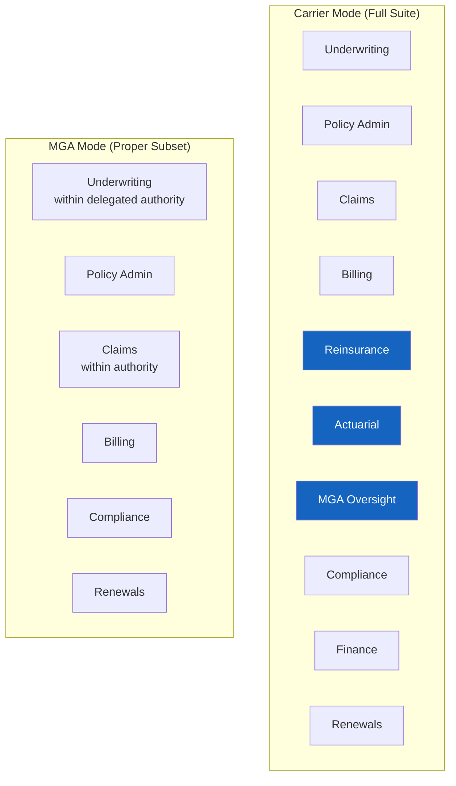

Configuration: `OPENINSURE_DEPLOYMENT_TYPE=carrier` or `OPENINSURE_DEPLOYMENT_TYPE=mga`

---

## 9. Deployment Model

### White-Label Template

OpenInsure is a **white-label deployment template**, not a hosted SaaS platform. Each customer deploys their own instance with full control over:

- Infrastructure and data residency
- Agent configuration and model selection
- Product definitions and rating rules
- Branding and UI customization
- Authentication provider (Entra ID)
- Knowledge base content

### Azure Resource Requirements

| Resource | SKU | Purpose | Est. Monthly Cost |
|---|---|---|---|
| Resource Group | — | Container | Free |
| Managed Identity | Standard | Service-to-service auth | Free |
| Container Registry (ACR) | Basic | Image storage | ~$5 |
| Container Apps (×2) | Consumption | Backend + Dashboard | ~$30–$150 |
| Azure SQL Database | S1 Standard | Transactional data (26 tables) | ~$15–$500 |
| Cosmos DB (NoSQL) | Serverless | Knowledge graph | ~$25–$200 |
| Blob Storage | Standard LRS | Documents | ~$5–$50 |
| Azure AI Search | Standard | Knowledge index | ~$250 |
| Azure AI Foundry Project | — | 10 GPT-5.2 agents | ~$500–$5,000 |
| Service Bus | Standard | Event messaging | ~$10 |
| Event Grid | Standard | Event routing | ~$1 |
| Log Analytics + App Insights | Pay-as-you-go | Monitoring | ~$50–$200 |

**Total estimated monthly cost:** $900–$6,500 (primarily driven by Foundry usage)

### Infrastructure as Code (Bicep)

9 Bicep modules in `infra/`:

| Module | Resource | Key Configuration |
|---|---|---|
| `main.bicep` | Orchestrator | Manages dependencies, creates managed identity |
| `monitoring.bicep` | Log Analytics + App Insights | Diagnostics workspace for all services |
| `sql.bicep` | Azure SQL Server + Database | Entra-only auth, TDE, SQL auditing |
| `cosmos.bicep` | Cosmos DB (NoSQL API) | Entra RBAC only, serverless in dev |
| `storage.bicep` | Blob Storage (StorageV2) | Entra-only, soft delete, versioning |
| `search.bicep` | AI Search | openinsure-knowledge index |
| `servicebus.bicep` | Service Bus + Queue | Dead-letter, max delivery 10 |
| `eventgrid.bicep` | Event Grid Topic | Domain event routing |
| `identity.bicep` | RBAC Assignments | Least-privilege for managed identity |

**Deployment:**

```bash
# Validate
az deployment group validate \
  --resource-group rg-openinsure-prod \
  --template-file infra/main.bicep \
  --parameters environmentName=prod

# Deploy (10–15 minutes)
az deployment group create \
  --resource-group rg-openinsure-prod \
  --template-file infra/main.bicep \
  --parameters environmentName=prod \
  --mode Incremental
```

### Application Deployment

```powershell
# Auto-versioned build & deploy (backend + dashboard)
pwsh scripts/deploy.ps1

# Backend only
pwsh scripts/deploy.ps1 -BackendOnly

# Explicit version
pwsh scripts/deploy.ps1 -Version 55
```

The `deploy.ps1` script:
1. Reads latest ACR tag and increments version (e.g., v48 → v49)
2. Builds Docker images (backend: Python/FastAPI, dashboard: Node.js/Vite)
3. Pushes to Azure Container Registry
4. Updates Container Apps with new image tag
5. Reports build time, deploy time, total elapsed

### Foundry Agent Deployment

```bash
# Deploy all 10 agents with AI Search tools
python scripts/deploy_all_agents_with_tools.py
```

This creates prompt agents on Azure AI Foundry with:
- GPT-5.2 model deployment
- Azure AI Search tool (knowledge index)
- Agent-specific system prompts
- Function calling definitions (Underwriting)
- Memory configuration (UW + Claims)

---

## 10. Integration Architecture

### REST API

152 endpoints with full OpenAPI documentation. Standard patterns:

```
GET    /api/v1/{resource}           # List with pagination
GET    /api/v1/{resource}/{id}      # Get by ID
POST   /api/v1/{resource}           # Create
PUT    /api/v1/{resource}/{id}      # Update
POST   /api/v1/{resource}/{id}/{action}  # Domain action (triage, quote, bind)
```

All responses include correlation IDs for distributed tracing. Errors follow a consistent format with error codes and human-readable messages.

### MCP Server (AI Agent Integration)

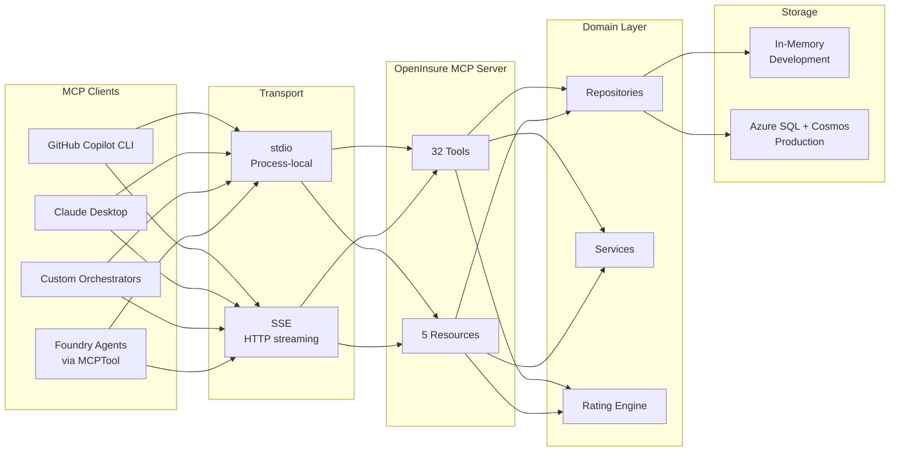

### Webhook Patterns (Event-Driven)

Domain events are published to Azure Service Bus and Event Grid for downstream consumption:

| Event | Trigger | Payload |
|---|---|---|
| `submission.received` | New submission created | submission_id, applicant, LOB |
| `submission.triaged` | AI triage completed | submission_id, risk_score, recommendation |
| `submission.quoted` | Quote generated | submission_id, premium |
| `submission.bound` | Submission bound (aggregate event) | submission_id, policy_id, policy_number, premium |
| `submission.declined` | Submission declined | submission_id, reason |
| `underwriting.completed` | Quote generated | submission_id, premium, authority_decision |
| `policy.bound` | Policy issued | policy_id, policy_number, premium |
| `policy.activated` | Policy activated (aggregate event) | policy_id |
| `policy.endorsed` | Mid-term change | policy_id, endorsement_id, premium_delta |
| `policy.cancelled` | Cancellation processed | policy_id, reason, refund_amount |
| `claim.reported` | FNOL received | claim_id, policy_id, cause_of_loss |
| `claim.reserved` | Reserve set/updated | claim_id, amount, category |
| `claim.settled` | Payment made | claim_id, amount, payee |
| `claim.denied` | Claim denied (aggregate event) | claim_id, reason |
| `compliance.check.completed` | Audit completed | decision_id, compliant, violations |

### Document Ingestion

| Channel | Method | Status |
|---|---|---|
| **ACORD XML** | `POST /api/v1/submissions/acord-ingest` — parses ACORD 125/126 | ✅ Working |
| **PDF/OCR** | `POST /api/v1/documents/upload` — Azure Document Intelligence | ✅ Working |
| **Manual Upload** | React dashboard or API | ✅ Working |
| **Email** | Service Bus consumer → parse → create submission | ⬜ Planned |

**ACORD XML extraction** supports: applicant name, contact info, revenue, employee count, SIC/NAICS, policy dates, limits, deductibles, loss history, coverages.

**Document Intelligence OCR** extracts structured data from uploaded PDFs. Falls back to regex-based extraction when Azure DI is not configured.

### Knowledge Base API

Full CRUD + search for insurance knowledge:

```
GET  /api/v1/knowledge/guidelines/{lob}
GET  /api/v1/knowledge/rating-factors/{lob}
GET  /api/v1/knowledge/coverage-options/{lob}
GET  /api/v1/knowledge/claims-precedents/{claim_type}
GET  /api/v1/knowledge/compliance-rules/{framework}
GET  /api/v1/knowledge/industry-profiles
GET  /api/v1/knowledge/jurisdiction-rules
GET  /api/v1/knowledge/search?q={query}
GET  /api/v1/knowledge/sync-status
PUT  /api/v1/knowledge/claims-precedents/{claim_type}
PUT  /api/v1/knowledge/compliance-rules/{framework}
```

Carriers update knowledge by modifying YAML files and triggering a sync (`POST /api/v1/admin/sync-knowledge`), which propagates changes through Cosmos DB to AI Search within 5 minutes.

---

## 11. Testing & Quality

### Test Suite

| Type | Files | Tests | Purpose |
|---|---|---|---|
| **Unit** | ~25 | ~300 | Domain entities, state machines, agents, authority engine, bias monitor, compliance |
| **Integration** | ~18 | ~180 | API endpoints, database repositories, service layer, Azure adapters |
| **E2E** | ~7 | ~70 | Multi-agent workflows: submission-to-bind, FNOL-to-close, renewal |
| **Total** | **50** | **553** | Full lifecycle coverage |

### CI Pipeline

Every PR runs the full quality gate:

```bash
ruff check src/ tests/                    # Lint (style, imports, complexity)
ruff format --check src/ tests/           # Format verification
mypy src/openinsure/                      # Type checking (strict mode)
bandit -r src/openinsure/ -c pyproject.toml  # Security scanning (0 findings required)
pytest tests/ -v --cov=src/openinsure --cov-fail-under=80  # Tests (≥80% coverage)
```

All gates must pass before merge. CI runs on GitHub Actions.

### Smoke Test

`scripts/smoke_test.py` validates 15 critical endpoints before production deployment:

| # | Check | Endpoint |
|---|---|---|
| 1 | Health | `GET /health` |
| 2 | Submissions list | `GET /api/v1/submissions` |
| 3 | Policies list | `GET /api/v1/policies` |
| 4 | Claims list | `GET /api/v1/claims` |
| 5 | Metrics summary | `GET /api/v1/metrics/summary` |
| 6 | Executive metrics | `GET /api/v1/metrics/executive` |
| 7 | Actuarial reserves | `GET /api/v1/actuarial/reserves` |
| 8 | Finance summary | `GET /api/v1/finance/summary` |
| 9 | Compliance decisions | `GET /api/v1/compliance/decisions` |
| 10 | Audit trail | `GET /api/v1/compliance/audit-trail` |
| 11 | Knowledge sync status | `GET /api/v1/knowledge/sync-status` |
| 12 | Workflows | `GET /api/v1/workflows` |
| 13 | MGA authorities | `GET /api/v1/mga/authorities` |
| 14 | Reinsurance treaties | `GET /api/v1/reinsurance/treaties` |
| 15 | Full demo workflow | `POST /api/v1/demo/full-workflow` |

### Frontend Testing

- **Playwright** visual regression testing for all dashboard pages
- **Test screenshots** captured and compared on each build
- Screenshot archive in `test-screenshots/`

---

## 12. Current Metrics

These are representative metrics from a running deployment with 3+ years of seeded operational data.

### Portfolio

| Metric | Value |
|---|---|
| **Gross Written Premium** | $24.19M |
| **Total Submissions** | 1,540+ |
| **Active Policies** | 513+ |
| **Open Claims** | 115+ |
| **Bind Rate** | ~22% |
| **Loss Ratio** | 36.9% |
| **Combined Ratio** | 88.8% |

### AI Operations

| Metric | Value |
|---|---|
| **Foundry Agents Deployed** | 10 (GPT-5.2) |
| **Decision Records** | 170+ (EU AI Act Art. 12 compliant) |
| **Agent Invocations Logged** | 170+ with full input/output traces |
| **Knowledge Documents Indexed** | 50+ in AI Search |
| **Cosmos DB Knowledge Documents** | 13+ seeded |

### Platform

| Metric | Value |
|---|---|
| **REST API Endpoints** | 172 across 31 modules |
| **MCP Tools** | 32 + 5 resources |
| **RBAC Roles** | 26 (20 MGA, 26 Carrier) |
| **Database Tables** | 42 across 18 migrations |
| **Domain Entities** | 13 with state machines + 3 aggregate roots |
| **Business Services** | 27 |
| **Infrastructure Adapters** | 13 |
| **Test Suite** | 862 tests |
| **Bicep IaC Modules** | 9 |
| **Dashboard Pages** | 25 |
| **Knowledge Categories** | 7 (guidelines, rating factors, coverages, precedents, compliance, industry, jurisdiction) |

### Performance

| Operation | Time |
|---|---|
| **Full demo workflow** (submission → triage → quote → bind → claim → reserve) | ~284ms |
| **Smoke test** (15 endpoint checks) | <10s |

---

## Appendix A: Repository Structure

```
openinsure/
├── src/openinsure/
│   ├── main.py                    # FastAPI application entry point
│   ├── config.py                  # Pydantic Settings (env-based config)
│   ├── api/                       # 28 FastAPI router modules (153 endpoints)
│   ├── agents/                    # 8 agent classes + orchestrator + Foundry client
│   │   ├── base.py                # InsuranceAgent base, DecisionRecord, AgentConfig
│   │   ├── submission_agent.py
│   │   ├── underwriting_agent.py
│   │   ├── policy_agent.py
│   │   ├── claims_agent.py
│   │   ├── compliance_agent.py
│   │   ├── document_agent.py
│   │   ├── knowledge_agent.py
│   │   ├── orchestrator.py
│   │   ├── foundry_client.py      # Microsoft Foundry integration wrapper
│   │   └── prompts/               # System prompts package (13 modules, split from prompts.py in v95)
│   │       ├── __init__.py        # Re-exports all public symbols
│   │       ├── _triage.py         # Submission triage prompts
│   │       ├── _underwriting.py   # Underwriting & pricing prompts
│   │       ├── _claims.py         # Claims processing prompts
│   │       ├── _policy.py         # Policy lifecycle prompts
│   │       ├── _compliance.py     # Compliance & audit prompts
│   │       ├── _document.py       # Document processing prompts
│   │       ├── _enrichment.py     # Data enrichment prompts
│   │       ├── _knowledge.py      # Knowledge retrieval prompts
│   │       ├── _analytics.py      # Analytics & reporting prompts
│   │       ├── _billing.py        # Billing prompts
│   │       ├── _comparable.py     # Comparable account prompts
│   │       └── _orchestrator.py   # Workflow orchestration prompts
│   ├── domain/                    # 14 Pydantic domain entities + state machines + limits
│   │   ├── aggregates/            # DDD aggregate roots (Submission, Policy, Claim) — #170
│   │   └── limits.py              # Centralized authority, reserve, premium limits (v95)
│   ├── services/                  # 27 business logic services
│   │   ├── rating.py              # CyberRatingEngine (tier 2 of 3-tier cascade)
│   │   ├── workflow_registry.py   # Data-driven workflow template registry (#180)
│   │   ├── bind_handlers.py       # DDD event handlers: PolicyCreation, Billing, Reinsurance (#170)
│   │   └── product_knowledge_sync.py  # SQL → Cosmos → AI Search sync (v95)
│   ├── infrastructure/            # Azure service adapters + repository layer
│   │   ├── database.py            # Azure SQL (async SQLAlchemy + pyodbc)
│   │   ├── cosmos.py              # Cosmos DB NoSQL
│   │   ├── blob_storage.py        # Azure Blob Storage
│   │   ├── ai_search.py           # Azure AI Search
│   │   ├── event_bus.py           # Event Grid + Service Bus
│   │   ├── document_intelligence.py
│   │   ├── factory.py             # Dependency injection factory
│   │   └── repositories/          # SQL + InMemory repository implementations
│   ├── mcp/                       # MCP server (32 tools, 5 resources)
│   ├── rbac/                      # 26 roles, authority engine, access matrix
│   ├── compliance/                # Decision records, audit trail, bias monitor
│   └── knowledge/                 # Knowledge graph schemas
├── tests/                         # 50+ test files (unit, integration, e2e)
├── infra/                         # 9 Bicep IaC modules
├── dashboard/                     # React 19 + TypeScript + Tailwind + Vite
├── knowledge/                     # YAML knowledge base (products, guidelines, rules)
├── scripts/                       # deploy.ps1, smoke_test.py
├── docs/                          # Architecture, guides, this document
└── .github/                       # CI/CD workflows
```

## Appendix B: Known Technical Debt

A comprehensive code review was conducted alongside this document. The following 16 issues were filed as GitHub issues (label: `tech-debt`) and **all resolved in v95**:

| # | Issue | Severity | Category | Resolution |
|---|---|---|---|---|
| #92 | Split prompts.py god file (1,265 lines) into focused modules | Critical | Over-engineering | ✅ `agents/prompts/` package (13 modules) |
| #93 | Consolidate duplicate policy lifecycle logic (policy_agent + policy_lifecycle) | Critical | Redundant code | ✅ Single `PolicyLifecycleService` |
| #94 | Rating engine not used as Foundry fallback — flat $5K premium instead | Critical | Missing integration | ✅ 3-tier cascade: Foundry → CyberRatingEngine → LOB minimum |
| #95 | Consolidate duplicate bias monitoring (services/ and compliance/) | High | Redundant code | ✅ Single `services/bias_monitor.py` |
| #96 | 5 phantom agents are stubs returning empty defaults | High | Dead code | ✅ Foundry wrappers with graceful fallback |
| #97 | 8 redundant knowledge retrieval paths — consolidate into single pipeline | High | Over-engineering | ✅ Unified Cosmos → AI Search pipeline |
| #98 | Compliance repository does not extend BaseRepository | High | Inconsistent patterns | ✅ `ComplianceRepository` extends `BaseRepository` |
| #99 | State machine defines states not in domain enums | High | Inconsistent patterns | ✅ `referred`, `reinstated`, `reported` in domain enums |
| #100 | 13 untyped API endpoints return raw dicts | High | Inconsistent patterns | ✅ Pydantic response models |
| #101 | Duplicate workflow paths for same operation | Medium | Redundant code | ✅ Collapsed |
| #102 | 7 domain events defined but never emitted | Medium | Dead code | ✅ Wired to event publisher |
| #103 | 30+ hardcoded authority/reserve/premium limits | High | Missing abstraction | ✅ `domain/limits.py` |
| #104 | Products and Renewals have no SQL implementations | High | Missing implementation | ✅ `SqlProductRepository` + knowledge sync pipeline |
| #105 | knowledge_agent.py is 80% embedded data (738 lines) | Medium | Over-engineering | ✅ Data served from Cosmos/AI Search |
| #106 | Hidden duplicate routes with include_in_schema=False | Low | Naming inconsistency | ✅ Removed |
| #107 | Inconsistent API naming — mixed plural/singular paths | Low | Naming inconsistency | ✅ Normalized to plural |

## Appendix C: Architectural Decision Records (ADRs)

These decisions are foundational and unlikely to change. They are recorded here for historical context.

| ADR | Decision | Rationale |
|---|---|---|
| **ADR-001** | Python 3.12 + FastAPI for backend | AI/ML ecosystem, native async/await, Pydantic integration, auto-generated OpenAPI |
| **ADR-002** | Pydantic v2 for domain entities | Runtime validation at construction, Rust-based core (5–50× faster than v1), native `.model_dump()` / `.model_validate()`, full mypy support |
| **ADR-003** | Azure SQL + Cosmos DB dual storage | SQL for ACID transactions (insurance operations), Cosmos for knowledge graph documents. Both first-party Azure with Entra ID integration |
| **ADR-004** | Event-driven (Event Grid + Service Bus) | Insurance workflows are multi-step and async. Loose coupling, audit trail (every event persists), at-least-once delivery with dead-letter queues |
| **ADR-005** | Microsoft Foundry for AI orchestration | Native agent orchestration, 1,900+ model catalog, guardrails, audit logging, MCP compatibility, M365 publishing |
| **ADR-006** | EU AI Act compliance-by-design | Insurance underwriting classified as high-risk (Annex III). Deadline Aug 2026, fines up to €15M / 3% turnover. Retroactive compliance would require costly rewrite |
| **ADR-007** | ACORD-aligned JSON/REST API | Industry-standard terminology for interoperability, modern JSON/REST (no legacy XML overhead), OpenAPI auto-generated |
| **ADR-008** | Explicit transaction boundaries for multi-step operations | Bind (policy + billing + status) wrapped in a single DB transaction to prevent orphan records. Non-critical ops (events, AI, compliance) excluded to avoid coupling. Cessions use a separate transaction for independent atomicity |
| **ADR-009** | DDD aggregate boundaries with synchronous event dispatch | Submission, Policy, Claim as independent consistency units (Evans DDD Ch.6). Cross-aggregate communication via domain events dispatched synchronously for now. Async event-driven architecture is future work. Each aggregate validates its own invariants before mutating (#170) |
| **ADR-010** | Data-driven workflow templates with hardcoded fallback | Workflow steps stored in SQL (per-product configurable) with in-memory defaults as fallback. Product-specific templates loaded via `WorkflowRegistry` only when `product_id` is specified; otherwise hardcoded definitions preserved for backward compatibility (#180) |
| **ADR-011** | URL-path API versioning (`/api/v1/`) | Explicit version in URL for proxy routing and client clarity. Breaking changes require `/api/v2/` with 6-month deprecation window. Avoids header-based versioning complexity (#288) |
| **ADR-012** | Three-tier health probes (liveness / readiness / startup) | `/health` is lightweight (no dep checks) to avoid restart loops during transient outages. `/ready` checks all deps for load-balancer decisions. `/startup` allows slow initialisation without premature restarts (#294) |
| **ADR-013** | Middleware extraction pattern | HTTP middleware (broker scope enforcement, rate limiting) extracted to `middleware.py` to keep `main.py` under 200 lines. Improves testability and separation of concerns (#295) |
| **ADR-014** | Typed service interfaces with Pydantic models | Critical service methods (`run_triage`, `generate_quote`) use Pydantic input/output models instead of `dict[str, Any]` for type safety, IDE support, and self-documenting APIs (#296) |
| **ADR-015** | Consistent paginated response envelope | All list endpoints return `{items, total, skip, limit}` via `PaginatedResponse` model. Enables uniform client-side pagination and avoids per-endpoint response format divergence (#287) |

## Appendix D: Related Documentation

| Document | Purpose | Audience |
|---|---|---|
| [Architecture Specification v01](architecture/architecture-spec-v01.md) | North star vision document | Architect, CTO |
| [Operating Model v02](architecture/operating-model-v02.md) | AI-native carrier/MGA operating model | CTO, COO, Strategy |
| [Feature Guide](guides/feature-guide.md) | Detailed walkthrough of all 16 features | Product, Demo, QA |
| [Developer Quickstart](guides/developer-quickstart.md) | Local setup, first API call, run tests | New developers |
| [Enterprise Integration Guide](guides/enterprise-integration-guide.md) | Production deployment and integration | DevOps, Solutions Architect |
| [CHANGELOG](../CHANGELOG.md) | Version history and release notes | All |

---

*OpenInsure is open-source software licensed under AGPL-3.0. For commercial licensing inquiries, see LICENSE.*
