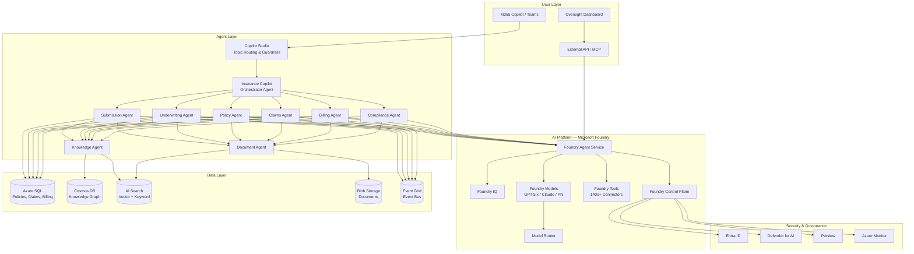

# OpenInsure: AI-Native Open Source Core Insurance Platform

## Architecture & Implementation Specification v0.1

**Project Codename:** OpenInsure
**Platform:** Microsoft Foundry + Copilot Studio + M365 Copilot
**License:** AGPL-3.0 (core) / Commercial (enterprise features)
**Target LOB (Phase 1):** Cyber Insurance
**Target Users:** MGAs, InsurTech startups, small specialty carriers
**Date:** March 2026

---

## 1. Vision & Strategic Positioning

### 1.1 What This Is

OpenInsure is an open-source, AI-native core insurance platform built on the Microsoft AI stack. It is not a traditional core system with AI bolted on. Every module — underwriting, policy administration, claims, billing, compliance — is designed from the ground up to be operated by, and through, AI agents.

The distinction matters. Guidewire ($1.2B revenue, 570+ insurers) and Duck Creek were architected in the 2000s around human-operated screens, batch processes, and deterministic business rules. They are now retrofitting AI capabilities onto architectures that were never designed for them. mea Platform, Corgi, Federato, and Concirrus Inspire are AI-native but closed-source and VC-funded ($50M–$260M+). No credible open-source AI-native core insurance system exists today. The previous attempt (APOSIN, backed by Allianz) was closed/defunct. Openkoda is an application framework with insurance templates, not an AI-native insurance system.

### 1.2 What "AI-Native" Means in Practice

AI-native does not mean "uses AI." It means AI is the primary interface and execution engine, not an enhancement to a human-operated system. Concretely:

**Traditional core system:** Human opens screen → fills form fields → clicks "calculate premium" → system runs deterministic rating algorithm → human reviews → human clicks "bind"

**AI-bolted-on system:** Human opens screen → AI pre-fills some fields from documents → human reviews and corrects → system runs deterministic rating algorithm → AI suggests adjustments → human clicks "bind"

**AI-native system:** Agent receives submission (email, API, document) → Agent extracts and validates all data → Agent runs rating through configurable model (deterministic + ML) → Agent applies underwriting guidelines → Agent flags exceptions for human review → Agent binds within authority, or escalates to human with recommendation and reasoning → Human intervenes only on exceptions

The difference is that the default path is autonomous, with human oversight on exceptions — not human-driven with AI assistance.

### 1.3 Design Principles

1. **Agents-first, screens-second.** Every business process is exposed as an agent-callable API. UIs exist for oversight, configuration, and exception handling — not as the primary operating interface.

2. **Model-agnostic AI.** The platform does not depend on any specific LLM. It runs on Microsoft Foundry's model catalog (1,900+ models including GPT-5.x, Claude, Mistral, Phi, open-source models). When a better model ships, the platform gets smarter without code changes. This is a deliberate strategic choice — companies investing in proprietary insurance LLMs (mea's "ora" dsLM, Jointly's "Insurance Instruct v1") are building depreciating assets given that frontier generalist models consistently outperform domain-specific models (BloombergGPT precedent).

3. **Knowledge graph over model weights.** Durable insurance intelligence lives in a structured knowledge graph (product definitions, regulatory rules, underwriting guidelines, coverage forms), not in fine-tuned model weights. The knowledge graph is the moat; the LLM is the engine. When Claude 5 or GPT-6 ships, the knowledge graph makes the new model immediately expert in your specific insurance operations.

4. **ACORD-aligned, not ACORD-dependent.** Data models align with ACORD reference architecture concepts (Party, Policy, Claim, Product) for interoperability, but are not constrained by ACORD's XML schemas. Modern JSON/REST APIs with ACORD-compatible mapping layers.

5. **Regulatory compliance as first-class architecture.** EU AI Act (high-risk system requirements effective August 2026), GDPR, Solvency II, DORA, IDD, BaFin guidance, NAIC Model AI Bulletin — compliance is not a module bolted on after the fact. Every AI decision is logged, explainable, auditable, and traceable by design.

6. **Microsoft ecosystem integration.** Agents publish to M365 Copilot and Teams. Business users interact with insurance operations through the tools they already use. Configuration through Copilot Studio. Enterprise governance through Foundry Control Plane, Entra ID, Defender, and Purview.

---

## 2. Microsoft Platform Architecture

### 2.1 Platform Components and Their Roles

```
┌─────────────────────────────────────────────────────────────┐
│                    M365 Copilot / Teams                      │
│         (User-facing agent surface for insurance ops)        │
├─────────────────────────────────────────────────────────────┤
│                    Copilot Studio                             │
│      (No-code agent config, topic routing, guardrails)       │
├─────────────────────────────────────────────────────────────┤
│                Microsoft Foundry                             │
│  ┌──────────────┬──────────────┬───────────────────────┐    │
│  │ Agent Service │  Foundry IQ  │   Foundry Models      │    │
│  │ (Multi-agent  │ (Knowledge   │  (GPT-5.x, Claude,   │    │
│  │  orchestration│  retrieval,  │   Phi, Mistral,       │    │
│  │  & workflows) │  agentic RAG)│   open-source)        │    │
│  ├──────────────┼──────────────┼───────────────────────┤    │
│  │Foundry Tools  │ Control Plane│   Model Router        │    │
│  │(1400+ connec- │ (Governance, │  (Auto-selects best   │    │
│  │ tors, MCP,    │  monitoring, │   model per task:     │    │
│  │ browser auto) │  audit, RBAC)│   cost/latency/       │    │
│  │               │              │   quality)            │    │
│  └──────────────┴──────────────┴───────────────────────┘    │
├─────────────────────────────────────────────────────────────┤
│              Azure Infrastructure                            │
│  ┌──────────┬───────────┬────────────┬──────────────────┐   │
│  │ Azure SQL│ AI Search │ Logic Apps │ Event Grid/      │   │
│  │ / Cosmos │ (vector + │ (workflow  │ Service Bus      │   │
│  │ DB       │  keyword) │  automation│ (event-driven    │   │
│  │          │           │  1400+     │  architecture)   │   │
│  │          │           │  connectors│                  │   │
│  └──────────┴───────────┴────────────┴──────────────────┘   │
│  ┌──────────┬───────────┬────────────┬──────────────────┐   │
│  │ Blob     │ Entra ID  │ Defender   │ Purview          │   │
│  │ Storage  │ (Identity,│ (Threat    │ (Data governance,│   │
│  │ (Docs,   │  RBAC,    │  protection│  compliance,     │   │
│  │  media)  │  agent ID)│  for AI)   │  classification) │   │
│  └──────────┴───────────┴────────────┴──────────────────┘   │
└─────────────────────────────────────────────────────────────┘
```

### 2.2 Microsoft Foundry — Core AI Platform

Microsoft Foundry serves as the unified AI platform-as-a-service. Key capabilities used:

**Foundry Agent Service** — The core runtime for all insurance agents. Supports multi-agent workflows with visual orchestration, hosted agents (deploy LangGraph or any framework as managed service), built-in persistent memory across sessions, and MCP/A2A tool integration. Agents built here publish directly to M365 Copilot and Teams with one-click publishing.

**Foundry IQ** — The knowledge retrieval layer. Not traditional RAG (search → retrieve chunks → send to LLM). Foundry IQ operates as an agentic reasoning layer over the insurance knowledge graph, connecting to Azure AI Search, Blob Storage (documents), SharePoint (operational docs), and custom data sources. Respects security boundaries and access controls via Entra ID.

**Foundry Models + Model Router** — Access to 1,900+ models. Model Router automatically selects optimal model per task based on latency, quality, and cost. For OpenInsure this means: high-reasoning models (GPT-5.x, Claude Opus) for complex underwriting decisions, fast/cheap models (Phi, Mistral) for document classification and data extraction, specialized models for specific tasks (e.g., vision models for damage assessment photos in claims).

**Foundry Tools** — 1,400+ pre-built connectors (SAP, Salesforce, Dynamics 365, ServiceNow) plus MCP servers and custom APIs. Insurance agents connect to external data providers, payment systems, regulatory filing APIs, and existing carrier infrastructure through this catalog.

**Foundry Control Plane** — Organization-wide observability and governance. Real-time monitoring of all agent operations, Azure Monitor integration, Defender for AI threat protection, Purview data governance. Every agent action is logged, every AI decision traceable. This is critical for EU AI Act compliance.

### 2.3 Copilot Studio — Business-User Agent Configuration

Copilot Studio is the no-code/low-code layer where insurance operations teams configure agent behavior without engineering involvement:

- Define agent topics and conversation flows for insurance-specific scenarios
- Set guardrails: what agents can and cannot do autonomously
- Configure authority limits (e.g., "agent can bind policies up to $1M, escalate above")
- Connect Foundry agents as "connected agents" — Copilot Studio routes to the appropriate specialized Foundry agent based on the request
- Access Work IQ for organizational context (who is this underwriter, what is their authority, what team are they on)
- Deploy to Teams, Outlook, SharePoint, and M365 Copilot surfaces

### 2.4 M365 Copilot — The User Surface

Insurance professionals interact with OpenInsure agents through M365 Copilot, appearing in their daily workflow:

- **In Teams:** "@OpenInsure what's the status of submission SUB-2024-0847?" or "@OpenInsure bind this quote with the revised terms"
- **In Outlook:** Copilot detects an incoming submission email, routes to the intake agent, returns extracted data and risk assessment in a side panel
- **In Excel/Word:** Agent generates bordereaux reports, loss runs, or compliance documentation on demand
- **Agent Store:** Published OpenInsure agents appear in the organizational agent store, governed by M365 Admin Center

Publishing flow: Build agent in Foundry → Test in Foundry Playground → One-click publish to M365 → Admin approval in M365 Admin Center → Available to users in Teams, Outlook, and Copilot Chat.

---

## 3. Insurance Knowledge Architecture

### 3.1 The Knowledge Graph (The Real Moat)

The insurance knowledge graph is the durable intelligence layer — distinct from, and more valuable than, any LLM. It contains:

**Product Ontology**
- Coverage forms and their relationships (e.g., CGL → BI/PD → Products/Completed Ops)
- Rating variables, factors, and algorithms per LOB and jurisdiction
- Endorsement catalog with modification rules
- Exclusion logic and exception conditions
- Underwriting guidelines per product, tier, and risk class

**Regulatory Knowledge Base**
- Jurisdiction-specific requirements (state/country filing rules, rate regulations, form approvals)
- EU AI Act high-risk system classification mappings
- Solvency II / DORA / IDD compliance requirements
- BaFin AI governance guidance
- NAIC Model AI Bulletin requirements
- Data protection rules per jurisdiction (GDPR, state privacy laws)

**Operational Knowledge**
- Claims adjudication rules and settlement guidelines
- Fraud indicators and red-flag patterns
- Reinsurance treaty terms and cession rules
- Commission structures and distribution agreements
- Billing rules (installment plans, agency bill, direct bill)

**Data Model Semantics**
- ACORD-aligned entity definitions (Party, Policy, Claim, Account, Submission)
- Field-level validation rules and business constraints
- Cross-entity relationship rules

### 3.2 How Agents Use the Knowledge Graph

The knowledge graph is not a static database. It is the instruction set that agents reason over:

```
User/System trigger → Agent receives task
                    → Agent queries knowledge graph for relevant rules
                    → Foundry IQ retrieves contextual knowledge
                    → LLM reasons over: task + knowledge + data
                    → Agent executes action or escalates
                    → All decisions logged with knowledge graph references
```

Example: Cyber insurance submission arrives.
1. **Intake Agent** queries knowledge graph for "cyber insurance submission requirements" → gets list of required data points, acceptable formats, minimum information thresholds
2. **Underwriting Agent** queries "cyber insurance underwriting guidelines" → gets risk appetite, pricing factors, authority limits, referral triggers
3. **Compliance Agent** queries "cyber insurance regulatory requirements [jurisdiction]" → gets filing status, rate constraints, form requirements
4. LLM reasons across all three knowledge domains simultaneously to produce a recommendation

### 3.3 Knowledge Graph Storage

- **Azure Cosmos DB (Gremlin API)** for graph relationships between insurance entities
- **Azure AI Search** for vector + keyword hybrid search over knowledge documents
- **Azure Blob Storage** for source documents (coverage forms, regulatory filings, guidelines)
- **Foundry IQ** as the unified retrieval interface connecting all sources

---

## 4. Core Domain Modules

Each module is designed agent-first: the primary interface is an API consumed by agents, with human UIs for oversight and exception handling.

### 4.1 Product Configuration Engine

**What it does:** Defines insurance products — coverages, rating algorithms, rules, forms, and regulatory constraints.

**AI-native difference:** In Guidewire, actuaries work with product designers in a visual tool to manually configure rating tables, coverage structures, and rules. In OpenInsure, the primary interface is conversational:

```
Actuary: "Create a cyber liability product for SMBs with revenue under $50M.
          Base coverage: first-party breach response, third-party liability,
          regulatory defense costs. Rating factors: industry SIC code,
          employee count, annual revenue, security maturity score.
          Minimum premium $2,500. Territory: all US states except NY and CA
          which need separate filings."

Product Agent: [Generates product definition in structured schema]
             [Creates rating algorithm with factor tables]
             [Maps to regulatory filing requirements per state]
             [Identifies missing information: "What deductible options?
              What sublimits for breach response costs?"]
             [Outputs: product config JSON, draft rate filing documents,
              compliance gap report]
```

**Technical implementation:**
- Product definitions stored as versioned JSON schemas in Cosmos DB
- Rating algorithms as configurable computation graphs (not hardcoded)
- Version control: every product change tracked, auditable, rollback-capable
- Agent-callable APIs: `createProduct`, `modifyProduct`, `calculateRate`, `validateCompliance`
- Knowledge graph links: product → coverage forms → regulatory requirements → filing status

**Foundry integration:**
- Product Config Agent deployed via Foundry Agent Service
- Uses Foundry IQ to retrieve regulatory requirements for the target jurisdictions
- Model Router selects reasoning model (GPT-5.x / Claude) for complex product logic generation
- Logic Apps triggers for downstream notifications when products are modified

### 4.2 Submission Intake & Triage

**What it does:** Receives insurance submissions from any channel (email, API, portal, broker platform), extracts structured data, validates completeness, classifies risk, and routes to appropriate processing path.

**AI-native difference:** This is the single highest-value AI capability and where mea Platform started. Current state: underwriters manually open emails, download attachments (ACORD applications, loss runs, supplementals, financials), re-key data into their systems, cross-reference against multiple databases. This takes hours per submission.

**Agent workflow:**

```
1. RECEIVE: Submission arrives (email attachment, API call, uploaded document)
2. CLASSIFY: Document Agent identifies document types (ACORD app, loss run,
   financial statement, supplemental questionnaire, SOV, prior policy)
3. EXTRACT: Extraction Agent pulls structured data from each document
   - Named insured, address, SIC code, revenue, employee count
   - Prior coverage details, limits, deductibles, premiums
   - Loss history (dates, amounts, types, status)
   - For cyber: security controls, incident history, tech stack
4. VALIDATE: Validation Agent checks completeness against product requirements
   - Flags missing fields with confidence scores
   - Identifies inconsistencies across documents
   - Requests clarification from broker if below threshold
5. ENRICH: Enrichment Agent pulls external data
   - Corporate registry data (firmographics)
   - Security ratings (SecurityScorecard, BitSight via API)
   - News/litigation monitoring
   - Loss database cross-reference
6. TRIAGE: Triage Agent classifies submission
   - Within appetite / outside appetite / borderline
   - Priority scoring based on probability of bind, premium size
   - Assigns to underwriter queue or auto-declines with explanation
7. PREPARE: Workbench Agent assembles underwriting package
   - Pre-filled rating worksheet
   - Risk summary with key findings
   - Comparable account analysis
   - Recommended terms (limits, deductible, premium range)
```

**Foundry integration:**
- Document classification and extraction use Foundry Tools (OCR, document intelligence)
- Multi-model approach: vision models for scanned documents, text models for digital PDFs
- External data enrichment via Foundry Tools connectors and MCP servers
- Logic Apps orchestrates the multi-step workflow with retry/error handling
- Event Grid publishes submission events for downstream agents

### 4.3 Underwriting Workbench

**What it does:** Provides the decision-support environment where underwriting agents (AI) and underwriters (human) collaborate to evaluate risk and determine terms.

**AI-native difference:** The agent has already done 80-90% of the work by the time a human sees the submission. The human reviews the agent's recommendation, the reasoning behind it, and the confidence level — then approves, modifies, or overrides.

**Agent capabilities:**
- **Risk Scoring:** Multi-factor risk assessment combining structured data (financials, loss history) with unstructured intelligence (news, litigation, security posture)
- **Comparable Analysis:** Finds similar accounts in the book, shows how they were priced, what their loss experience has been
- **Terms Generation:** Proposes coverage terms, limits, deductibles, and premium based on product rules and portfolio strategy
- **Authority Management:** Knows which underwriter has authority for which limits/LOBs. Auto-binds within authority; escalates above
- **Referral Routing:** Complex risks requiring specialist review are routed with full context package
- **Quote Generation:** Produces formatted quote documents ready for broker delivery

**Human oversight model:**
- Dashboard shows all active submissions, agent recommendations, confidence scores
- Red/amber/green flagging: green = auto-processed within authority, amber = agent recommendation needs approval, red = exception requiring human judgment
- Every agent decision is explainable: click to see the reasoning chain, knowledge graph references, and data sources
- Override any agent decision with mandatory reason logging (feeds back into knowledge graph)

### 4.4 Policy Administration

**What it does:** Manages the complete policy lifecycle: quote → bind → issue → endorse → renew → cancel → reinstate.

**Agent capabilities:**
- **Bind Processing:** Validates all requirements met (signed application, premium payment, subjectivities cleared), creates policy record, triggers document generation
- **Document Generation:** Policy forms, declarations pages, endorsements, certificates of insurance — generated from templates populated by agents
- **Endorsement Processing:** Mid-term changes (add coverage, change limits, update insured info) with automatic premium recalculation and billing adjustment
- **Renewal Management:** Renewal Agent identifies upcoming renewals 90-60-30 days out, pulls updated data, generates renewal terms, sends to underwriting for review
- **Cancellation/Reinstatement:** Processes cancellations (flat, pro-rata, short-rate), handles earned premium calculations, manages reinstatement requests

**Data model (core entities):**

```
Submission
  ├── submissionId (UUID)
  ├── status (received | triaging | underwriting | quoted | bound | declined)
  ├── channel (email | api | portal | broker_platform)
  ├── documents[] (reference to extracted docs)
  ├── extractedData (structured JSON)
  ├── triageResult (appetite | risk_score | priority | assigned_to)
  └── timestamps (received | triaged | quoted | bound)

Policy
  ├── policyId (UUID)
  ├── policyNumber (human-readable)
  ├── status (active | expired | cancelled | pending)
  ├── product (reference to product definition)
  ├── insured (reference to Party)
  ├── effectiveDate / expirationDate
  ├── coverages[] (coverage_code | limit | deductible | premium)
  ├── endorsements[] (ordered modifications)
  ├── premium (written | earned | unearned)
  ├── billing (plan | schedule | payments[])
  └── documents[] (policy forms, dec pages, endorsements)

Party
  ├── partyId (UUID)
  ├── type (individual | organization)
  ├── roles[] (insured | broker | agent | claimant | vendor)
  ├── identifiers (tax_id | registration | license)
  ├── addresses[] | contacts[]
  ├── relationships[] (parent_org | subsidiary | related_party)
  └── riskProfile (LOB-specific structured data)

Claim
  ├── claimId (UUID)
  ├── claimNumber (human-readable)
  ├── policy (reference)
  ├── status (fnol | investigating | reserved | settling | closed | reopened)
  ├── lossDate / reportDate
  ├── lossType / causeOfLoss
  ├── claimants[] (reference to Party)
  ├── reserves (indemnity | expense | total)
  ├── payments[] (amount | payee | date | type)
  ├── documents[] (FNOL report, adjuster notes, invoices)
  └── agentActions[] (audit trail of all agent decisions)
```

### 4.5 Claims Management

**What it does:** Manages the claims lifecycle from first notice of loss through investigation, reserving, settlement, and closure.

**AI-native difference:** FNOL intake is conversational (phone, email, chat, form). The agent extracts loss details, validates coverage, sets initial reserves based on comparable claims, assigns to adjuster, and begins investigation — all within minutes of report, not days.

**Agent workflow:**

```
1. FNOL INTAKE: Customer/broker reports claim via any channel
   - Conversational Agent conducts structured interview
   - Extracts: date of loss, description, parties involved, damages
   - For cyber: type of incident, systems affected, data compromised
2. COVERAGE VERIFICATION: Policy Agent confirms
   - Active policy at date of loss
   - Coverage applies to reported loss type
   - No exclusions triggered
   - Deductible and limit identification
3. INITIAL RESERVE: Reserving Agent sets reserves
   - Based on comparable claims analysis from knowledge graph
   - Severity scoring from loss description
   - Initial estimate with confidence interval
4. TRIAGE & ASSIGN: Routing Agent determines
   - Complexity tier (simple → complex → catastrophe)
   - Fraud indicators check
   - Specialist requirements (legal, forensic, technical)
   - Adjuster assignment based on expertise and capacity
5. INVESTIGATION SUPPORT: Investigation Agent assists adjuster
   - Document collection and organization
   - Third-party data gathering
   - Timeline reconstruction
   - Coverage analysis memo generation
6. SETTLEMENT: Settlement Agent supports resolution
   - Calculates settlement based on damages, policy terms, reserves
   - Generates settlement authorization within authority
   - Produces payment instructions
   - Issues closing documents
```

### 4.6 Billing & Payments

**What it does:** Premium billing, payment processing, commission calculations, agency/direct billing, installment plans.

**Agent capabilities:**
- Generate billing schedules based on policy terms and payment plan selection
- Process payments and reconcile against outstanding balances
- Calculate and distribute commissions per distribution agreements
- Handle premium audits and retrospective adjustments
- Manage cancellation for non-payment workflows (notice sequences, grace periods, reinstatement rules)
- Generate bordereaux for MGAs (premium, claims, loss ratio reports)

### 4.7 Regulatory Compliance Engine

**What it does:** Ensures all operations comply with applicable regulations and produces required regulatory reporting.

**AI-native difference:** This is where the EU AI Act creates an immediate, mandatory, budget-backed requirement. Every insurer deploying AI in underwriting (life/health pricing = high-risk system) needs conformity assessments, technical documentation, fundamental rights impact assessments, bias auditing, and ongoing monitoring — all by August 2026.

**Agent capabilities:**
- **Regulatory Monitoring Agent:** Tracks regulatory changes across jurisdictions, maps impact to current product/operations configurations
- **Compliance Checking Agent:** Validates every rating decision, underwriting decision, and claims decision against regulatory constraints
- **Audit Trail Agent:** Maintains immutable log of all AI decisions with reasoning chains, confidence scores, data sources, and knowledge graph references
- **Bias Detection Agent:** Continuous monitoring of outcomes across demographic groups, flags disparate impact
- **Reporting Agent:** Generates statutory reports, rate filing documentation, market conduct data
- **EU AI Act Compliance:**
  - Maintains AI system inventory with risk classifications
  - Generates technical documentation per Articles 9-15
  - Produces fundamental rights impact assessments (FRIAs)
  - Monitors conformity assessment status
  - Tracks and documents human oversight interventions

---

## 5. Agent Architecture

### 5.1 Agent Taxonomy

OpenInsure agents are organized in a hierarchy reflecting insurance operations:

**Tier 1 — Orchestrator Agents (Copilot Studio)**
- **Insurance Copilot:** The primary user-facing agent in M365 Copilot. Routes requests to specialized agents. Handles natural language conversations about any insurance operation.
- **Admin Copilot:** Configuration, system health, compliance dashboard.

**Tier 2 — Domain Agents (Foundry Agent Service)**
- **Submission Agent:** Intake, extraction, validation, triage
- **Underwriting Agent:** Risk assessment, pricing, terms, authority management
- **Policy Agent:** Policy lifecycle management
- **Claims Agent:** FNOL, investigation support, settlement
- **Billing Agent:** Premium, payments, commissions
- **Compliance Agent:** Regulatory checking, audit, reporting
- **Knowledge Agent:** Manages and queries the insurance knowledge graph

**Tier 3 — Utility Agents (Foundry Agent Service)**
- **Document Agent:** OCR, extraction, classification, generation
- **Data Agent:** External data enrichment (firmographics, security ratings, weather, geo)
- **Communication Agent:** Email/notification generation, broker correspondence
- **Analytics Agent:** Portfolio analysis, loss ratio trending, KPI computation

### 5.2 Multi-Agent Orchestration

Foundry Agent Service supports multi-agent workflows with visual orchestration. Complex insurance processes are modeled as agent workflows:

**Example: New Business Processing**

```
[Submission Agent] ──receives submission──→ [Document Agent]
                                                │
                                          extracts data
                                                │
                                          ←─────┘
        │
  validates & enriches
        │
        ▼
[Underwriting Agent] ──queries rules──→ [Knowledge Agent]
        │                                      │
        │                              returns guidelines
        │                                      │
        ←──────────────────────────────────────┘
        │
  assesses risk, generates terms
        │
        ├──within authority──→ [Policy Agent] → auto-bind
        │
        └──exceeds authority──→ human underwriter queue
                                     │
                              human approves/modifies
                                     │
                               [Policy Agent] → bind
                                     │
                               [Billing Agent] → invoice
                                     │
                               [Compliance Agent] → log & validate
```

### 5.3 Agent Memory & State

Foundry Agent Service provides built-in persistent memory. Agents maintain:

- **Session memory:** Current conversation context (what submission are we discussing, what actions have been taken)
- **Entity memory:** Key facts about parties, policies, claims that persist across sessions
- **Operational memory:** Running totals, portfolio state, capacity utilization
- All memory scoped and governed via Entra ID (agent X can only access data it's authorized for)

### 5.4 Agent Identity & Security

Each agent operates under a managed identity in Entra ID:
- Least-privilege access: Submission Agent can read submissions but cannot modify policies
- Role-based authority: Underwriting Agent's bind authority configurable per deployment
- Audit: Every agent action logged with agent identity, timestamp, reasoning, data accessed
- Defender for AI: Real-time threat protection against prompt injection, data exfiltration, adversarial manipulation

---

## 6. Data Architecture

### 6.1 Storage Layer

| Data Type | Azure Service | Rationale |
|---|---|---|
| Transactional (policies, claims, billing) | Azure SQL Database | ACID compliance, relational integrity, familiar to insurance IT |
| Knowledge graph relationships | Cosmos DB (Gremlin API) | Graph traversal for insurance entity relationships |
| Document storage | Azure Blob Storage | Scalable object storage for PDFs, images, correspondence |
| Vector embeddings + search | Azure AI Search | Hybrid vector + keyword search for knowledge retrieval |
| Event log / audit trail | Azure Event Hubs + Cosmos DB | Immutable event stream for compliance |
| Agent memory | Foundry Agent Service built-in | Managed persistence with Entra ID scoping |
| Analytics / reporting | Azure Synapse or Fabric | Analytical workloads, bordereaux, statutory reporting |

### 6.2 Event-Driven Architecture

All state changes publish events via Azure Event Grid / Service Bus:

```
submission.received
submission.triaged
submission.quoted
policy.bound
policy.endorsed
policy.renewed
policy.cancelled
claim.reported
claim.reserved
claim.paid
claim.closed
compliance.alert
compliance.audit_generated
```

Events enable: loose coupling between modules, real-time dashboards, external system integration, audit trail reconstruction, and downstream automation via Logic Apps.

### 6.3 Data Interoperability

**ACORD compatibility layer:**
- Internal data model is modern (JSON, REST APIs)
- ACORD mapping service translates to/from ACORD XML/AL3 for integration with carriers, brokers, and industry platforms
- ACORD Transcriber-style capability: AI agents map proprietary/unstructured formats to the internal schema

**API-first design:**
- Every operation exposed as a REST API
- OpenAPI 3.0 specification auto-generated
- MCP server interface for Foundry Tools integration
- Webhook support for external event consumers

---

## 7. EU AI Act & Regulatory Compliance Architecture

### 7.1 Why This Is Architecturally Critical

The EU AI Act classifies AI systems used for life/health insurance risk assessment and pricing as high-risk (Annex III). Requirements become enforceable August 2, 2026. Non-compliance penalties: up to 7% of global annual turnover.

High-risk system requirements that must be baked into the architecture:

1. **Risk Management System (Art. 9):** Documented, ongoing risk management across the AI lifecycle
2. **Data Governance (Art. 10):** Training data quality, representativeness, bias checking
3. **Technical Documentation (Art. 11):** Comprehensive documentation of system design, purpose, performance
4. **Record-Keeping (Art. 12):** Automatic logging of AI system events
5. **Transparency (Art. 13):** Information to deployers for compliance
6. **Human Oversight (Art. 14):** Mechanisms for human monitoring and intervention
7. **Accuracy, Robustness, Cybersecurity (Art. 15):** Performance standards

### 7.2 Compliance-by-Design Implementation

**Every AI decision in OpenInsure produces a Decision Record:**

```json
{
  "decisionId": "uuid",
  "timestamp": "ISO-8601",
  "agentId": "underwriting-agent-v2.1",
  "modelUsed": "gpt-5.3-chat",
  "modelVersion": "2026-03-01",
  "decisionType": "underwriting_recommendation",
  "input": {
    "submissionId": "uuid",
    "dataSourcesUsed": ["submission_docs", "security_scorecard", "firmographics"],
    "knowledgeGraphQueries": ["cyber_uw_guidelines_v3", "ny_rate_filing_2026"]
  },
  "output": {
    "recommendation": "quote",
    "riskScore": 67,
    "suggestedPremium": 12500,
    "confidence": 0.82
  },
  "reasoning": {
    "chainOfThought": "Structured reasoning trace...",
    "keyFactors": ["revenue_band", "security_maturity", "industry_risk"],
    "knowledgeReferences": ["guideline_ref_1", "rating_factor_table_7"]
  },
  "fairnessMetrics": {
    "protectedAttributesChecked": true,
    "disparateImpactFlags": []
  },
  "humanOversight": {
    "required": false,
    "reason": "within_auto_authority",
    "overridden": false
  }
}
```

**Foundry Control Plane provides the governance layer:**
- Real-time monitoring of all agent operations
- Azure Monitor integration for performance/drift detection
- Defender for AI for security monitoring
- Purview for data classification and governance
- Custom dashboards for compliance officers

### 7.3 Bias Monitoring

Continuous monitoring of underwriting, pricing, and claims decisions:
- Statistical parity analysis across protected characteristics
- Equal opportunity metrics per decision type
- Automated alerts when disparate impact exceeds thresholds
- Quarterly bias audit reports (auto-generated)
- All analysis stored as compliance evidence

---

## 8. Integration Architecture

### 8.1 External System Connectors

OpenInsure must integrate with the insurance ecosystem. Foundry Tools + Logic Apps provide 1,400+ pre-built connectors. Key integration categories:

**Broker/Distribution Platforms**
- Intake from email (Outlook connector), broker portals (API), industry platforms
- Quote delivery via email, API, or portal
- Certificate issuance on demand

**Data Providers**
- Security ratings (SecurityScorecard, BitSight)
- Firmographics (D&B, LexisNexis)
- Claims databases (ISO ClaimSearch, NICB)
- Geospatial (CoreLogic, HazardHub)
- Weather/catastrophe (NOAA, Swiss Re)

**Regulatory**
- SERFF (US state filing system)
- BaFin reporting interfaces
- EIOPA/Solvency II reporting
- Tax authority interfaces

**Financial**
- Payment gateways (Stripe, bank APIs)
- General ledger systems (SAP, Dynamics 365)
- Reinsurance accounting platforms

**Existing Core Systems (Coexistence Mode)**
- Guidewire APIs (for carriers running OpenInsure alongside Guidewire)
- Duck Creek APIs
- Legacy system wrappers via Logic Apps

### 8.2 MCP Server Interface

OpenInsure exposes itself as an MCP (Model Context Protocol) server, allowing any MCP-compatible agent platform to interact with it:

```
openinsure-mcp-server
  ├── tools/
  │   ├── getSubmission
  │   ├── createQuote
  │   ├── bindPolicy
  │   ├── reportClaim
  │   ├── getPortfolioMetrics
  │   └── runComplianceCheck
  └── resources/
      ├── policies/{policyId}
      ├── claims/{claimId}
      ├── products/{productId}
      └── knowledge/{topic}
```

This means OpenInsure can be consumed by Copilot Studio agents, Foundry agents, third-party agent frameworks, or any MCP client.

---

## 9. Open Source Strategy

### 9.1 What Is Open Source vs. Commercial

**Open Source (AGPL-3.0):**
- Core insurance data model and entity definitions
- Policy lifecycle engine (quote → bind → endorse → renew → cancel)
- Claims lifecycle engine (FNOL → investigate → reserve → settle → close)
- Billing engine (basic installment plans, payment tracking)
- Agent framework and orchestration patterns
- Knowledge graph schema and management tools
- ACORD compatibility mapping layer
- Basic compliance audit trail
- Single-LOB reference implementation (cyber insurance)
- API specifications and MCP server interface
- Basic web UI for oversight and configuration

**Commercial (Subscription License):**
- Multi-tenant SaaS hosting and management
- Advanced regulatory compliance packs (EU AI Act conformity assessment automation, jurisdiction-specific filing automation)
- Premium AI capabilities (advanced fraud detection, predictive analytics, portfolio optimization)
- Enterprise security features (Purview integration, advanced RBAC, SSO federation)
- SLA-backed support and implementation assistance
- Additional LOB modules beyond the initial open-source LOB
- White-label/embedded deployment options
- Managed Foundry infrastructure

### 9.2 Why AGPL

AGPL requires anyone who modifies and deploys OpenInsure (including as a network service) to release their modifications under AGPL. This prevents: consulting firms building proprietary practices on top without contributing, competitors forking and commercializing without sharing improvements, cloud providers offering it as a managed service without contributing.

It does NOT prevent: using the unmodified platform (no contribution required), building proprietary applications that consume OpenInsure APIs (these are separate works), or purchasing the commercial license for proprietary modifications.

---

## 10. Phase 1 Implementation Plan — Cyber Insurance MVP

### 10.1 Scope

Phase 1 delivers a working cyber insurance submission-to-bind workflow for a single MGA or small specialty carrier. Not a toy demo — a system that can process real submissions and produce bindable quotes.

### 10.2 Sprint Breakdown (12 Weeks)

**Weeks 1-2: Foundation**
- Azure infrastructure setup (SQL, Cosmos DB, AI Search, Blob Storage, Event Grid)
- Foundry project creation with model deployments
- Core data model implementation (Party, Submission, Policy, Claim entities)
- Authentication and RBAC via Entra ID
- Event bus configuration
- CI/CD pipeline setup

**Weeks 3-4: Knowledge Graph — Cyber Insurance**
- Cyber insurance product definition (coverage forms, rating factors, exclusions)
- Underwriting guidelines knowledge base (risk appetite, referral triggers, authority levels)
- Regulatory requirements for target jurisdictions (US: select states; EU: Germany)
- Populate Azure AI Search with embeddings of insurance knowledge documents
- Build Foundry IQ knowledge sources

**Weeks 5-6: Submission Intake**
- Document Agent: classify and extract from ACORD applications, loss runs, supplementals
- Validation Agent: completeness checking against cyber product requirements
- Enrichment Agent: SecurityScorecard/BitSight integration, firmographic lookup
- Triage Agent: appetite matching, priority scoring
- Email integration via Outlook connector
- Test with 50+ sample cyber submissions

**Weeks 7-8: Underwriting & Quoting**
- Rating engine: configurable cyber insurance rating algorithm
- Underwriting Agent: risk assessment, comparable analysis, terms generation
- Authority management: auto-bind rules, escalation triggers
- Quote document generation
- Human review dashboard (React web app)

**Weeks 9-10: Policy & Billing**
- Bind workflow: quote acceptance → policy creation → document issuance
- Basic endorsement processing (limit changes, additional insureds)
- Billing: direct bill with installment plan options
- Commission calculation (flat %)
- Declaration page and policy document generation

**Weeks 11-12: Compliance, Testing, Polish**
- Decision record logging for all agent actions
- Basic bias monitoring (loss ratio by industry, geography)
- Compliance dashboard
- M365 Copilot publishing (Insurance Copilot agent)
- End-to-end testing: 100 submissions through complete workflow
- Documentation: API docs, deployment guide, configuration guide
- Open source repository setup and initial release

### 10.3 Success Criteria for Phase 1

- Process a cyber insurance submission from email receipt to bindable quote in under 15 minutes (vs. industry average of 2-5 days)
- Extract data from ACORD applications with 90%+ accuracy
- Generate premium quotes within 5% of human underwriter pricing
- Complete audit trail for every AI decision
- Deployable on Azure with documented setup process
- Functional M365 Copilot agent for basic operations

---

## 11. Technical Stack Summary

| Layer | Technology | Purpose |
|---|---|---|
| AI Platform | Microsoft Foundry | Agent service, model access, knowledge, governance |
| Agent Orchestration | Foundry Agent Service + Microsoft Agent Framework | Multi-agent workflows, memory, tool use |
| User Surface | M365 Copilot + Teams | Where users interact with agents |
| Agent Config | Copilot Studio | No-code agent topic/flow configuration |
| LLMs | GPT-5.x, Claude (Foundry), Phi (lightweight tasks) | Reasoning, extraction, generation |
| Application Backend | Python (FastAPI) or TypeScript (Node.js) | API layer, business logic, integrations |
| Relational DB | Azure SQL Database | Transactional insurance data |
| Graph DB | Azure Cosmos DB (Gremlin) | Knowledge graph relationships |
| Search | Azure AI Search | Vector + keyword hybrid for RAG |
| Object Storage | Azure Blob Storage | Documents, media, generated files |
| Events | Azure Event Grid + Service Bus | Event-driven architecture |
| Workflow | Azure Logic Apps | Integration workflows, automation |
| Identity | Microsoft Entra ID | Auth, RBAC, agent identity |
| Security | Microsoft Defender for AI | Threat protection, monitoring |
| Data Governance | Microsoft Purview | Classification, compliance, lineage |
| Monitoring | Azure Monitor + Foundry Control Plane | Observability, alerting |
| Frontend | React (oversight dashboard) | Human review UIs |
| API Standard | REST (OpenAPI 3.0) + MCP | External integration |
| Infrastructure | Azure (Bicep/Terraform IaC) | Repeatable deployment |

---

## 12. Open Questions & Decisions Required

1. **LOB selection confirmation:** Cyber insurance is recommended for Phase 1 given inherently digital risk data, weak incumbent coverage, and AI-friendly underwriting. Alternative: commercial property (broader market, more conventional). Decision needed.

2. **Backend language:** Python (FastAPI) vs TypeScript (Node.js). Python has stronger data science / ML ecosystem integration; TypeScript has better Azure Functions / Logic Apps tooling. Recommendation: Python for agent logic, TypeScript for API layer if needed.

3. **Database choice:** Azure SQL (familiar, relational) vs Cosmos DB (flexible schema, global distribution). Recommendation: Azure SQL for transactional data, Cosmos DB for knowledge graph. Avoid over-engineering with too many database technologies in Phase 1.

4. **Foundry Agent Framework:** Microsoft Agent Framework (Semantic Kernel + AutoGen convergence, Python/.NET) vs LangGraph (Python, mature agent orchestration) vs custom. Recommendation: Start with Microsoft Agent Framework for maximum Foundry integration; evaluate LangGraph if multi-agent patterns prove limiting.

5. **M365 licensing requirement:** Agents published to M365 Copilot require Microsoft 365 Copilot licenses for end users. This may limit adoption for smaller MGAs. Mitigation: also provide standalone web interface + direct API access. M365 integration is a value-add, not a dependency.

6. **EU AI Act classification:** Cyber insurance underwriting may or may not be classified as high-risk under Annex III (which specifically calls out "life and health insurance" pricing). Commercial P&C may fall outside. This affects compliance requirements scope. Legal analysis needed.

7. **Reinsurance scope:** Phase 1 excludes reinsurance. Phase 2 should include basic cession tracking and bordereau generation. Full reinsurance management (treaty, facultative, retrocession) is Phase 3+.

8. **Open source governance:** Repository hosting (GitHub), contribution guidelines, code of conduct, CLA requirements, maintainer structure. Needs definition before public release.

---

## 13. Competitive Positioning Reference

This section is context for agents/developers to understand what exists and where OpenInsure differentiates.

### What Exists Today

| Company | Approach | Funding | Key Differentiator | OpenInsure Advantage |
|---|---|---|---|---|
| Guidewire | Traditional core + AI bolt-on | Public ($1.2B rev) | 570+ insurers, ecosystem | Open source, AI-native architecture, no multi-year implementation |
| Duck Creek | Traditional core (Azure-native) | Vista Equity | 90-day implementation promise | AI-native vs. AI-assisted, open source |
| mea Platform | AI-native operations layer | $50M (bootstrapped → SEP) | dsLM + knowledge graph, 21 countries | Open source, model-agnostic (doesn't depreciate with frontier model upgrades) |
| Corgi | AI-native full-stack carrier | $108M | Owns entire stack including carrier license | OpenInsure is platform, not carrier — serves anyone |
| Federato | AI control tower + portfolio | $180M (Goldman Sachs) | Real-time portfolio governance | Open source, broader scope than portfolio management |
| Concirrus Inspire | AI-native underwriting | Private | Specialty insurance focus, triple certification | Open source, full lifecycle (not just underwriting) |
| Openkoda | Open source app platform | Self-funded | MIT license, insurance templates | AI-native vs. traditional with AI templates |
| APOSIN | Open source core system | Allianz-backed | Comprehensive all-class system | Alive (APOSIN is defunct) |

### OpenInsure's Unique Position

The only solution that is simultaneously: open source AND AI-native AND built on enterprise Microsoft stack AND model-agnostic AND compliance-first.

This combination matters because:
- Open source addresses vendor lock-in (Guidewire's biggest criticism)
- AI-native addresses operational efficiency (mea's value proposition, but open)
- Microsoft stack addresses enterprise IT requirements (90%+ of insurers run Microsoft)
- Model-agnostic addresses the BloombergGPT risk (domain models depreciate)
- Compliance-first addresses the August 2026 EU AI Act deadline

---

## Appendix A: Glossary

- **ACORD:** Association for Cooperative Operations Research and Development — industry data standards body
- **AGPL:** Affero General Public License — copyleft open-source license requiring modifications to network services to be shared
- **Bordereaux:** Detailed reports that MGAs provide to carriers, showing premium, claims, and loss data
- **Combined Ratio:** Insurance profitability metric (loss ratio + expense ratio). Below 100% = underwriting profit
- **DORA:** Digital Operational Resilience Act — EU regulation on ICT risk management for financial entities
- **dsLM:** Domain-specific Language Model (term used by mea Platform)
- **FNOL:** First Notice of Loss — initial report of an insurance claim
- **Foundry IQ:** Microsoft Foundry's agentic knowledge retrieval layer
- **GWP:** Gross Written Premium — total premium before reinsurance
- **IDD:** Insurance Distribution Directive — EU regulation on insurance sales and distribution
- **LOB:** Line of Business — insurance product category (e.g., cyber, property, auto)
- **MCP:** Model Context Protocol — open protocol for connecting AI agents to tools and data sources
- **MGA:** Managing General Agent — entity authorized by carriers to bind coverage and manage programs
- **SOV:** Schedule of Values — listing of insured property locations and their values
- **Solvency II:** EU regulatory framework for insurance companies, covering capital requirements and governance

## Appendix B: Reference Architecture Diagram (Mermaid)


