# OpenInsure Azure Infrastructure — `openinsure-dev-sc`

> **Region:** Sweden Central · **Subscription:** `d20aaf79-…` · **Generated:** Auto by Infra Squad Agent

## Summary

OpenInsure runs on **Azure Container Apps** with a VNet-integrated architecture. Two container apps (`openinsure-backend` and `openinsure-dashboard`) run in a managed environment (`openinsure-env-vnet`) delegated to a dedicated subnet. Data services — **Azure SQL**, **Cosmos DB**, **AI Search** — are accessed via private endpoints where available. Three **Azure OpenAI** accounts (Sweden Central, East US, East US 2) provide AI capabilities. **Event Grid** and **Service Bus** handle async messaging. **Application Insights** + **Log Analytics** provide observability.

The network is secured with a single VNet (`10.0.0.0/16`) split into two subnets: one for container apps (`10.0.0.0/23`) and one for private endpoints (`10.0.2.0/24`). Both subnets have NSGs with default deny-all-inbound rules. SQL and Cosmos DB have public access **disabled** and are reachable only via private endpoints. AI Search currently does **not** have a private endpoint.

## Architecture Diagram

```mermaid
graph TB
    subgraph "Internet"
        USER["👤 Users"]
    end

    subgraph "openinsure-dev-sc — Sweden Central"
        subgraph "Identity & Security"
            MI["openinsure-dev-identity<br/>User Assigned Managed Identity"]
        end

        subgraph "openinsure-vnet  10.0.0.0/16"
            subgraph "container-apps-subnet  10.0.0.0/23"
                NSG_CA["NSG<br/>container-apps-subnet<br/>Default deny inbound"]
                subgraph "openinsure-env-vnet  (Managed Environment)"
                    BACKEND["openinsure-backend<br/>Container App<br/>Rev 70 · 1 replica · Healthy"]
                    DASHBOARD["openinsure-dashboard<br/>Container App<br/>Rev 43 · 1 replica · Healthy"]
                end
            end

            subgraph "private-endpoints-subnet  10.0.2.0/24"
                NSG_PE["NSG<br/>private-endpoints-subnet<br/>Default deny inbound"]
                SQL_PE["openinsure-sql-pe<br/>Private Endpoint<br/>10.0.2.4"]
                COSMOS_PE["openinsure-cosmos-pe<br/>Private Endpoint<br/>10.0.2.5 / 10.0.2.6"]
            end
        end

        subgraph "Data Services"
            SQL["openinsure-dev-sql<br/>Azure SQL Server v12<br/>DB: openinsure-db (Standard)<br/>Public access: Disabled"]
            COSMOS["openinsure-dev-cosmos<br/>Cosmos DB (GlobalDocumentDB)<br/>Public access: Disabled"]
            SEARCH["openinsure-dev-search<br/>AI Search (Standard)<br/>1 replica · 1 partition<br/>⚠️ No private endpoint"]
            STORAGE["openinsuredevknshtzbu<br/>Storage (StorageV2, LRS)"]
        end

        subgraph "AI / Cognitive Services"
            AI_SC["openinsure-dev-ai<br/>Azure OpenAI (S0)<br/>Sweden Central"]
            AI_EUS2["openinsure-ai<br/>Azure OpenAI (S0)<br/>East US 2"]
            AI_EUS["openinsure-ai-eastus<br/>Azure OpenAI (S0)<br/>East US"]
        end

        subgraph "Messaging"
            EVENTGRID["openinsure-dev-events<br/>Event Grid Topic (Basic)"]
            SYSEVENTS["openinsure-dev-system-events<br/>Event Grid System Topic"]
            SERVICEBUS["openinsure-dev-servicebus<br/>Service Bus (Standard)"]
        end

        subgraph "Observability"
            INSIGHTS["openinsure-dev-insights<br/>Application Insights (web)"]
            LOGS["openinsure-dev-logs<br/>Log Analytics Workspace"]
        end

        subgraph "Container Registry"
            ACR["openinsuredevacr<br/>ACR (Basic)"]
        end

        subgraph "Private DNS Zones"
            DNS_SQL["privatelink.database.windows.net"]
            DNS_COSMOS["privatelink.documents.azure.com"]
        end
    end

    %% User traffic
    USER -->|"HTTPS"| BACKEND
    USER -->|"HTTPS"| DASHBOARD

    %% Container App → Data (via Private Endpoints)
    BACKEND ==>|"SQL via PE"| SQL_PE
    SQL_PE ==>|"Private Link"| SQL
    BACKEND ==>|"Cosmos via PE"| COSMOS_PE
    COSMOS_PE ==>|"Private Link"| COSMOS

    %% Container App → Data (public / RBAC)
    BACKEND -->|"HTTPS (no PE)"| SEARCH
    BACKEND -->|"Blob Storage"| STORAGE

    %% Container App → AI
    BACKEND -->|"OpenAI API"| AI_SC
    BACKEND -.->|"Failover"| AI_EUS2
    BACKEND -.->|"Failover"| AI_EUS

    %% Messaging
    BACKEND -->|"Publish events"| EVENTGRID
    BACKEND -->|"Queue messages"| SERVICEBUS

    %% Observability
    BACKEND -.->|"OpenTelemetry traces"| INSIGHTS
    DASHBOARD -.->|"Logs"| INSIGHTS
    INSIGHTS -->|"Ingest"| LOGS

    %% DNS resolution
    SQL_PE -.->|"DNS"| DNS_SQL
    COSMOS_PE -.->|"DNS"| DNS_COSMOS
    DNS_SQL -.->|"VNet link"| SQL
    DNS_COSMOS -.->|"VNet link"| COSMOS

    %% Identity
    MI -.->|"RBAC auth"| BACKEND
    MI -.->|"RBAC auth"| SQL
    MI -.->|"RBAC auth"| COSMOS
    MI -.->|"RBAC auth"| AI_SC

    %% ACR
    ACR -->|"Image pull"| BACKEND
    ACR -->|"Image pull"| DASHBOARD

    %% Styling
    classDef healthy fill:#d4edda,stroke:#28a745
    classDef warning fill:#fff3cd,stroke:#ffc107
    classDef secure fill:#d1ecf1,stroke:#17a2b8
    class BACKEND,DASHBOARD healthy
    class SEARCH warning
    class SQL_PE,COSMOS_PE,NSG_CA,NSG_PE secure
```

## Resource Inventory

| Resource | Type | SKU/Tier | Location | Notes |
|----------|------|----------|----------|-------|
| openinsure-dev-identity | Managed Identity (User) | — | swedencentral | RBAC auth for services |
| openinsure-dev-cosmos-knshtzbusr734 | Cosmos DB (GlobalDocumentDB) | — | swedencentral | Public access disabled |
| openinsure-dev-logs | Log Analytics Workspace | — | swedencentral | Telemetry sink |
| openinsure-dev-events | Event Grid Topic | Basic | swedencentral | Domain events |
| openinsure-dev-system-events | Event Grid System Topic | — | global | Azure system events |
| openinsuredevknshtzbu | Storage Account (V2) | Standard_LRS | swedencentral | Blob/queue/table storage |
| openinsure-dev-search-knshtzbusr734 | AI Search | Standard | swedencentral | ⚠️ No private endpoint |
| openinsure-dev-servicebus | Service Bus | Standard | swedencentral | Async messaging |
| openinsure-dev-sql-knshtzbusr734 | Azure SQL Server | v12.0 | swedencentral | Public access disabled |
| openinsure-dev-sql-knshtzbusr734/openinsure-db | Azure SQL Database | Standard | swedencentral | Primary database |
| openinsure-dev-insights | Application Insights | web | swedencentral | APM / traces |
| openinsure-dev-ai | Azure OpenAI | S0 | swedencentral | Primary AI endpoint |
| openinsure-ai | Azure OpenAI | S0 | eastus2 | Secondary AI endpoint |
| openinsure-ai-eastus | Azure OpenAI | S0 | eastus | Tertiary AI endpoint |
| openinsuredevacr | Container Registry | Basic | swedencentral | Docker images |
| openinsure-backend | Container App | — | swedencentral | Rev 70, Healthy |
| openinsure-dashboard | Container App | — | swedencentral | Rev 43, Healthy |
| openinsure-env-vnet | Managed Environment | — | swedencentral | VNet-integrated |
| openinsure-vnet | Virtual Network | 10.0.0.0/16 | swedencentral | 2 subnets |
| openinsure-sql-pe | Private Endpoint | — | swedencentral | SQL → 10.0.2.4 |
| openinsure-cosmos-pe | Private Endpoint | — | swedencentral | Cosmos → 10.0.2.5/6 |
| 2× NSGs | Network Security Groups | — | swedencentral | Default rules only |
| 2× Private DNS Zones | DNS Zones | — | global | database.windows.net, documents.azure.com |

## Network Topology

- **VNet:** `openinsure-vnet` — `10.0.0.0/16`
  - **container-apps-subnet** (`10.0.0.0/23`) — Delegated to `Microsoft.App/environments`. NSG attached (default rules only).
  - **private-endpoints-subnet** (`10.0.2.0/24`) — Hosts SQL and Cosmos DB private endpoints. NSG attached (default rules only).
- **Private Endpoints:**
  - `openinsure-sql-pe` → SQL Server (`10.0.2.4`) — Approved, Succeeded
  - `openinsure-cosmos-pe` → Cosmos DB (`10.0.2.5`, `10.0.2.6`) — Approved, Succeeded
- **Private DNS Zones:** `privatelink.database.windows.net` and `privatelink.documents.azure.com` — both linked to VNet

## Diagnostics Summary

| Service | Status | Details |
|---------|--------|---------|
| openinsure-backend | ✅ Healthy | Rev 70, 1 replica active |
| openinsure-dashboard | ✅ Healthy | Rev 43, 1 replica active |
| Azure SQL Server | ✅ Ready | Public access disabled, PE active |
| Cosmos DB | ✅ Succeeded | Public access disabled, PE active |
| AI Search | ✅ Running | 1 replica, 1 partition — ⚠️ no PE |
| Application Insights | ✅ Provisioned | Ingestion via Log Analytics |

## Findings & Recommendations

### ⚠️ AI Search — No Private Endpoint
AI Search (`openinsure-dev-search-knshtzbusr734`) is accessed over the public internet. SQL and Cosmos DB both use private endpoints. Adding a private endpoint for AI Search would close this network security gap.

### ⚠️ Application Insights — Missing `APPLICATIONINSIGHTS_CONNECTION_STRING` Env Var
The backend container app does **not** have `APPLICATIONINSIGHTS_CONNECTION_STRING` or any `OTEL_*` environment variables configured. The code in `foundry_client.py` retrieves the connection string dynamically from the Foundry project endpoint, but this is best-effort and only instruments OpenAI calls. Full request/trace telemetry (HTTP requests, dependencies, exceptions) requires the connection string to be set as an environment variable on the container app.

### ✅ NSGs Use Default Rules Only
Both NSGs have no custom security rules — only Azure defaults. This is acceptable for the dev environment but should be hardened for production with explicit allow-lists.
