# OpenInsure Azure Reference Architecture

> **White-label template** — deploy into any Azure tenant. All resource names and IDs are tenant-specific.

## Summary

OpenInsure runs on **Azure Container Apps** with a VNet-integrated architecture. Two container apps (backend API and dashboard) run in a managed environment delegated to a dedicated subnet. Data services — **Azure SQL**, **Cosmos DB**, **AI Search** — are accessed via private endpoints where available. **Azure OpenAI** (multi-region for failover) provides AI capabilities. **Event Grid** and **Service Bus** handle async messaging. **Application Insights** + **Log Analytics** provide observability.

The network is secured with a single VNet split into two subnets: one for container apps and one for private endpoints. Both subnets have NSGs. SQL and Cosmos DB have public access **disabled** and are reachable only via private endpoints.

## Architecture Diagram

```mermaid
graph TB
    subgraph "Internet"
        USER["👤 Users / Brokers"]
    end

    subgraph "Azure Tenant — Customer Resource Group"
        subgraph "Identity & Security"
            MI["User Assigned<br/>Managed Identity"]
            KV["Azure Key Vault<br/>(recommended)"]
        end

        subgraph "VNet (10.x.x.x/16)"
            subgraph "Container Apps Subnet (/23)"
                NSG_CA["NSG"]
                subgraph "Container Apps Environment"
                    BACKEND["Backend API<br/>Container App<br/>(Python / FastAPI)"]
                    DASHBOARD["Dashboard<br/>Container App<br/>(React / nginx)"]
                end
            end

            subgraph "Private Endpoints Subnet (/24)"
                NSG_PE["NSG"]
                SQL_PE["SQL Private Endpoint"]
                COSMOS_PE["Cosmos DB Private Endpoint"]
            end
        end

        subgraph "Data Services"
            SQL["Azure SQL Server<br/>Database<br/>Public access: Disabled"]
            COSMOS["Cosmos DB<br/>(NoSQL API)<br/>Public access: Disabled"]
            SEARCH["Azure AI Search<br/>(Basic or Standard)"]
            STORAGE["Azure Blob Storage<br/>(StorageV2, LRS)"]
        end

        subgraph "AI Services"
            AI_PRIMARY["Azure OpenAI<br/>(Primary Region)"]
            AI_FAILOVER["Azure OpenAI<br/>(Failover Region)"]
            FOUNDRY["Microsoft Foundry<br/>10 AI Agents (GPT-5.2)"]
        end

        subgraph "Messaging"
            EVENTGRID["Event Grid Topic"]
            SERVICEBUS["Service Bus<br/>(Standard)"]
        end

        subgraph "Observability"
            INSIGHTS["Application Insights"]
            LOGS["Log Analytics<br/>Workspace"]
        end

        subgraph "Container Registry"
            ACR["Azure Container Registry<br/>(Basic)"]
        end

        subgraph "Private DNS Zones"
            DNS_SQL["privatelink.database.windows.net"]
            DNS_COSMOS["privatelink.documents.azure.com"]
        end
    end

    %% User traffic
    USER -->|"HTTPS"| BACKEND
    USER -->|"HTTPS"| DASHBOARD

    %% Container App → Data (via Private Endpoints)
    BACKEND ==>|"SQL via PE"| SQL_PE
    SQL_PE ==>|"Private Link"| SQL
    BACKEND ==>|"Cosmos via PE"| COSMOS_PE
    COSMOS_PE ==>|"Private Link"| COSMOS

    %% Container App → Data (public / RBAC)
    BACKEND -->|"HTTPS"| SEARCH
    BACKEND -->|"Blob Storage"| STORAGE

    %% Container App → AI
    BACKEND -->|"OpenAI API"| AI_PRIMARY
    BACKEND -.->|"Failover"| AI_FAILOVER
    BACKEND -->|"Agent Invocation"| FOUNDRY

    %% Messaging
    BACKEND -->|"Publish events"| EVENTGRID
    BACKEND -->|"Queue messages"| SERVICEBUS

    %% Observability
    BACKEND -.->|"OpenTelemetry"| INSIGHTS
    DASHBOARD -.->|"Logs"| INSIGHTS
    INSIGHTS -->|"Ingest"| LOGS

    %% DNS resolution
    SQL_PE -.->|"DNS"| DNS_SQL
    COSMOS_PE -.->|"DNS"| DNS_COSMOS

    %% Identity
    MI -.->|"RBAC auth"| BACKEND
    MI -.->|"RBAC auth"| SQL
    MI -.->|"RBAC auth"| COSMOS
    MI -.->|"RBAC auth"| AI_PRIMARY

    %% ACR
    ACR -->|"Image pull"| BACKEND
    ACR -->|"Image pull"| DASHBOARD

    %% Styling
    classDef healthy fill:#d4edda,stroke:#28a745
    classDef warning fill:#fff3cd,stroke:#ffc107
    class BACKEND,DASHBOARD,SQL,COSMOS healthy
    class SEARCH warning
```



## Required Azure Services

| Service | SKU / Tier | Purpose |
|---------|-----------|---------|
| Container Apps | Consumption | Backend API + Dashboard hosting |
| Azure SQL | Basic (dev) / Standard (prod) | Transactional data (45 tables) |
| Cosmos DB | Serverless | Knowledge base, agent context |
| Azure AI Search | Basic (dev) / Standard (prod) | Agent knowledge retrieval |
| Azure OpenAI | S0 (multi-region) | GPT model deployments |
| Microsoft Foundry | — | 10 AI agent definitions |
| Blob Storage | Standard LRS | Document storage |
| Event Grid | Basic | Domain event publishing |
| Service Bus | Standard | Async message processing |
| Application Insights | — | Telemetry and tracing |
| Container Registry | Basic | Docker image storage |
| Virtual Network | — | Network isolation |
| Key Vault | Standard (recommended) | Secret management |

## Network Architecture

- **VNet**: Single VNet with `/16` CIDR
- **Container Apps Subnet**: `/23` — delegated to Container Apps managed environment
- **Private Endpoints Subnet**: `/24` — SQL and Cosmos DB private endpoints
- **NSGs**: Applied to both subnets
- **Private DNS Zones**: `privatelink.database.windows.net`, `privatelink.documents.azure.com`
- **Public Access**: Disabled on SQL and Cosmos DB; AI Search should be moved to private endpoint for production

## Security Model

- **Authentication**: Managed Identity (RBAC) for all service-to-service communication
- **No local auth**: SQL uses Entra-only, Cosmos DB uses `disableLocalAuth=true`
- **Encryption**: TDE on SQL, Azure-managed keys, TLS 1.2 minimum
- **Secrets**: Should be stored in Key Vault (not plain env vars) for production
    classDef secure fill:#d1ecf1,stroke:#17a2b8
    class BACKEND,DASHBOARD healthy
    class SEARCH warning
    class SQL_PE,COSMOS_PE,NSG_CA,NSG_PE secure
```

## Resource Inventory

| Resource | Type | SKU/Tier | Location | Notes |
|----------|------|----------|----------|-------|
| openinsure-dev-identity | Managed Identity (User) | — | swedencentral | RBAC auth for services |
| openinsure-dev-cosmos-knshtzbusr734 | Cosmos DB (GlobalDocumentDB) | — | swedencentral | Public access disabled |
| openinsure-dev-logs | Log Analytics Workspace | — | swedencentral | Telemetry sink |
| openinsure-dev-events | Event Grid Topic | Basic | swedencentral | Domain events |
| openinsure-dev-system-events | Event Grid System Topic | — | global | Azure system events |
| openinsuredevknshtzbu | Storage Account (V2) | Standard_LRS | swedencentral | Blob/queue/table storage |
| openinsure-dev-search-knshtzbusr734 | AI Search | Standard | swedencentral | ⚠️ No private endpoint |
| openinsure-dev-servicebus | Service Bus | Standard | swedencentral | Async messaging |
| openinsure-dev-sql-knshtzbusr734 | Azure SQL Server | v12.0 | swedencentral | Public access disabled |
| openinsure-dev-sql-knshtzbusr734/openinsure-db | Azure SQL Database | Standard | swedencentral | Primary database |
| openinsure-dev-insights | Application Insights | web | swedencentral | APM / traces |
| openinsure-dev-ai | Azure OpenAI | S0 | swedencentral | Primary AI endpoint |
| openinsure-ai | Azure OpenAI | S0 | eastus2 | Secondary AI endpoint |
| openinsure-ai-eastus | Azure OpenAI | S0 | eastus | Tertiary AI endpoint |
| openinsuredevacr | Container Registry | Basic | swedencentral | Docker images |
| openinsure-backend | Container App | — | swedencentral | Rev 70, Healthy |
| openinsure-dashboard | Container App | — | swedencentral | Rev 43, Healthy |
| openinsure-env-vnet | Managed Environment | — | swedencentral | VNet-integrated |
| openinsure-vnet | Virtual Network | 10.0.0.0/16 | swedencentral | 2 subnets |
| openinsure-sql-pe | Private Endpoint | — | swedencentral | SQL → 10.0.2.4 |
| openinsure-cosmos-pe | Private Endpoint | — | swedencentral | Cosmos → 10.0.2.5/6 |
| 2× NSGs | Network Security Groups | — | swedencentral | Default rules only |
| 2× Private DNS Zones | DNS Zones | — | global | database.windows.net, documents.azure.com |

## Network Topology

- **VNet:** `openinsure-vnet` — `10.0.0.0/16`
  - **container-apps-subnet** (`10.0.0.0/23`) — Delegated to `Microsoft.App/environments`. NSG attached (default rules only).
  - **private-endpoints-subnet** (`10.0.2.0/24`) — Hosts SQL and Cosmos DB private endpoints. NSG attached (default rules only).
- **Private Endpoints:**
  - `openinsure-sql-pe` → SQL Server (`10.0.2.4`) — Approved, Succeeded
  - `openinsure-cosmos-pe` → Cosmos DB (`10.0.2.5`, `10.0.2.6`) — Approved, Succeeded
- **Private DNS Zones:** `privatelink.database.windows.net` and `privatelink.documents.azure.com` — both linked to VNet

## Diagnostics Summary

| Service | Status | Details |
|---------|--------|---------|
| openinsure-backend | ✅ Healthy | Rev 70, 1 replica active |
| openinsure-dashboard | ✅ Healthy | Rev 43, 1 replica active |
| Azure SQL Server | ✅ Ready | Public access disabled, PE active |
| Cosmos DB | ✅ Succeeded | Public access disabled, PE active |
| AI Search | ✅ Running | 1 replica, 1 partition — ⚠️ no PE |
| Application Insights | ✅ Provisioned | Ingestion via Log Analytics |

## Findings & Recommendations

### ⚠️ AI Search — No Private Endpoint
AI Search (`openinsure-dev-search-knshtzbusr734`) is accessed over the public internet. SQL and Cosmos DB both use private endpoints. Adding a private endpoint for AI Search would close this network security gap.

### ⚠️ Application Insights — Missing `APPLICATIONINSIGHTS_CONNECTION_STRING` Env Var
The backend container app does **not** have `APPLICATIONINSIGHTS_CONNECTION_STRING` or any `OTEL_*` environment variables configured. The code in `foundry_client.py` retrieves the connection string dynamically from the Foundry project endpoint, but this is best-effort and only instruments OpenAI calls. Full request/trace telemetry (HTTP requests, dependencies, exceptions) requires the connection string to be set as an environment variable on the container app.

**Remediation:** Set `APPLICATIONINSIGHTS_CONNECTION_STRING` on both `openinsure-backend` and `openinsure-dashboard` Container Apps. See `docs/guides/enterprise-integration-guide.md` Appendix A.4 for step-by-step instructions.

### ✅ NSGs Use Default Rules Only
Both NSGs have no custom security rules — only Azure defaults. This is acceptable for the dev environment but should be hardened for production with explicit allow-lists.

### Recommended NSG Rules for Production (#268)

For production deployments, add custom NSG rules to both subnets to enforce defense-in-depth:

#### Container Apps Subnet NSG

| Priority | Direction | Action | Source | Destination | Port | Protocol | Purpose |
|----------|-----------|--------|--------|-------------|------|----------|---------|
| 100 | Inbound | Allow | Internet | VirtualNetwork | 443 | TCP | HTTPS traffic to Container Apps |
| 110 | Inbound | Allow | AzureLoadBalancer | * | * | * | Azure health probes |
| 200 | Inbound | Allow | VirtualNetwork | VirtualNetwork | * | * | VNet-internal communication |
| 4096 | Inbound | Deny | * | * | * | * | Deny all other inbound |
| 100 | Outbound | Allow | VirtualNetwork | VirtualNetwork | * | * | VNet-internal (to private endpoints) |
| 110 | Outbound | Allow | VirtualNetwork | AzureCloud | 443 | TCP | Azure service APIs (Foundry, Event Grid, etc.) |
| 120 | Outbound | Allow | VirtualNetwork | Internet | 443 | TCP | External APIs (AI Search if no PE, HTTPS deps) |
| 4096 | Outbound | Deny | * | * | * | * | Deny all other outbound |

#### Private Endpoints Subnet NSG

| Priority | Direction | Action | Source | Destination | Port | Protocol | Purpose |
|----------|-----------|--------|--------|-------------|------|----------|---------|
| 100 | Inbound | Allow | VirtualNetwork | VirtualNetwork | 1433 | TCP | SQL Server from Container Apps |
| 110 | Inbound | Allow | VirtualNetwork | VirtualNetwork | 443 | TCP | Cosmos DB / AI Search from Container Apps |
| 4096 | Inbound | Deny | * | * | * | * | Deny all other inbound |
| 100 | Outbound | Allow | * | * | * | * | Allow outbound (PE traffic is Azure-managed) |

```bash
# Example: Add HTTPS-only inbound rule to Container Apps subnet NSG
az network nsg rule create \
  --resource-group "$RESOURCE_GROUP" \
  --nsg-name "openinsure-vnet-container-apps-subnet-nsg-swedencentral" \
  --name "AllowHTTPS" \
  --priority 100 \
  --direction Inbound \
  --access Allow \
  --protocol Tcp \
  --source-address-prefixes Internet \
  --destination-port-ranges 443

# Add deny-all inbound rule
az network nsg rule create \
  --resource-group "$RESOURCE_GROUP" \
  --nsg-name "openinsure-vnet-container-apps-subnet-nsg-swedencentral" \
  --name "DenyAllInbound" \
  --priority 4096 \
  --direction Inbound \
  --access Deny \
  --protocol '*' \
  --source-address-prefixes '*' \
  --destination-port-ranges '*'
```
