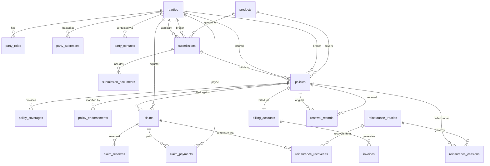
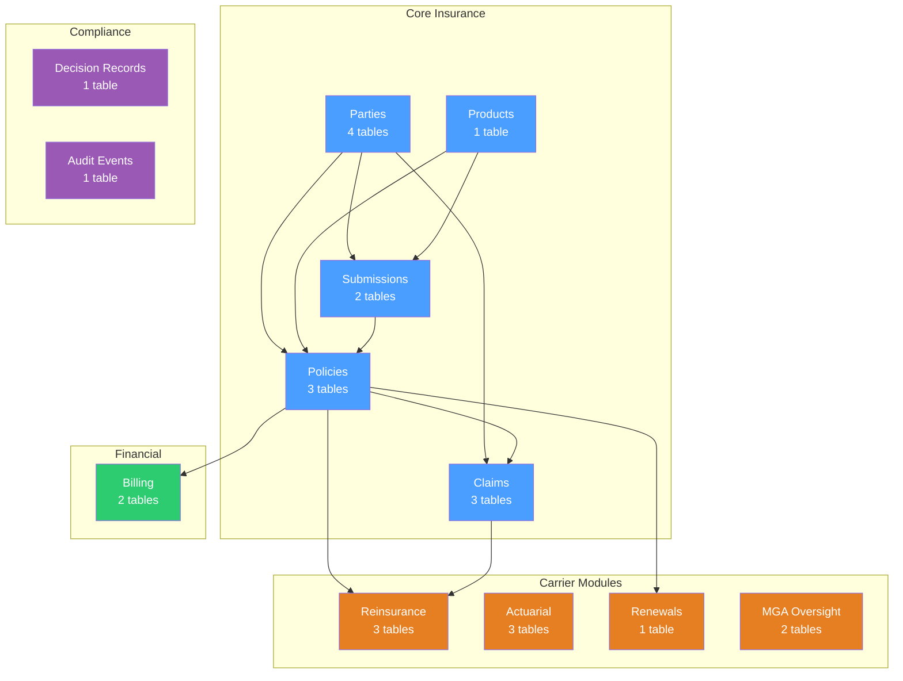
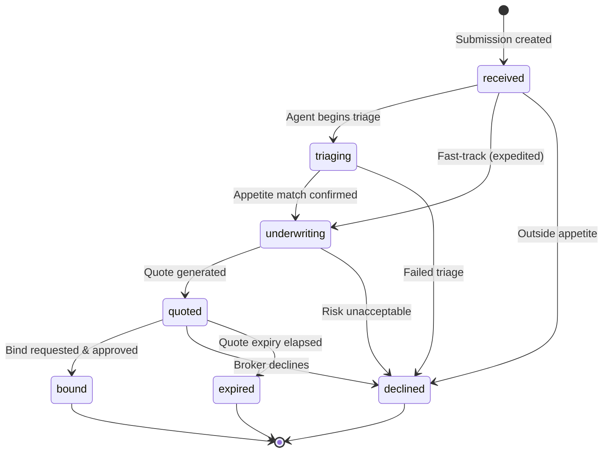
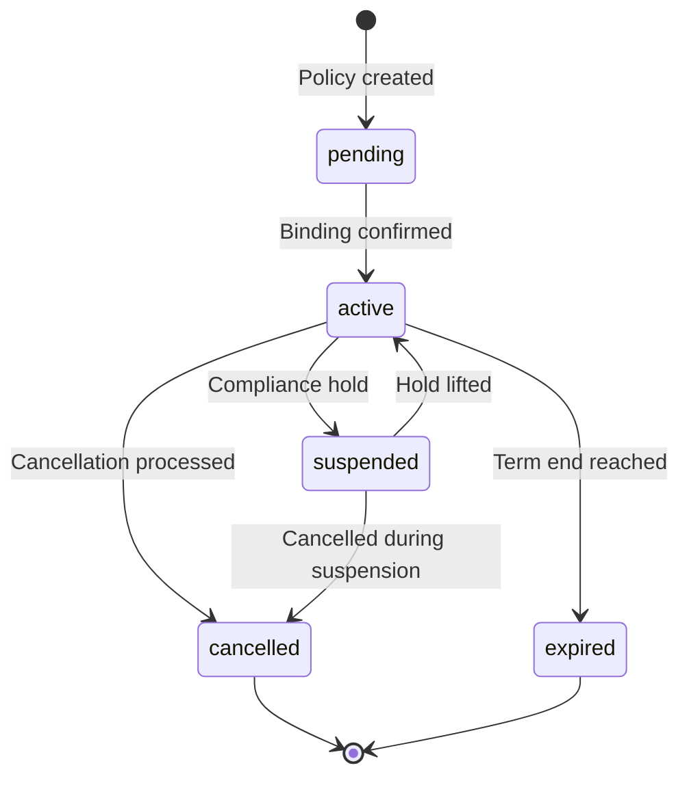
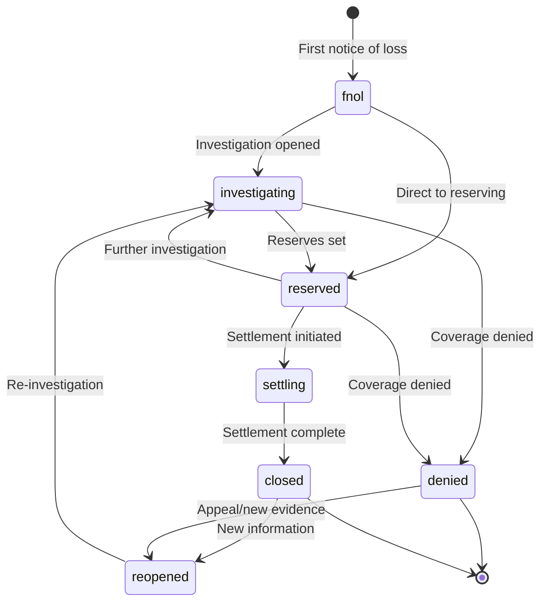
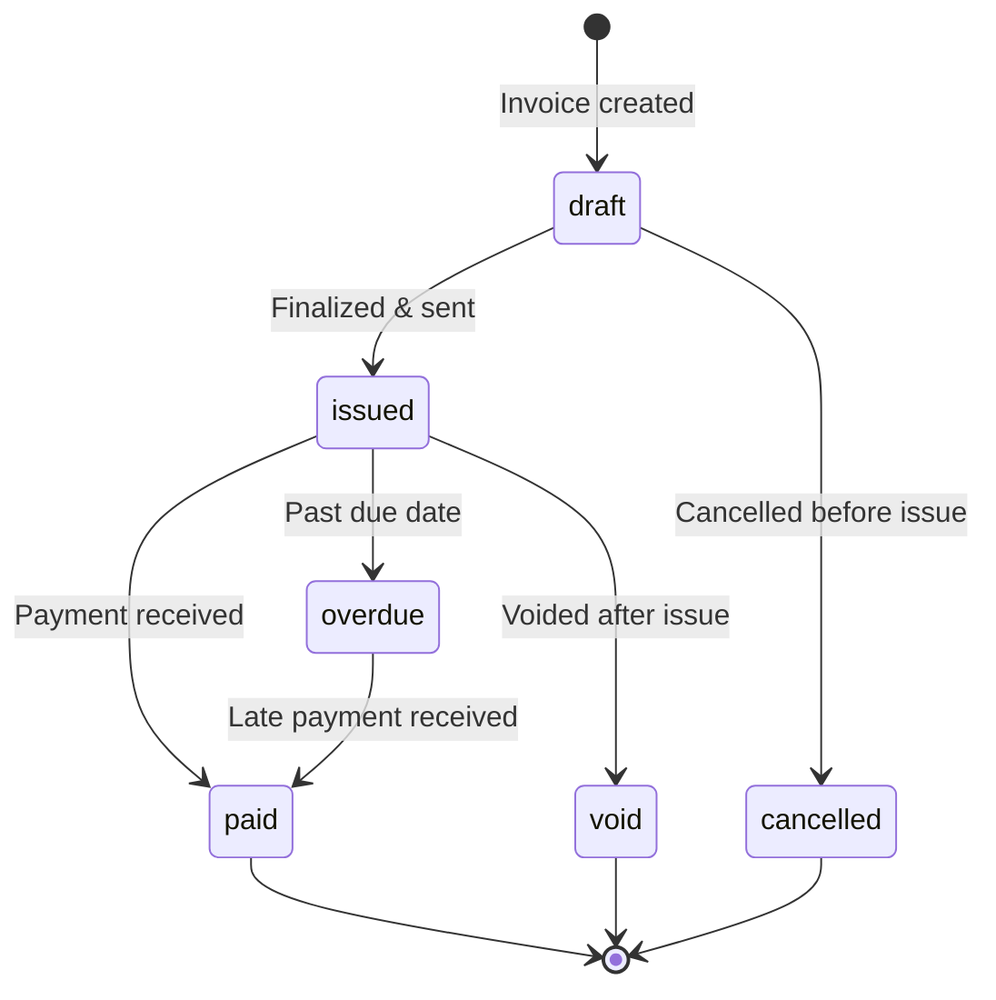
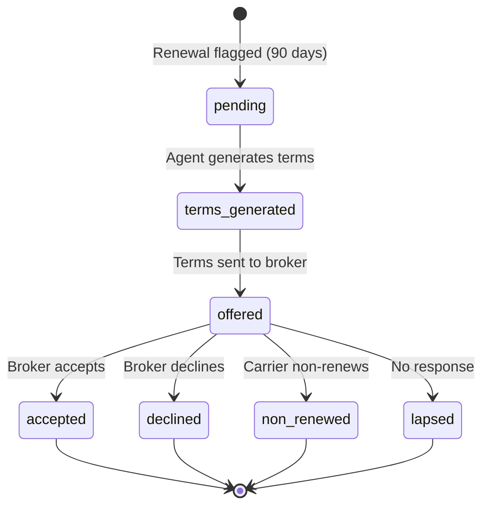
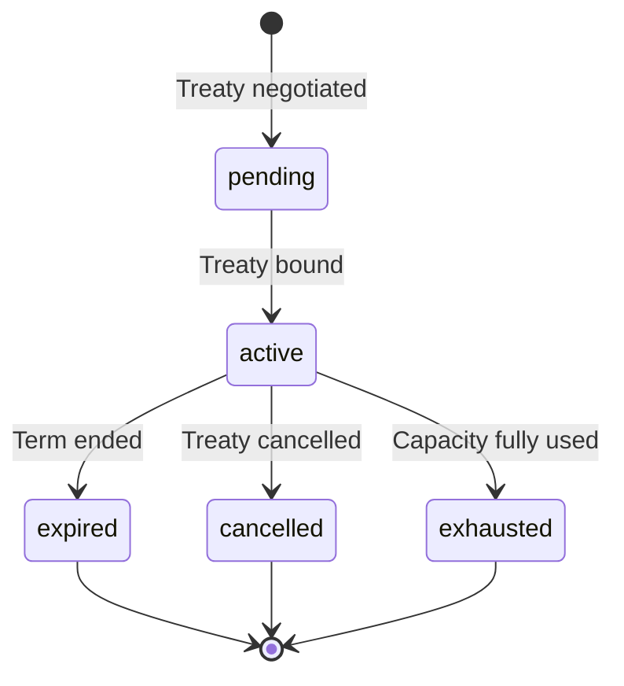

# OpenInsure Data Model

> Complete entity-relationship documentation for the OpenInsure platform.
> Covers all 26 tables across 3 SQL migrations, domain models, state machines, and integration points.

---

## Table of Contents

- [Entity Relationship Overview](#entity-relationship-overview)
- [Core Entities](#core-entities)
  - [Parties Module](#parties-module)
  - [Products](#products)
  - [Submissions](#submissions)
  - [Policies](#policies)
  - [Claims](#claims)
- [Financial Entities](#financial-entities)
  - [Billing & Invoicing](#billing--invoicing)
- [Carrier Modules](#carrier-modules)
  - [Reinsurance](#reinsurance)
  - [Actuarial](#actuarial)
  - [Renewals](#renewals)
  - [MGA Oversight](#mga-oversight)
- [Compliance & Audit](#compliance--audit)
- [State Machines](#state-machines)
  - [Submission Lifecycle](#submission-lifecycle)
  - [Policy Lifecycle](#policy-lifecycle)
  - [Claim Lifecycle](#claim-lifecycle)
  - [Invoice Lifecycle](#invoice-lifecycle)
  - [Renewal Lifecycle](#renewal-lifecycle)
  - [Reinsurance Treaty Lifecycle](#reinsurance-treaty-lifecycle)
- [Domain Value Types](#domain-value-types)

---

## Entity Relationship Overview

### Full System ERD

### Module Organization

---

## Core Entities

### Parties Module

The Parties module provides a unified model for all actors in the system — insureds, brokers, adjusters, vendors, and claimants.

#### `parties`

| Column | Type | Description |
|--------|------|-------------|
| `id` | UUID | Primary key |
| `name` | NVARCHAR(500) | Full name (individual or organization) |
| `party_type` | NVARCHAR(50) | `individual` · `organization` |
| `tax_id` | NVARCHAR(50) | Tax identification number |
| `registration_number` | NVARCHAR(100) | Business registration number |
| `created_at` | DATETIME2 | Record creation timestamp |
| `updated_at` | DATETIME2 | Last update timestamp |

#### `party_roles`

Maps parties to their roles in the system. A party can hold multiple roles simultaneously (e.g., an organization can be both an insured and a broker).

| Column | Type | Description |
|--------|------|-------------|
| `party_id` | UUID | FK → `parties.id` |
| `role` | NVARCHAR(50) | `insured` · `broker` · `agent` · `claimant` · `vendor` · `adjuster` |

**Primary Key:** (`party_id`, `role`)

#### `party_addresses`

| Column | Type | Description |
|--------|------|-------------|
| `id` | UUID | Primary key |
| `party_id` | UUID | FK → `parties.id` |
| `address_type` | NVARCHAR(50) | `mailing` · `physical` · `billing` |
| `street` | NVARCHAR(500) | Street address |
| `city` | NVARCHAR(200) | City |
| `state` | NVARCHAR(100) | State/province |
| `zip_code` | NVARCHAR(20) | Postal code |
| `country` | NVARCHAR(100) | Country (default: `US`) |

#### `party_contacts`

| Column | Type | Description |
|--------|------|-------------|
| `id` | UUID | Primary key |
| `party_id` | UUID | FK → `parties.id` |
| `contact_type` | NVARCHAR(50) | `primary` · `billing` · `claims` |
| `name` | NVARCHAR(500) | Contact name |
| `email` | NVARCHAR(500) | Email address |
| `phone` | NVARCHAR(50) | Phone number |

---

### Products

#### `products`

Defines insurance product templates with rating rules and coverage configurations.

| Column | Type | Description |
|--------|------|-------------|
| `id` | UUID | Primary key |
| `product_code` | NVARCHAR(50) | Unique product identifier (e.g., `CYBER-SMB-001`) |
| `product_name` | NVARCHAR(500) | Human-readable name |
| `description` | NVARCHAR(MAX) | Full description |
| `line_of_business` | NVARCHAR(50) | LOB classification (e.g., `cyber`) |
| `status` | NVARCHAR(50) | `draft` · `active` · `filed` · `suspended` · `retired` |
| `version` | INT | Version number |
| `min_premium` | DECIMAL(18,2) | Floor premium (e.g., $2,500) |
| `max_premium` | DECIMAL(18,2) | Ceiling premium (e.g., $500,000) |
| `effective_date` | DATE | Product availability start |
| `expiration_date` | DATE | Product availability end |
| `config_json` | NVARCHAR(MAX) | Full product configuration (coverages, rating factors, exclusions) |
| `created_at` | DATETIME2 | Record creation timestamp |
| `updated_at` | DATETIME2 | Last update timestamp |

**Indexes:** `status`, `line_of_business`

---

### Submissions

#### `submissions`

The central intake entity — every new business opportunity begins as a submission.

| Column | Type | Description |
|--------|------|-------------|
| `id` | UUID | Primary key |
| `submission_number` | NVARCHAR(50) | Unique business identifier |
| `status` | NVARCHAR(50) | See [Submission Lifecycle](#submission-lifecycle) |
| `channel` | NVARCHAR(50) | `email` · `api` · `portal` · `broker_platform` |
| `line_of_business` | NVARCHAR(50) | LOB classification |
| `applicant_id` | UUID | FK → `parties.id` (the insured) |
| `broker_id` | UUID | FK → `parties.id` (producing broker) |
| `product_id` | UUID | FK → `products.id` |
| `requested_effective_date` | DATE | Desired coverage start |
| `requested_expiration_date` | DATE | Desired coverage end |
| `extracted_data` | NVARCHAR(MAX) | JSON: structured data extracted from documents |
| `cyber_risk_data` | NVARCHAR(MAX) | JSON: cyber-specific risk factors |
| `triage_result` | NVARCHAR(MAX) | JSON: appetite match, risk score, priority, routing |
| `quoted_premium` | DECIMAL(18,2) | Final quoted premium amount |
| `received_at` | DATETIME2 | When submission was received |
| `triaged_at` | DATETIME2 | When triage completed |
| `quoted_at` | DATETIME2 | When quote was generated |
| `bound_at` | DATETIME2 | When policy was bound |
| `declined_at` | DATETIME2 | When submission was declined |

**Indexes:** `status`, `line_of_business`

**Cyber Risk Data Structure:**

| Field | Type | Description |
|-------|------|-------------|
| `annual_revenue` | Decimal | Annual revenue ($500K–$50M) |
| `employee_count` | int | Number of employees |
| `industry_sic_code` | str | SIC code for industry classification |
| `security_maturity_score` | float | 0–10 score |
| `has_mfa` | bool | Multi-factor authentication enabled |
| `has_endpoint_protection` | bool | EDR/antivirus deployed |
| `has_backup_strategy` | bool | Regular backups with offline copy |
| `has_incident_response_plan` | bool | Documented IR plan |
| `prior_incidents` | int | Number of prior cyber incidents |
| `prior_breach_costs` | Decimal | Total prior breach costs |
| `tech_stack` | list | Technologies in use |

#### `submission_documents`

| Column | Type | Description |
|--------|------|-------------|
| `id` | UUID | Primary key |
| `submission_id` | UUID | FK → `submissions.id` |
| `document_type` | NVARCHAR(100) | `acord_application` · `loss_run` · `financial_statement` · `supplemental` · `sov` · `prior_policy` |
| `filename` | NVARCHAR(500) | Original filename |
| `storage_url` | NVARCHAR(2000) | Azure Blob Storage URL |
| `extracted_data` | NVARCHAR(MAX) | JSON: data extracted via Document Intelligence |
| `classification_confidence` | FLOAT | AI classification confidence (0.0–1.0) |
| `uploaded_at` | DATETIME2 | Upload timestamp |

---

### Policies

#### `policies`

Active insurance contracts created when a submission is bound.

| Column | Type | Description |
|--------|------|-------------|
| `id` | UUID | Primary key |
| `policy_number` | NVARCHAR(50) | Unique policy identifier |
| `status` | NVARCHAR(50) | See [Policy Lifecycle](#policy-lifecycle) |
| `product_id` | UUID | FK → `products.id` |
| `submission_id` | UUID | FK → `submissions.id` |
| `insured_id` | UUID | FK → `parties.id` |
| `broker_id` | UUID | FK → `parties.id` |
| `effective_date` | DATE | Coverage start date |
| `expiration_date` | DATE | Coverage end date |
| `total_premium` | DECIMAL(18,2) | Full annual premium |
| `written_premium` | DECIMAL(18,2) | Booked written premium |
| `earned_premium` | DECIMAL(18,2) | Earned portion (pro-rata) |
| `unearned_premium` | DECIMAL(18,2) | Unearned portion |
| `bound_at` | DATETIME2 | Binding timestamp |
| `cancelled_at` | DATETIME2 | Cancellation timestamp |
| `cancel_reason` | NVARCHAR(500) | Reason for cancellation |

**Indexes:** `status`, `insured_id`

#### `policy_coverages`

Individual coverage parts within a policy.

| Column | Type | Description |
|--------|------|-------------|
| `id` | UUID | Primary key |
| `policy_id` | UUID | FK → `policies.id` |
| `coverage_code` | NVARCHAR(50) | Coverage identifier |
| `coverage_name` | NVARCHAR(500) | Human-readable name |
| `limit_amount` | DECIMAL(18,2) | Per-occurrence limit |
| `deductible` | DECIMAL(18,2) | Per-occurrence deductible |
| `premium` | DECIMAL(18,2) | Coverage premium |
| `sublimits` | NVARCHAR(MAX) | JSON: sub-limit breakdown |

**Cyber Liability SMB Coverages:**

| Coverage | Default Limit | Default Deductible | Limit Range |
|----------|--------------|-------------------|-------------|
| First-Party Breach Response | $1,000,000 | $10,000 | $100K–$5M |
| Third-Party Liability | $1,000,000 | $25,000 | $250K–$10M |
| Regulatory Defense & Penalties | $500,000 | $10,000 | $100K–$2M |
| Business Interruption | $500,000 | $25,000 | $50K–$2M |
| Ransomware & Extortion | $500,000 | $10,000 | $100K–$2M |

#### `policy_endorsements`

Mid-term modifications to policy coverage.

| Column | Type | Description |
|--------|------|-------------|
| `id` | UUID | Primary key |
| `policy_id` | UUID | FK → `policies.id` |
| `endorsement_number` | NVARCHAR(50) | Endorsement identifier |
| `effective_date` | DATE | Endorsement effective date |
| `description` | NVARCHAR(MAX) | Description of change |
| `premium_change` | DECIMAL(18,2) | Premium adjustment (positive or negative) |
| `coverages_modified` | NVARCHAR(MAX) | JSON: list of modified coverage codes |

**Premium Adjustment Rules:**

| Change Type | Adjustment |
|-------------|-----------|
| Increase limit | +15% of coverage premium |
| Decrease limit | −10% of coverage premium |
| Add coverage | +20% of coverage premium |
| Remove coverage | −15% of coverage premium |

---

### Claims

#### `claims`

Insurance claims filed against active policies.

| Column | Type | Description |
|--------|------|-------------|
| `id` | UUID | Primary key |
| `claim_number` | NVARCHAR(50) | Unique claim identifier |
| `status` | NVARCHAR(50) | See [Claim Lifecycle](#claim-lifecycle) |
| `policy_id` | UUID | FK → `policies.id` |
| `loss_date` | DATE | Date of loss |
| `report_date` | DATE | Date loss was reported |
| `loss_type` | NVARCHAR(100) | Type of loss |
| `cause_of_loss` | NVARCHAR(100) | `data_breach` · `ransomware` · `social_engineering` · `system_failure` · `unauthorized_access` · `denial_of_service` · `other` |
| `description` | NVARCHAR(MAX) | Full loss description |
| `severity` | NVARCHAR(50) | `simple` · `moderate` · `complex` · `catastrophe` |
| `assigned_adjuster` | UUID | FK → `parties.id` |
| `fraud_score` | FLOAT | AI fraud assessment (0.0–1.0) |
| `closed_at` | DATETIME2 | Closure timestamp |
| `close_reason` | NVARCHAR(500) | Reason for closure |

**Indexes:** `status`, `policy_id`

#### `claim_reserves`

Financial reserves set against open claims.

| Column | Type | Description |
|--------|------|-------------|
| `id` | UUID | Primary key |
| `claim_id` | UUID | FK → `claims.id` |
| `reserve_type` | NVARCHAR(50) | `indemnity` · `expense` |
| `amount` | DECIMAL(18,2) | Reserve amount |
| `set_date` | DATETIME2 | Date reserve was set |
| `set_by` | NVARCHAR(200) | Who set the reserve (agent or human) |
| `confidence` | FLOAT | AI confidence in reserve (0.0–1.0) |

#### `claim_payments`

Payments made on claims.

| Column | Type | Description |
|--------|------|-------------|
| `id` | UUID | Primary key |
| `claim_id` | UUID | FK → `claims.id` |
| `amount` | DECIMAL(18,2) | Payment amount |
| `payee_id` | UUID | FK → `parties.id` |
| `payment_date` | DATETIME2 | Date payment was made |
| `payment_type` | NVARCHAR(50) | `indemnity` · `expense` · `deductible_recovery` |

---

## Financial Entities

### Billing & Invoicing

#### `billing_accounts`

One-to-one link between a policy and its billing configuration.

| Column | Type | Description |
|--------|------|-------------|
| `id` | UUID | Primary key |
| `policy_id` | UUID | FK → `policies.id` |
| `billing_plan` | NVARCHAR(50) | `full_pay` · `quarterly` · `monthly` · `agency_bill` · `direct_bill` |
| `total_premium` | DECIMAL(18,2) | Total premium owed |
| `balance_due` | DECIMAL(18,2) | Outstanding balance |

#### `invoices`

Individual billing invoices generated from billing accounts.

| Column | Type | Description |
|--------|------|-------------|
| `id` | UUID | Primary key |
| `invoice_number` | NVARCHAR(50) | Unique invoice identifier |
| `billing_account_id` | UUID | FK → `billing_accounts.id` |
| `status` | NVARCHAR(50) | See [Invoice Lifecycle](#invoice-lifecycle) |
| `issue_date` | DATE | Date invoice was issued |
| `due_date` | DATE | Payment due date |
| `amount` | DECIMAL(18,2) | Total invoice amount |
| `paid_amount` | DECIMAL(18,2) | Amount paid so far |
| `line_items` | NVARCHAR(MAX) | JSON: itemized charges |

---

## Carrier Modules

> These tables are used in carrier deployments only. MGA deployments may omit them.

### Reinsurance

#### `reinsurance_treaties`

| Column | Type | Description |
|--------|------|-------------|
| `id` | UUID | Primary key |
| `treaty_number` | NVARCHAR(50) | Unique treaty identifier |
| `treaty_type` | NVARCHAR(50) | `quota_share` · `excess_of_loss` · `surplus` · `facultative` |
| `reinsurer_name` | NVARCHAR(500) | Name of reinsurer |
| `status` | NVARCHAR(50) | `active` · `expired` · `cancelled` · `pending` · `exhausted` |
| `effective_date` | DATE | Treaty start |
| `expiration_date` | DATE | Treaty end |
| `lines_of_business` | NVARCHAR(MAX) | JSON: covered LOBs |
| `retention` | DECIMAL(18,2) | Cedent retention amount |
| `treaty_limit` | DECIMAL(18,2) | Maximum treaty limit |
| `rate` | DECIMAL(10,6) | Cession rate |
| `capacity_total` | DECIMAL(18,2) | Total treaty capacity |
| `capacity_used` | DECIMAL(18,2) | Used capacity |
| `reinstatements` | INT | Number of reinstatements |

**Indexes:** `status`, `reinsurer_name`

#### `reinsurance_cessions`

| Column | Type | Description |
|--------|------|-------------|
| `id` | UUID | Primary key |
| `treaty_id` | UUID | FK → `reinsurance_treaties.id` |
| `policy_id` | UUID | FK → `policies.id` |
| `policy_number` | NVARCHAR(50) | Denormalized policy number |
| `ceded_premium` | DECIMAL(18,2) | Premium ceded to reinsurer |
| `ceded_limit` | DECIMAL(18,2) | Limit ceded |
| `cession_date` | DATE | Date of cession |

**Indexes:** `treaty_id`, `policy_id`

#### `reinsurance_recoveries`

| Column | Type | Description |
|--------|------|-------------|
| `id` | UUID | Primary key |
| `treaty_id` | UUID | FK → `reinsurance_treaties.id` |
| `claim_id` | UUID | FK → `claims.id` |
| `claim_number` | NVARCHAR(50) | Denormalized claim number |
| `recovery_amount` | DECIMAL(18,2) | Amount recovered |
| `recovery_date` | DATE | Date of recovery |
| `status` | NVARCHAR(50) | `pending` · `submitted` · `collected` · `disputed` |

**Indexes:** `treaty_id`, `claim_id`

### Actuarial

#### `actuarial_reserves`

| Column | Type | Description |
|--------|------|-------------|
| `id` | UUID | Primary key |
| `line_of_business` | NVARCHAR(50) | LOB classification |
| `accident_year` | INT | Accident/underwriting year |
| `reserve_type` | NVARCHAR(50) | `case` · `ibnr` · `bulk` |
| `carried_amount` | DECIMAL(18,2) | Currently carried reserve |
| `indicated_amount` | DECIMAL(18,2) | Actuarially indicated reserve |
| `selected_amount` | DECIMAL(18,2) | Selected reserve after review |
| `as_of_date` | DATE | Valuation date |
| `analyst` | NVARCHAR(200) | Preparing analyst |
| `approved_by` | NVARCHAR(200) | Approving actuary |
| `notes` | NVARCHAR(MAX) | Analyst notes |

**Indexes:** `line_of_business`

#### `loss_triangle_entries`

| Column | Type | Description |
|--------|------|-------------|
| `id` | UUID | Primary key |
| `line_of_business` | NVARCHAR(50) | LOB classification |
| `accident_year` | INT | Accident year |
| `development_month` | INT | Development period (months) |
| `incurred_amount` | DECIMAL(18,2) | Cumulative incurred losses |
| `paid_amount` | DECIMAL(18,2) | Cumulative paid losses |
| `case_reserve` | DECIMAL(18,2) | Outstanding case reserves |
| `claim_count` | INT | Number of claims |

**Unique constraint:** (`line_of_business`, `accident_year`, `development_month`)

#### `rate_adequacy`

| Column | Type | Description |
|--------|------|-------------|
| `id` | UUID | Primary key |
| `line_of_business` | NVARCHAR(50) | LOB classification |
| `segment` | NVARCHAR(100) | Rating segment |
| `current_rate` | DECIMAL(10,4) | Current filed rate |
| `indicated_rate` | DECIMAL(10,4) | Actuarially indicated rate |
| `adequacy_ratio` | DECIMAL(10,4) | Current ÷ indicated |
| `as_of_date` | DATE | Analysis date |

**Unique constraint:** (`line_of_business`, `segment`)

### Renewals

#### `renewal_records`

| Column | Type | Description |
|--------|------|-------------|
| `id` | UUID | Primary key |
| `original_policy_id` | UUID | FK → `policies.id` (expiring policy) |
| `renewal_policy_id` | UUID | FK → `policies.id` (new policy, if accepted) |
| `status` | NVARCHAR(50) | See [Renewal Lifecycle](#renewal-lifecycle) |
| `expiring_premium` | DECIMAL(18,2) | Current policy premium |
| `renewal_premium` | DECIMAL(18,2) | Proposed renewal premium |
| `rate_change_pct` | DECIMAL(6,2) | Percentage rate change |
| `recommendation` | NVARCHAR(100) | Agent recommendation (e.g., `review_required`) |
| `conditions` | NVARCHAR(MAX) | JSON: renewal conditions |
| `generated_by` | NVARCHAR(50) | `system` · `agent` · `human` |

**Indexes:** `original_policy_id`, `status`

**Renewal Pricing Factor (based on claims history):**

| Claims History | Factor | Rate Change |
|---------------|--------|------------|
| No claims | 0.95× | −5% discount |
| 1 claim or <$25K incurred | 1.05× | +5% |
| 1–2 claims or $25K–$100K incurred | 1.10× | +10% |
| 2+ claims or $100K–$500K incurred | 1.20× | +20% |
| 3+ claims or >$500K incurred | 1.35× | +35% |

### MGA Oversight

#### `mga_authorities`

| Column | Type | Description |
|--------|------|-------------|
| `id` | UUID | Primary key |
| `mga_id` | NVARCHAR(50) | Unique MGA identifier |
| `mga_name` | NVARCHAR(500) | MGA name |
| `status` | NVARCHAR(50) | `active` · `suspended` · `expired` · `terminated` |
| `effective_date` | DATE | Authority start |
| `expiration_date` | DATE | Authority end |
| `lines_of_business` | NVARCHAR(MAX) | JSON: authorized LOBs |
| `premium_authority` | DECIMAL(18,2) | Max premium per policy |
| `premium_written` | DECIMAL(18,2) | Premium written to date |
| `claims_authority` | DECIMAL(18,2) | Max claims settlement |
| `loss_ratio` | DECIMAL(6,4) | Current loss ratio |
| `compliance_score` | INT | Compliance rating |
| `last_audit_date` | DATE | Most recent audit |

**Indexes:** `status`

#### `mga_bordereaux`

| Column | Type | Description |
|--------|------|-------------|
| `id` | UUID | Primary key |
| `mga_id` | NVARCHAR(50) | MGA identifier |
| `period` | NVARCHAR(50) | Reporting period |
| `premium_reported` | DECIMAL(18,2) | Premium in period |
| `claims_reported` | DECIMAL(18,2) | Claims in period |
| `loss_ratio` | DECIMAL(6,4) | Period loss ratio |
| `policy_count` | INT | Policies in period |
| `claim_count` | INT | Claims in period |
| `status` | NVARCHAR(50) | `pending` · `validated` · `exceptions` · `rejected` |
| `exceptions` | NVARCHAR(MAX) | JSON: validation exceptions |
| `submitted_at` | DATETIME2 | Submission timestamp |
| `validated_at` | DATETIME2 | Validation timestamp |

**Indexes:** `mga_id`

---

## Compliance & Audit

### `decision_records`

Every AI agent decision produces an immutable decision record for EU AI Act (Art. 12) compliance.

| Column | Type | Description |
|--------|------|-------------|
| `id` | UUID | Primary key |
| `agent_id` | NVARCHAR(100) | Agent identifier (e.g., `underwriting_agent`) |
| `agent_version` | NVARCHAR(50) | Agent version (e.g., `0.1.0`) |
| `model_used` | NVARCHAR(100) | AI model identifier |
| `model_version` | NVARCHAR(50) | Model version |
| `decision_type` | NVARCHAR(100) | Type of decision made |
| `input_summary` | NVARCHAR(MAX) | JSON: summarized input data |
| `data_sources_used` | NVARCHAR(MAX) | JSON: data sources consulted |
| `knowledge_graph_queries` | NVARCHAR(MAX) | JSON: Cosmos DB queries executed |
| `output_data` | NVARCHAR(MAX) | JSON: complete output |
| `reasoning` | NVARCHAR(MAX) | JSON: chain-of-thought reasoning |
| `confidence` | FLOAT | Confidence score (0.0–1.0) |
| `fairness_metrics` | NVARCHAR(MAX) | JSON: bias/fairness measurements |
| `human_oversight` | NVARCHAR(MAX) | JSON: human review actions |
| `execution_time_ms` | INT | Execution duration |
| `error_message` | NVARCHAR(MAX) | Error details (if failed) |
| `created_at` | DATETIME2 | Decision timestamp |

**Indexes:** `agent_id`, `decision_type`, `created_at`

### `audit_events`

System-wide audit trail for all actions.

| Column | Type | Description |
|--------|------|-------------|
| `id` | UUID | Primary key |
| `event_type` | NVARCHAR(100) | Event classification |
| `actor_type` | NVARCHAR(50) | `agent` · `human` · `system` |
| `actor_id` | NVARCHAR(100) | Who performed the action |
| `resource_type` | NVARCHAR(100) | Entity type affected |
| `resource_id` | NVARCHAR(100) | Entity ID affected |
| `action` | NVARCHAR(100) | Action performed |
| `details` | NVARCHAR(MAX) | JSON: action details |
| `correlation_id` | NVARCHAR(100) | Request correlation ID |
| `created_at` | DATETIME2 | Event timestamp |

**Indexes:** (`resource_type`, `resource_id`), `created_at`

---

## State Machines

All state transitions are enforced by `src/openinsure/domain/state_machine.py`. Invalid transitions raise a `ValueError`.

### Submission Lifecycle

| Status | Description | Next States |
|--------|-------------|-------------|
| `received` | New submission arrived | `triaging`, `underwriting`, `declined` |
| `triaging` | AI agent evaluating appetite & risk | `underwriting`, `declined` |
| `underwriting` | Full risk assessment & pricing | `quoted`, `declined` |
| `quoted` | Quote presented to broker | `bound`, `declined`, `expired` |
| `bound` | Policy issued *(terminal)* | — |
| `declined` | Submission rejected *(terminal)* | — |
| `expired` | Quote expired *(terminal)* | — |

### Policy Lifecycle

| Status | Description | Next States |
|--------|-------------|-------------|
| `pending` | Awaiting binding confirmation | `active` |
| `active` | In-force policy | `cancelled`, `expired`, `suspended` |
| `suspended` | Temporarily held | `active`, `cancelled` |
| `cancelled` | Policy cancelled *(terminal)* | — |
| `expired` | Term ended *(terminal)* | — |

### Claim Lifecycle

| Status | Description | Next States |
|--------|-------------|-------------|
| `fnol` | First notice of loss received | `investigating`, `reserved` |
| `investigating` | Under investigation | `reserved`, `denied` |
| `reserved` | Financial reserves set | `settling`, `investigating`, `denied` |
| `settling` | Settlement in progress | `closed` |
| `closed` | Claim closed | `reopened` |
| `reopened` | Claim reopened | `investigating` |
| `denied` | Claim denied | `reopened` |

### Invoice Lifecycle

### Renewal Lifecycle

### Reinsurance Treaty Lifecycle

---

## Domain Value Types

Defined in `src/openinsure/domain/common.py`:

| Type | Python Type | Constraints | Usage |
|------|-------------|-------------|-------|
| `Money` | `Decimal` | ≥ 0, 2 decimal places | All monetary values (premiums, reserves, payments) |
| `Percentage` | `Decimal` | 0–100, 4 decimal places | Rate changes, loss ratios |
| `Score` | `float` | 0.0–10.0 | Risk scores, security maturity |
| `ConfidenceScore` | `float` | 0.0–1.0 | AI confidence, fraud scores |
| `DomainEntity` | `BaseModel` | `id: UUID`, `created_at`, `updated_at` | Base class for all entities |

> **Design rule:** All monetary values use `Decimal` (never `float`) to avoid floating-point precision errors. All entity IDs are UUIDs. All timestamps are UTC ISO 8601.
