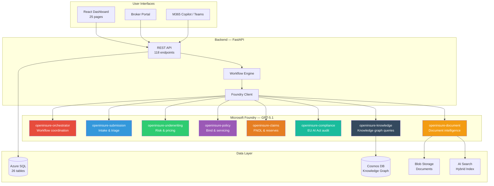
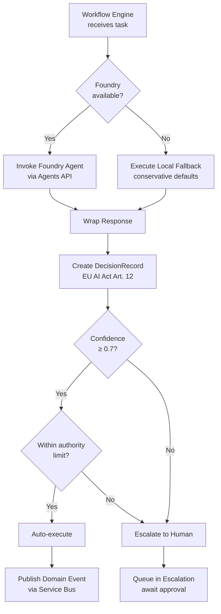
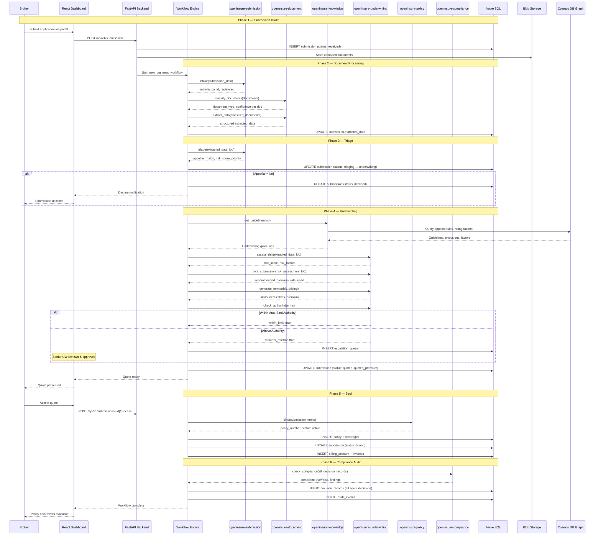
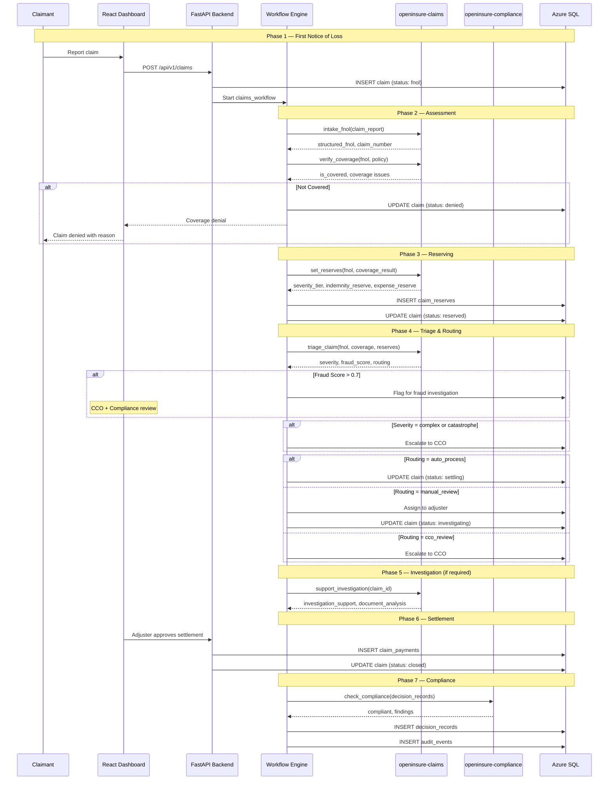
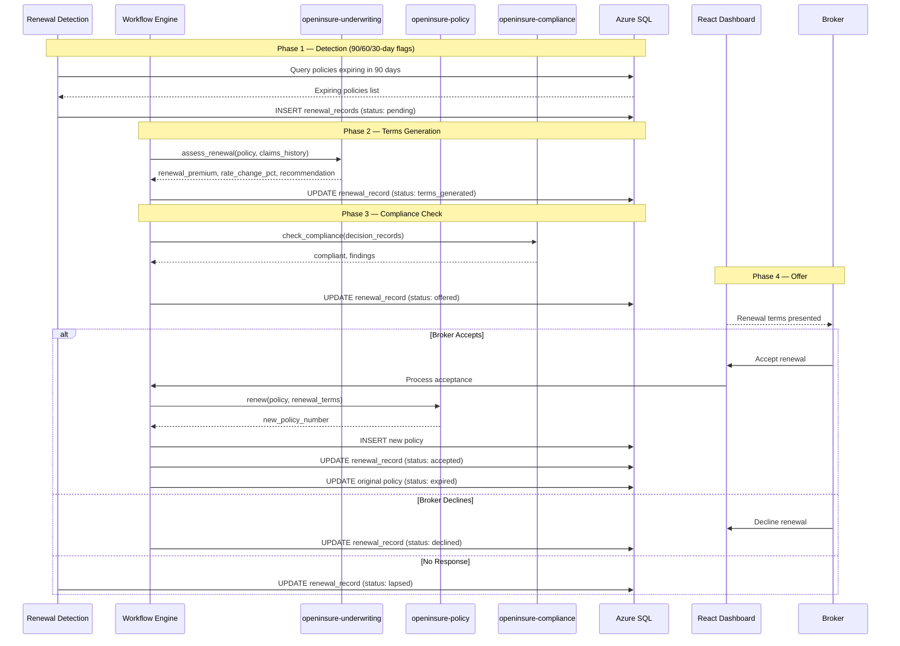
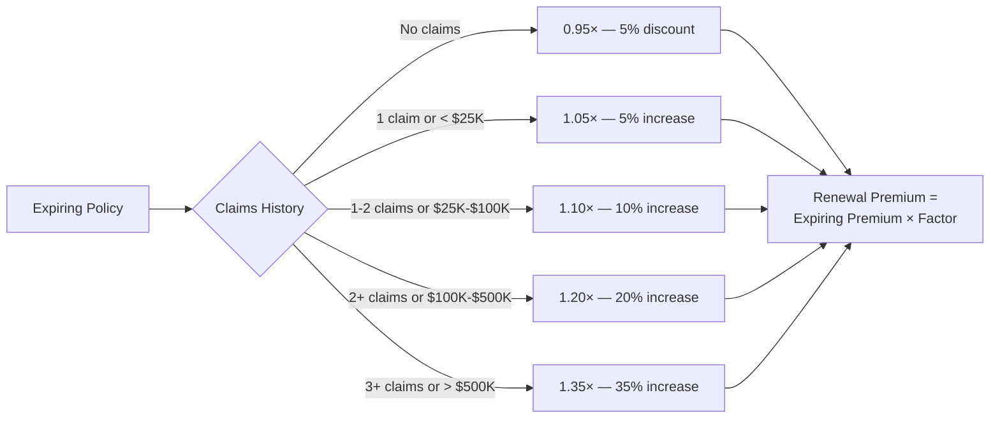
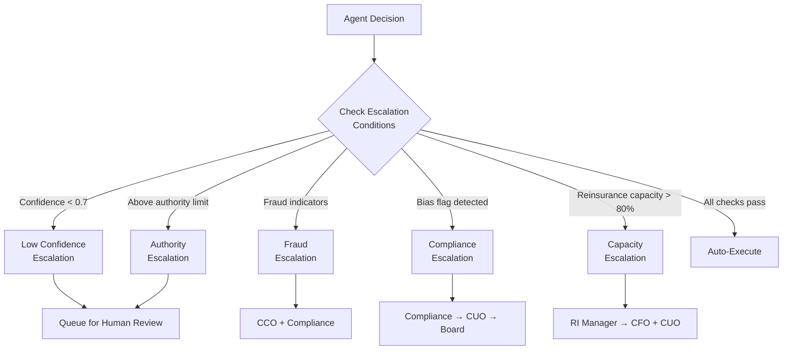
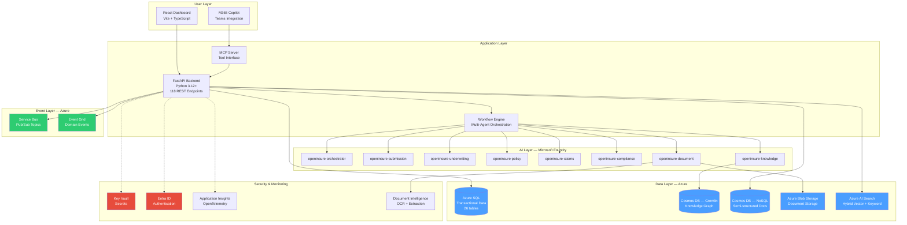
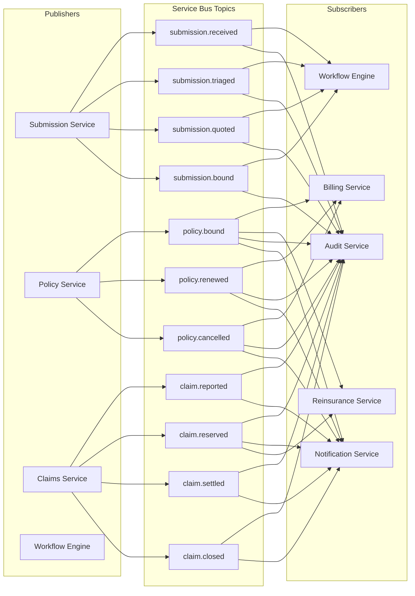

# OpenInsure Process Flows

> End-to-end workflow documentation for the OpenInsure platform.
> Covers agent architecture, insurance processes, role-based access, integration architecture, and escalation rules.

---

## Table of Contents

- [Agent Architecture](#agent-architecture)
  - [Agent Overview](#agent-overview)
  - [Agent Authority Limits](#agent-authority-limits)
  - [Agent Execution Model](#agent-execution-model)
- [New Business Workflow](#new-business-workflow)
- [Claims Workflow](#claims-workflow)
- [Renewal Workflow](#renewal-workflow)
- [Escalation Framework](#escalation-framework)
- [Role-Based Access Control](#role-based-access-control)
  - [Navigation Access Matrix](#navigation-access-matrix)
  - [Authority Matrix](#authority-matrix)
- [Integration Architecture](#integration-architecture)

---

## Agent Architecture

### Agent Overview

OpenInsure uses eight AI agents deployed on Microsoft Foundry (GPT-5.1), orchestrated by a workflow engine. Every agent decision produces an immutable `DecisionRecord` for EU AI Act compliance.



### Agent Authority Limits

Each agent has a configured authority limit. Actions above this threshold trigger escalation to a human approver.

| Agent | Authority Limit | Auto-Execute | Escalation Threshold | Key Capabilities |
|-------|----------------|--------------|---------------------|------------------|
| **Submission Agent** | $0 (recommend only) | No | 0.7 confidence | Intake, classify documents, extract data, validate, triage |
| **Underwriting Agent** | $1,000,000 | Yes (within limit) | 0.7 confidence | Risk assessment, pricing, terms generation, authority check, quote |
| **Claims Agent** | $250,000 | Yes (within limit) | 0.7 confidence | FNOL intake, coverage verification, reserves, triage, investigation support |
| **Policy Agent** | $5,000,000 | Yes (within limit) | 0.7 confidence | Bind, endorse, renew, cancel |
| **Compliance Agent** | $0 (audit only) | No | 0.7 confidence | Compliance check, audit report, bias monitoring, EU AI Act documentation |
| **Document Agent** | $0 (no authority) | No | 0.7 confidence | Classify, extract, generate documents |
| **Knowledge Agent** | — | — | — | Guidelines, knowledge queries, regulatory rules, product definitions |
| **Orchestrator** | — | — | — | Coordinate multi-agent workflows |

> **Escalation trigger:** When any agent's confidence score falls below **0.7**, the workflow is escalated to a human for review.

### Agent Execution Model



**Local Fallback Behavior:** When Foundry is unavailable, agents return conservative defaults:
- Submission Agent: `ai_mode: "local_fallback"`, manual triage required
- Underwriting Agent: `requires_referral: true`, all-zero pricing
- Claims Agent: `is_covered: false`, unknown severity
- Compliance Agent: `compliant: false`, manual review required

---

## New Business Workflow

### End-to-End Sequence



### Step-by-Step Detail

| Step | Agent | Action | Data Stored | User Sees |
|------|-------|--------|-------------|-----------|
| 1. Submit | — | Broker submits via portal or API | `submissions` row (status: `received`), documents in Blob | Confirmation with submission number |
| 2. Classify docs | Document Agent | Classify each uploaded document | `submission_documents` rows with type & confidence | Document types listed |
| 3. Extract data | Document Agent | Extract structured data from documents | `submissions.extracted_data` updated | Extracted fields shown |
| 4. Triage | Submission Agent | Evaluate appetite, score risk, set priority | `submissions.triage_result`, status → `triaging` | Risk score, appetite match |
| 5. Guidelines | Knowledge Agent | Fetch UW guidelines from knowledge graph | — (in-memory) | — |
| 6. Risk assessment | Underwriting Agent | Multi-factor risk assessment | — (in workflow context) | Risk factors displayed |
| 7. Pricing | Underwriting Agent | Calculate premium (base rate $1.50/$1K revenue) | `submissions.quoted_premium` | Premium breakdown |
| 8. Terms | Underwriting Agent | Generate coverage limits & deductibles | — (in workflow context) | Coverage details |
| 9. Authority check | Underwriting Agent | Verify within auto-bind authority | Escalation if above limit | Referral notice (if needed) |
| 10. Quote | — | Status updated to `quoted` | Status → `quoted` | Quote document ready |
| 11. Bind | Policy Agent | Create policy from bound submission | `policies` + `policy_coverages` rows | Policy number issued |
| 12. Billing | — | Create billing account & invoices | `billing_accounts` + `invoices` rows | Invoice details |
| 13. Compliance | Compliance Agent | Audit all decision records | `decision_records` rows | Compliance status |

### Underwriting Authority Levels

| Level | Max Premium | Max Aggregate Limit | Max Risk Score | Conditions |
|-------|-----------|---------------------|---------------|------------|
| **Auto-bind** (agent) | $25,000 | $2,000,000 | ≤ 5 | No referral triggers |
| **Junior Underwriter** | $100,000 | $5,000,000 | ≤ 7 | Max 1 referral trigger |
| **Senior Underwriter** | $250,000 | $10,000,000 | ≤ 9 | Requires Sr UW sign-off |
| **Committee** | $500,000+ | Unlimited | Any | Committee approval required |

### Referral Triggers

1. Risk score ≥ 8 → Senior UW review
2. Any cyber claim in past 3 years → Request incident report
3. Prior ransomware payment → May require sublimit
4. Revenue > $25M → Capacity review
5. Not PCI DSS compliant (handles card data) → Decline or remediate
6. No MFA for remote access → Decline unless MFA within 60 days
7. Handles PHI → Healthcare specialist review
8. International operations → Territory & regulatory review

---

## Claims Workflow

### End-to-End Sequence



### Severity Tiers & Routing

| Severity | Description | Reserve Range | Routing | Authority |
|----------|-------------|--------------|---------|-----------|
| **Simple** | Straightforward, clear coverage | <$25,000 | Auto-process | Claims Agent |
| **Moderate** | Multiple factors, some ambiguity | $25K–$100K | Adjuster review | Adjuster ($25K limit) |
| **Complex** | Coverage disputes, large exposure | $100K–$500K | CCO review | CCO ($500K limit) |
| **Catastrophe** | Systemic event, multiple claims | >$500K | CCO + CUO | Board approval |

### Fraud Detection Indicators

The Claims Agent evaluates these red flags and produces a fraud score (0.0–1.0):
- Recent policy inception (< 90 days before loss)
- Late reporting (> 30 days after loss)
- Revenue/employee mismatch with claimed damage
- Frequent claims history
- Inconsistent loss descriptions
- Known fraud patterns (ransomware payment demands matching known schemes)

> **Threshold:** Fraud score > 0.7 triggers mandatory CCO + Compliance review.

---

## Renewal Workflow

### End-to-End Sequence



### Renewal Pricing Logic

The renewal factor is calculated based on the expiring policy's claims experience:



---

## Escalation Framework

### Escalation Triggers



### Escalation Matrix

| Trigger | First Escalation | Second Escalation | Emergency |
|---------|-----------------|-------------------|-----------|
| Submission outside appetite | Senior UW | LOB Head / CUO | — |
| Quote above auto-authority | Authority holder | LOB Head / CUO | — |
| Claim with fraud indicators | CCO | CUO + Compliance | — |
| Claim above settlement authority | CCO | CUO | Board (if applicable) |
| Reinsurance treaty near 80% capacity | RI Manager | CFO + CUO | — |
| Bias flag detected (disparate impact < 0.80) | Compliance | CUO | Board |
| MGA authority breach | DA Manager | CUO | Compliance + Legal |
| Reserve adequacy concern | Chief Actuary | CFO + CUO | Board / Audit Committee |
| Agent confidence < 0.7 | Responsible human role | Next authority level | — |

### Human-Agent Authority Matrix

| Complexity | Low Consequence | Medium Consequence | High Consequence | Critical |
|------------|----------------|-------------------|-----------------|----------|
| **Routine** | Agent auto-executes | Agent auto-executes, logs | Agent executes, human notified | Agent prepares, human approves |
| **Standard** | Agent auto-executes | Agent recommends, human confirms | Agent recommends, human approves | Human decides, agent assists |
| **Complex** | Agent recommends, human confirms | Agent recommends, human approves | Human decides, agent assists | Human decides, agent assists, peer review |
| **Novel** | Agent researches, human decides | Human decides, agent assists | Human decides, agent assists, CUO approval | Board/committee decision |

---

## Role-Based Access Control

### Navigation Access Matrix

Configured in `dashboard/src/context/AuthContext.tsx` via the `NAV_ACCESS` object.

| Route | CEO | CUO | Sr UW | UW Analyst | CCO | Adjuster | CFO | Compliance | Product Mgr | Operations | Broker |
|-------|:---:|:---:|:-----:|:----------:|:---:|:--------:|:---:|:----------:|:-----------:|:----------:|:------:|
| `/` Dashboard | ✅ | ✅ | ✅ | ✅ | ✅ | ✅ | ✅ | ✅ | ✅ | ✅ | — |
| `/submissions` | — | ✅ | ✅ | ✅ | — | — | — | — | ✅ | ✅ | — |
| `/policies` | — | ✅ | ✅ | ✅ | ✅ | — | ✅ | ✅ | — | — | — |
| `/claims` | — | ✅ | — | — | ✅ | ✅ | — | ✅ | — | — | — |
| `/decisions` | ✅ | ✅ | — | — | — | — | — | ✅ | ✅ | — | — |
| `/escalations` | ✅ | ✅ | ✅ | — | ✅ | ✅ | ✅ | — | — | — | — |
| `/compliance` | ✅ | ✅ | — | — | — | — | — | ✅ | — | — | — |
| `/finance` | ✅ | — | — | — | — | — | ✅ | — | — | ✅ | — |
| `/workbench/underwriting` | — | ✅ | ✅ | ✅ | — | — | — | — | — | — | — |
| `/workbench/claims` | — | — | — | — | ✅ | ✅ | — | — | — | — | — |
| `/workbench/compliance` | — | — | — | — | — | — | — | ✅ | — | — | — |
| `/workbench/reinsurance` | — | ✅ | — | — | — | — | ✅ | — | — | — | — |
| `/workbench/actuarial` | ✅ | ✅ | — | — | — | — | ✅ | — | ✅ | — | — |
| `/executive` | ✅ | ✅ | — | — | — | — | ✅ | — | — | — | — |
| `/portal/broker` | — | — | — | — | — | — | — | — | — | — | ✅ |

### Default Landing Pages

| Role | Default Route | Landing Page |
|------|--------------|--------------|
| CEO — Alexandra Reed | `/executive` | Executive Dashboard |
| CUO — Sarah Chen | `/` | Main Dashboard |
| Senior UW — James Wright | `/workbench/underwriting` | Underwriter Workbench |
| UW Analyst — Maria Lopez | `/workbench/underwriting` | Underwriter Workbench |
| CCO — David Park | `/workbench/claims` | Claims Workbench |
| Adjuster — Lisa Martinez | `/workbench/claims` | Claims Workbench |
| CFO — Michael Torres | `/executive` | Executive Dashboard |
| Compliance — Anna Kowalski | `/workbench/compliance` | Compliance Workbench |
| Product Mgr — Robert Chen | `/` | Main Dashboard |
| Operations — Emily Davis | `/finance` | Finance Dashboard |
| Broker — Thomas Anderson | `/portal/broker` | Broker Portal |

### Authority Matrix

| Role | Bind Authority | Settlement Authority | Reserve Authority | Key Actions |
|------|---------------|---------------------|-------------------|-------------|
| **CEO** | Unlimited | Unlimited | Unlimited | Strategic decisions, override any escalation |
| **CUO** | Unlimited (all LOBs) | — | — | Approve all underwriting, suspend agents |
| **Senior UW** | Up to $2M limits | — | — | Bind within authority, approve referrals |
| **UW Analyst** | Renewals only, co-sign new | — | — | Process renewals, assist new business |
| **CCO** | — | Up to $500K | Unlimited | Approve settlements, manage adjusters |
| **Adjuster** | — | Up to $25K | Up to $250K | Process simple claims, set reserves |
| **CFO** | — | — | — | Financial reporting, no operational authority |
| **Compliance** | — | — | — | Full audit access, can suspend agents |
| **Product Mgr** | — | — | — | Configure agents, manage knowledge graph |
| **Operations** | — | — | — | System monitoring, operational metrics |
| **Broker** | — | — | — | Submit applications, view own policies/claims |

---

## Integration Architecture

### System Overview



### Data Flow by Service

| Azure Service | Purpose | Data Stored | Access Pattern |
|--------------|---------|-------------|----------------|
| **Azure SQL** | Transactional data | All 26 tables — parties, submissions, policies, claims, billing, reinsurance, actuarial, compliance | Async pyodbc, Entra-only auth, private endpoint, connection pooling (5 connections) |
| **Cosmos DB (Gremlin)** | Knowledge graph | Underwriting guidelines, product definitions, rating factors, regulatory rules, compliance mappings | Graph traversal via Gremlin, used by Knowledge Agent |
| **Cosmos DB (NoSQL)** | Semi-structured docs | Knowledge base documents | Document queries |
| **Blob Storage** | Document storage | Submission documents, policy certificates, claim evidence, quote documents | Upload/download via managed identity, private endpoint |
| **AI Search** | Full-text & semantic search | Indexed documents, decision history, compliance audit logs | Hybrid vector + keyword search |
| **Service Bus** | Event messaging | Domain events (pub/sub) | Async publish to topics |
| **Event Grid** | Event routing | Domain events → functions, logic apps, webhooks | Event-driven triggers |
| **Document Intelligence** | Document processing | — (processes documents in-place) | OCR + structured extraction from ACORD forms, loss runs, financial statements |
| **Application Insights** | Telemetry | Traces, metrics, logs | OpenTelemetry instrumentation, structured logging via structlog |
| **Key Vault** | Secrets management | API keys, connection strings | Referenced at runtime, never hardcoded |
| **Entra ID** | Identity & access | User identities, managed identities, RBAC assignments | DefaultAzureCredential for all service-to-service auth |

### Domain Events (Service Bus Topics)



### Infrastructure as Code

All Azure resources are deployed via Bicep templates in `infra/`:

```
infra/
├── main.bicep              # Root deployment (resource group scope)
└── modules/
    ├── monitoring.bicep     # App Insights + Log Analytics
    ├── storage.bicep        # Blob Storage (private endpoint)
    ├── cosmos.bicep          # Cosmos DB Gremlin (knowledge graph)
    ├── sql.bicep            # Azure SQL (Entra-only, VNet, private endpoint)
    ├── search.bicep         # AI Search (hybrid vector + keyword)
    ├── servicebus.bicep     # Service Bus namespace
    ├── eventgrid.bicep      # Event Grid topic
    └── identity.bicep       # RBAC role assignments (least privilege)
```

**Security model:**
- User-assigned managed identity for all service-to-service communication
- No hardcoded credentials — all via `DefaultAzureCredential`
- Private endpoints for SQL, Cosmos DB, Blob Storage, and AI Search
- Entra ID-only admin for Azure SQL (no SQL auth)
- Least-privilege RBAC assignments per service

### API Structure

All API endpoints are prefixed with `/api/v1/` and organized into 21 route modules:

| Module | Prefix | Endpoints | Description |
|--------|--------|-----------|-------------|
| `health` | `/health` | 1 | Health check |
| `submissions` | `/api/v1/submissions` | 4 | CRUD + process submissions |
| `policies` | `/api/v1/policies` | 3 | CRUD policies |
| `claims` | `/api/v1/claims` | 4 | CRUD + process claims |
| `renewals` | `/api/v1/renewals` | — | Renewal management |
| `billing` | `/api/v1/billing` | — | Billing accounts & invoices |
| `finance` | `/api/v1/finance` | 4 | Summary, cashflow, commissions, reconciliation |
| `products` | `/api/v1/products` | — | Product definitions |
| `knowledge` | `/api/v1/knowledge` | — | Knowledge graph queries |
| `compliance` | `/api/v1/compliance` | 3 | Decisions, audit trail, system inventory |
| `documents` | `/api/v1/documents` | — | Document management |
| `reinsurance` | `/api/v1/reinsurance` | 3 | Treaties, cessions, recoveries |
| `actuarial` | `/api/v1/actuarial` | — | Reserves, loss triangles, rate adequacy |
| `mga` | `/api/v1/mga` | 4 | MGA authorities, bordereaux, performance |
| `events` | `/api/v1/events` | — | Domain event stream |
| `metrics` | `/api/v1/metrics` | 1 | Dashboard summary metrics |
| `escalations` | `/api/v1/escalations` | — | Escalation queue management |
| `workflows` | `/api/v1/workflows` | — | Workflow execution tracking |
| `agent-traces` | `/api/v1/agent-traces` | — | Agent decision traces |
| `underwriter` | `/api/v1/underwriter` | — | UW workbench operations |
| `broker` | `/api/v1/broker` | — | Broker portal API |
| `demo` | `/api/v1/demo` | 1 | Full end-to-end demo workflow |
