# OpenInsure Feature Guide

> **Generated**: 2026-03-25 · **Platform**: v1.0.0 — AI-Native Insurance Platform
>
> Every feature verified against the live deployment with Playwright screenshots and API endpoint testing.
>
> **Dashboard**: `https://<your-dashboard-url>`
> **Backend API**: `https://<your-backend-url>/api/v1`
> **Auth header**: `X-API-Key: dev-key-change-me` · Role override via `X-User-Role` header

---

## Table of Contents

| # | Feature | Status |
|---|---------|--------|
| 0 | [Authentication & Personas](#0-authentication--personas) | ✅ Working |
| 1 | [New Business Submission](#1-new-business-submission) | ✅ Working |
| 2 | [Underwriting & Quoting](#2-underwriting--quoting) | ✅ Working |
| 3 | [Policy Binding & Documents](#3-policy-binding--documents) | ✅ Working |
| 4 | [Claims Management](#4-claims-management) | ✅ Working |
| 5 | [Renewals](#5-renewals) | ✅ Working |
| 6 | [Billing & Finance](#6-billing--finance) | ✅ Working |
| 7 | [Reinsurance](#7-reinsurance) | ✅ Working |
| 8 | [Compliance & EU AI Act](#8-compliance--eu-ai-act) | ⚠️ Partial |
| 9 | [Knowledge Base](#9-knowledge-base) | ✅ Working |
| 10 | [Analytics & Executive Dashboard](#10-analytics--executive-dashboard) | ✅ Working |
| 11 | [Escalations](#11-escalations) | ✅ Working |
| 12 | [Data Enrichment](#12-data-enrichment) | ✅ Working |
| 13 | [Document Processing](#13-document-processing) | ✅ Working |
| 14 | [MCP Server](#14-mcp-server) | ✅ Working |
| 15 | [Actuarial Workbench](#15-actuarial-workbench) | ✅ Working |
| 16 | [Broker Portal](#16-broker-portal) | ✅ Working |
| 17 | [Product Management](#17-product-management) | ✅ Working |

---

## 0. Authentication & Personas

**What it does**: OpenInsure uses role-based persona authentication. In the demo environment, users select a persona from the login screen. In production, authentication is via Microsoft Entra ID SSO. The selected role controls sidebar navigation, page access, and data visibility.

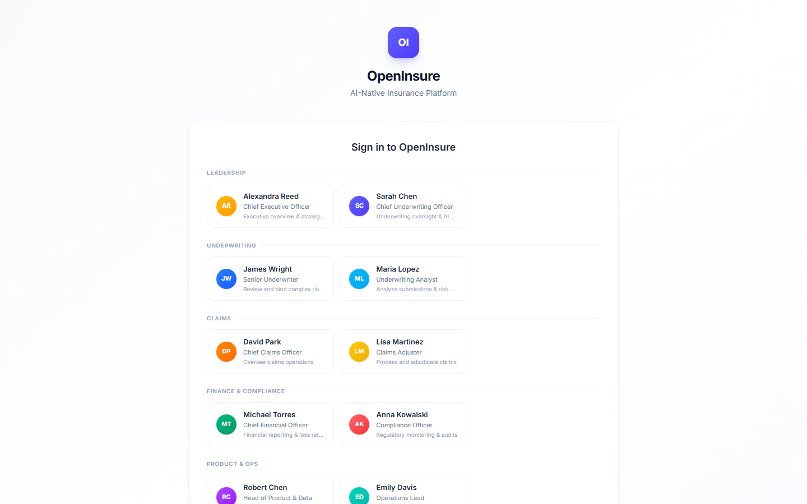

**11 Personas available**:

| Group | Name | Role | Default Route |
|-------|------|------|---------------|
| Leadership | Alexandra Reed | CEO | `/executive` |
| Leadership | Sarah Chen | CUO | `/` (Dashboard) |
| Underwriting | James Wright | Senior Underwriter | `/workbench/underwriting` |
| Underwriting | Maria Lopez | UW Analyst | `/workbench/underwriting` |
| Claims | David Park | Chief Claims Officer | `/workbench/claims` |
| Claims | Lisa Martinez | Claims Adjuster | `/workbench/claims` |
| Finance | Michael Torres | CFO | `/executive` |
| Compliance | Anna Kowalski | Compliance Officer | `/workbench/compliance` |
| Product & Ops | Robert Chen | Head of Product & Data | `/` |
| Operations | Emily Davis | Operations Lead | `/finance` |
| External | Thomas Anderson | Broker — Marsh & Co | `/portal/broker` |

**How to use**:
1. Navigate to the dashboard URL
2. Select a persona card from the login screen
3. The system sets `openinsure_role` in localStorage and routes to the role's default page

**API Authentication** (3 modes, in resolution order):
1. **Dev Mode** (default) — No credentials needed; override role via `X-User-Role` header
2. **API Key** — Header: `X-API-Key: dev-key-change-me` → grants CUO role
3. **JWT Bearer** — Header: `Authorization: Bearer <token>` → production Entra ID

**Status**: ✅ Working

---

## 1. New Business Submission

**What it does**: Brokers create insurance submission requests through the Broker Portal or API. Each submission enters the **New Business Pipeline**: Received → Triage → Underwriting → Quote → Bind. The SubmissionAgent handles intake, document classification, data extraction, and validation.

### Broker Portal View

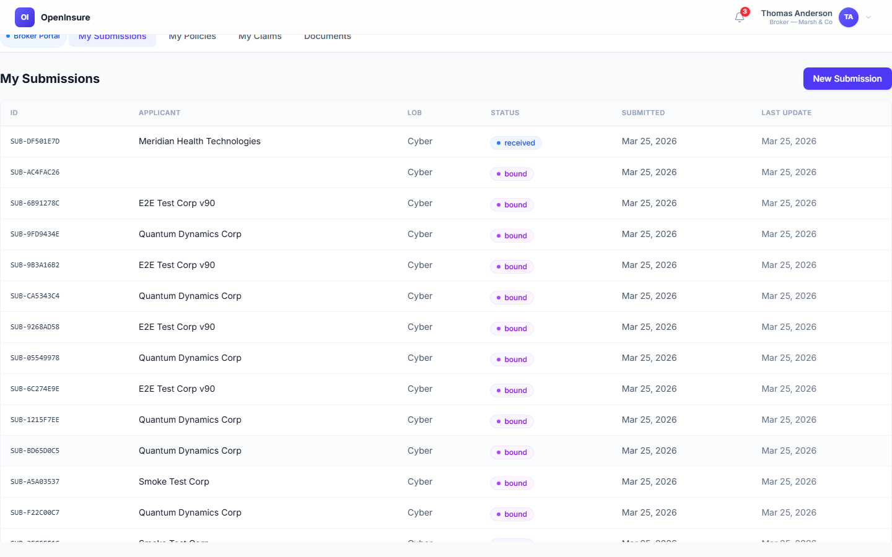

The broker (Thomas Anderson, Marsh & Co) sees their submissions with tabs for **My Submissions**, **My Policies**, **My Claims**, and **Documents**. A prominent **New Submission** button initiates the workflow.

### New Submission Form

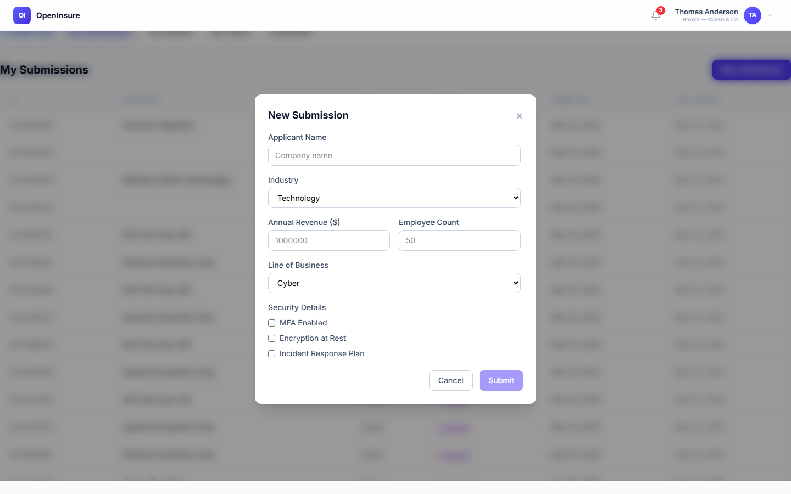

The form collects applicant details, company information, line of business (Cyber, Professional Liability, D&O, EPLI, General Liability), coverage amount, and cyber-specific risk data (MFA, encryption, incident response plan, etc.).

### Submission Detail & Pipeline

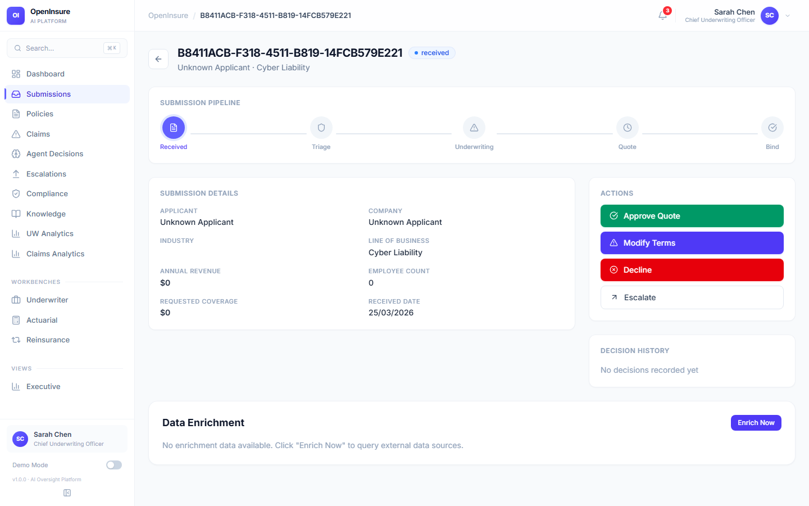

Each submission detail page shows the **Submission Pipeline** progress tracker (Received → Triage → Underwriting → Quote → Bind), applicant details, and action buttons: **Approve Quote**, **Modify Terms**, **Decline**, and **Escalate**. A **Data Enrichment** section with an "Enrich Now" button enables external data lookup.

### UW Workbench Queue

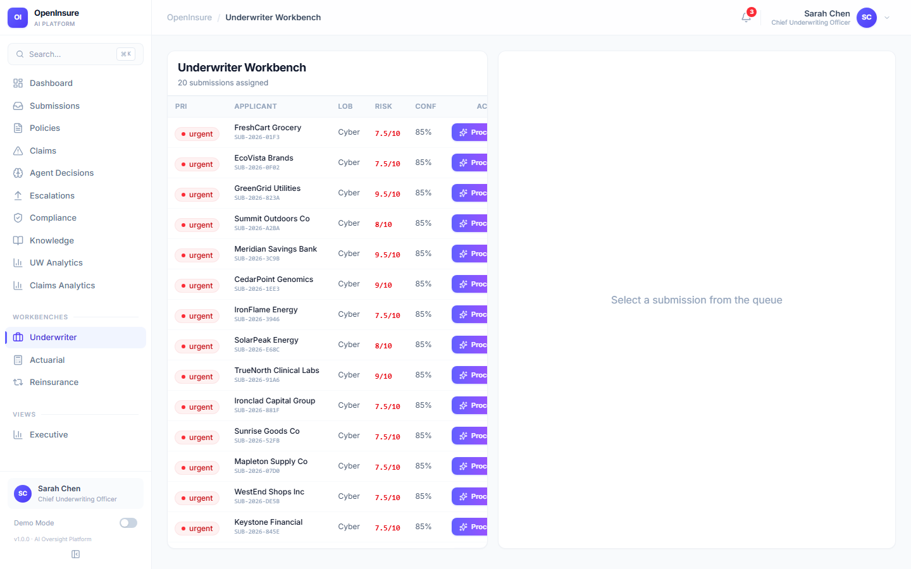

When Sarah Chen (CUO) logs in, the Underwriter Workbench shows 20 submissions assigned with priority, applicant, LOB, risk score, confidence, and a **Process** button on each row.

**Foundry Agent**: **SubmissionAgent** — handles intake, document classification, data extraction, validation, and triage. Uses GPT-5.1 via Microsoft Foundry.

**How to use (Portal)**:
1. Log in as **Thomas Anderson** (Broker)
2. Click **New Submission** → fill out the form → submit
3. Switch to **Sarah Chen** (CUO) → open **Underwriter Workbench** to see it in queue

**API Endpoints**:

| Method | Endpoint | Description |
|--------|----------|-------------|
| `POST` | `/submissions` | Create a new submission (returns 201) |
| `GET` | `/submissions` | List submissions (paginated, filterable by status) |
| `GET` | `/submissions/{id}` | Retrieve a single submission |
| `PUT` | `/submissions/{id}` | Update submission fields |
| `POST` | `/submissions/{id}/triage` | AI-driven triage & risk scoring |

**Example — Create Submission**:
```bash
curl -X POST "$API/submissions" \
  -H "X-API-Key: dev-key-change-me" \
  -H "Content-Type: application/json" \
  -d '{
    "applicant_name": "Acme Corp",
    "applicant_email": "risk@acme.com",
    "company_name": "Acme Corp",
    "line_of_business": "cyber",
    "annual_revenue": 5000000,
    "employee_count": 150,
    "industry": "technology",
    "coverage_amount": 2000000,
    "cyber_risk_data": {
      "has_mfa": true,
      "has_encryption": true,
      "has_incident_response_plan": true,
      "has_backup": true,
      "prior_incidents": 0,
      "security_score": 85,
      "annual_revenue": 5000000,
      "employee_count": 150,
      "industry": "technology"
    }
  }'
```

**Example — Triage**:
```bash
curl -X POST "$API/submissions/{id}/triage" \
  -H "X-API-Key: dev-key-change-me"
```

**Status**: ✅ Working — Submission creation returns 201, triage returns 200 with risk score and priority.

---

## 2. Underwriting & Quoting

**What it does**: The Underwriter Workbench is the central hub for risk assessment. Underwriters review AI-triaged submissions, examine risk factors, process with the multi-agent Foundry pipeline, and generate quotes using the deterministic CyberRatingEngine.

### UW Workbench Detail Panel

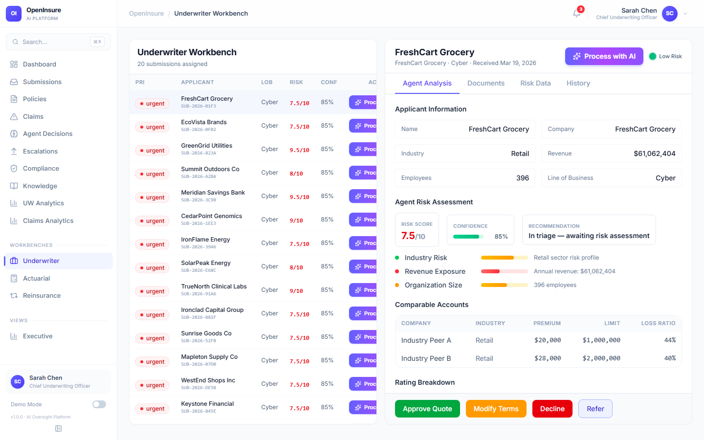

Selecting a submission in the queue opens a detail panel with multi-tab interface showing risk score, AI confidence, priority, and action buttons.

### AI Processing Modal (Microsoft Foundry Pipeline)

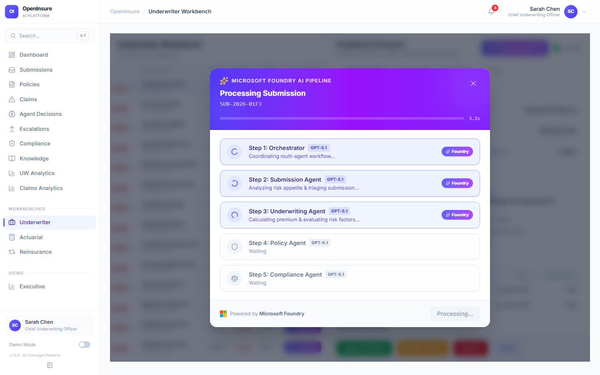

Clicking **Process** triggers the **Microsoft Foundry AI Pipeline** modal showing a 5-step workflow:

1. **Step 1: Orchestrator** (GPT-5.1) — Coordinating multi-agent workflow
2. **Step 2: Submission Agent** (GPT-5.1) — Analyzing risk appetite & triaging submission
3. **Step 3: Underwriting Agent** (GPT-5.1) — Calculating premium & evaluating risk factors
4. **Step 4: Policy Agent** (GPT-5.1) — Waiting (policy creation if bound)
5. **Step 5: Compliance Agent** (GPT-5.1) — Waiting (EU AI Act compliance check)

Each step shows a "Foundry" badge and real-time progress.

### Submissions List

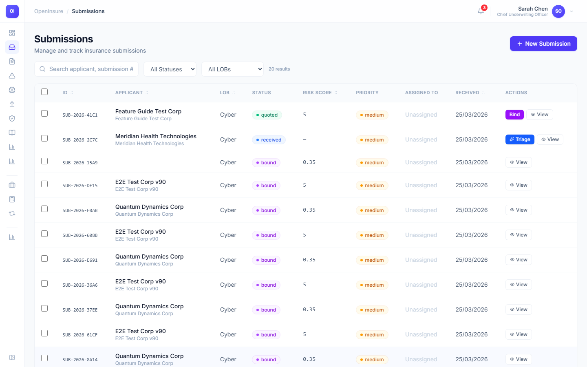

The submissions list shows all submissions with status badges (received, triaging, underwriting, quoted, bound, declined), LOB, dates, and sortable columns.

**Foundry Agents**:
- **UnderwritingAgent** — Risk assessment, pricing, quote generation
- **Orchestrator** — Coordinates the multi-agent new-business workflow

**How to use (Portal)**:
1. Log in as **Sarah Chen** (CUO) or **James Wright** (Senior UW)
2. Navigate to **Workbenches → Underwriter**
3. Click a submission row to see the detail panel
4. Click **Process** to trigger the Foundry AI Pipeline
5. Review the AI recommendation and rating breakdown

**API Endpoints**:

| Method | Endpoint | Description |
|--------|----------|-------------|
| `POST` | `/submissions/{id}/quote` | Generate underwriting quote |
| `POST` | `/submissions/{id}/process` | Trigger full submission processing |
| `GET` | `/underwriter/queue` | Get prioritized underwriter queue |

**Example — Generate Quote**:
```bash
curl -X POST "$API/submissions/{id}/quote" \
  -H "X-API-Key: dev-key-change-me"
# Returns: premium, rating factors, risk score, confidence
```

**Status**: ✅ Working — Quote generation returns 200 with premium calculation from CyberRatingEngine.

---

## 3. Policy Binding & Documents

**What it does**: Binding converts a quoted submission into an active policy. The PolicyAgent creates the policy record, generates a billing account, and produces insurance documents (declarations page, certificate of insurance, coverage schedule).

### Policies List

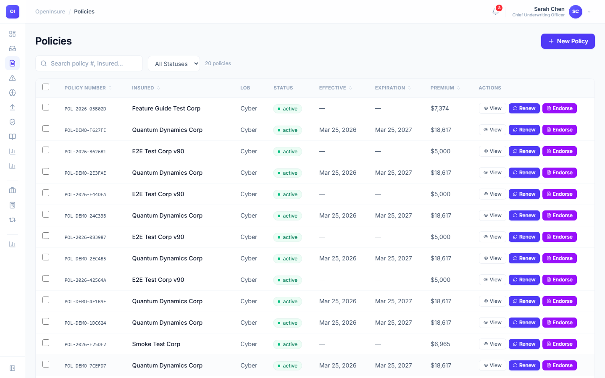

The policies page shows all policies with policy number, insured name, LOB, status, effective/expiration dates, premium, and action buttons (**View**, **Renew**, **Endorse**).

### Policy Detail

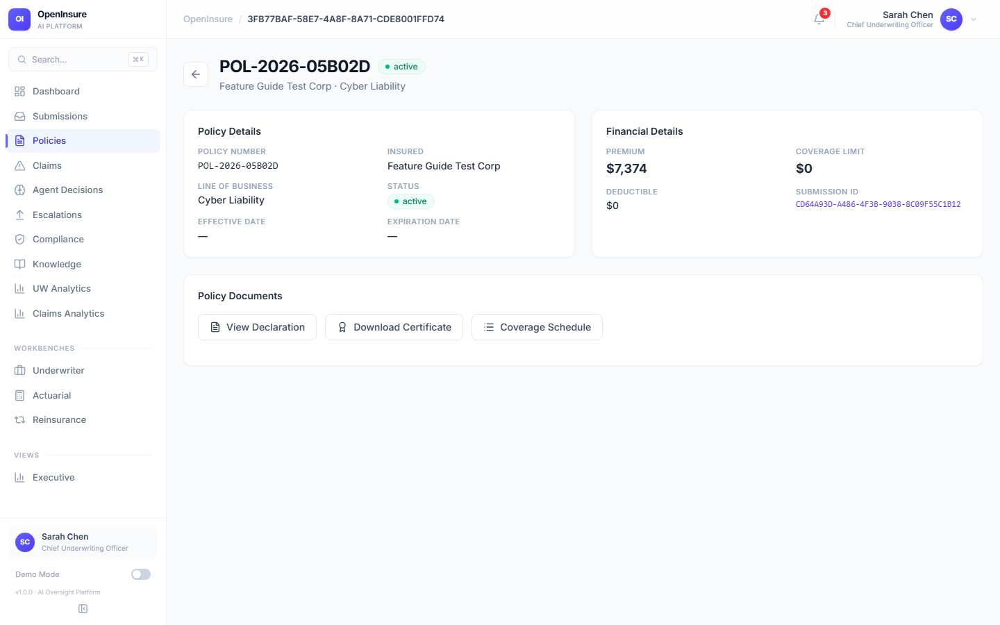

The detail view shows Policy Details (number, insured, LOB, status, dates), Financial Details (premium, coverage limit, deductible, submission ID), and a **Policy Documents** section with three buttons:
- **View Declaration** — Renders declarations page inline
- **Download Certificate** — Generates Certificate of Insurance
- **Coverage Schedule** — Shows detailed coverage breakdown

### Declaration Page (Rendered Inline)

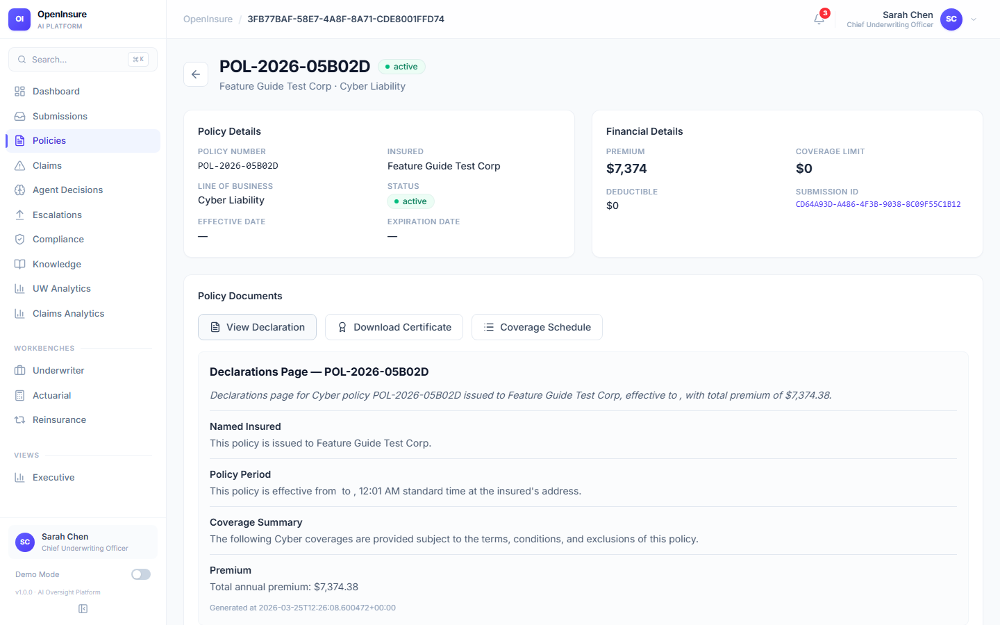

Clicking "View Declaration" renders the declarations page inline with sections for: Named Insured, Policy Period, Coverage Summary, and Premium.

**Foundry Agent**: **PolicyAgent** — Policy binding, endorsement, renewal, cancellation.

**How to use (Portal)**:
1. From a quoted submission, click **Bind** (or use the API)
2. Navigate to **Policies** → click **View** on any policy
3. In the **Policy Documents** section, click any of the three document buttons

**API Endpoints**:

| Method | Endpoint | Description |
|--------|----------|-------------|
| `POST` | `/submissions/{id}/bind` | Bind submission to policy (creates policy + billing account) |
| `GET` | `/policies` | List all policies |
| `GET` | `/policies/{id}` | Get policy detail |
| `POST` | `/policies/{id}/endorse` | Create mid-term endorsement |
| `POST` | `/policies/{id}/cancel` | Cancel policy (return premium calc) |
| `POST` | `/policies/{id}/reinstate` | Reinstate cancelled policy |
| `GET` | `/policies/{id}/documents/declaration` | Generate declarations page (JSON) |
| `GET` | `/policies/{id}/documents/certificate` | Generate Certificate of Insurance |
| `GET` | `/policies/{id}/documents/schedule` | Generate coverage schedule |

**Example — Bind & Get Declaration**:
```bash
# Bind submission to create policy
curl -X POST "$API/submissions/{sub_id}/bind" \
  -H "X-API-Key: dev-key-change-me"
# Returns: { "policy_id": "...", "policy_number": "POL-2026-..." }

# Generate declaration page
curl "$API/policies/{policy_id}/documents/declaration" \
  -H "X-API-Key: dev-key-change-me"
# Returns: structured JSON with titled sections
```

**Status**: ✅ Working — Bind returns 200, all three document endpoints return 200.

---

## 4. Claims Management

**What it does**: Claims management covers the full claims lifecycle — First Notice of Loss (FNOL), investigation, reserve setting, settlement, subrogation detection, and closure. The ClaimsAgent handles FNOL processing, coverage verification, reserve estimation, triage, and investigation support.

### Claims List

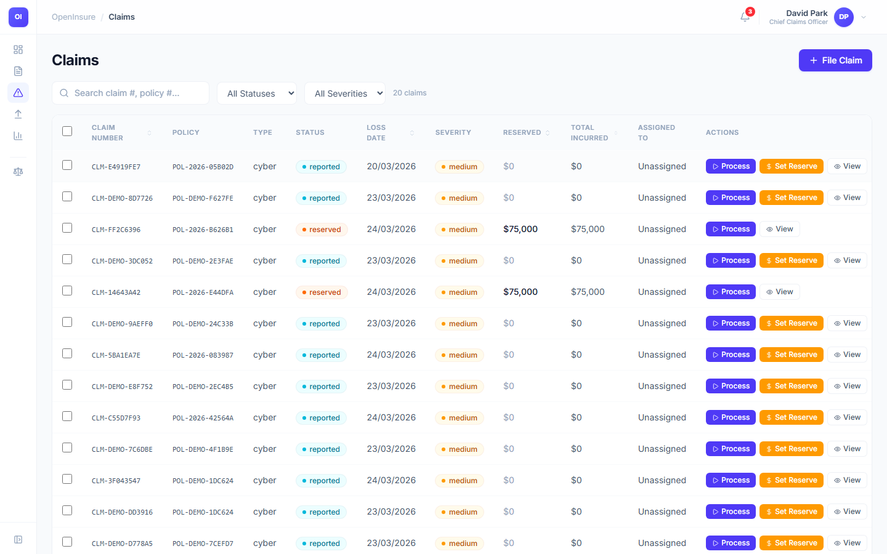

The claims page shows all claims with claim number, policy, status (reported, investigating, reserved, closed, denied), severity, loss date, and reserve amounts.

### Claims Workbench

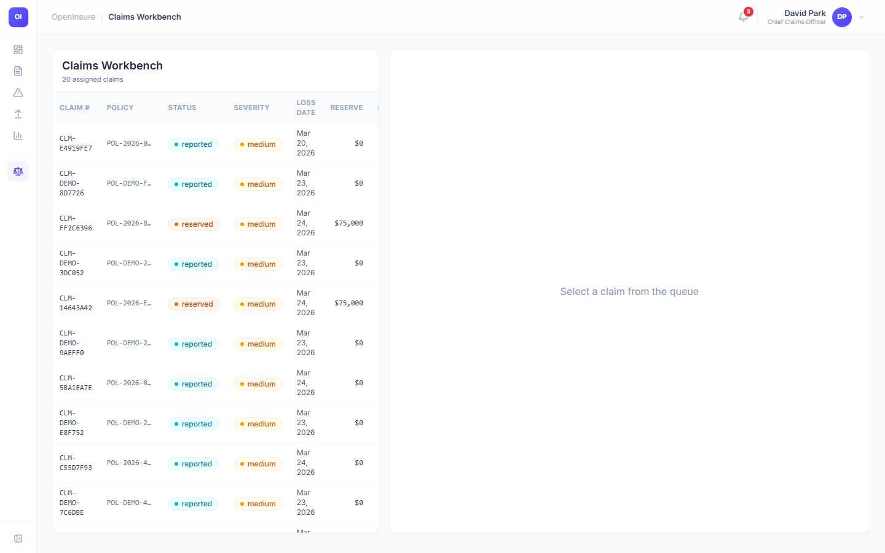

The Claims Workbench (David Park, CCO) shows 20 assigned claims in a queue with status, severity, loss date, and reserve columns.

### Claims Workbench — Detail Panel

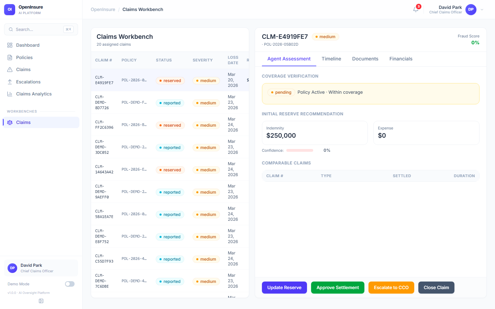

Selecting a claim opens the detail panel with tabs:
- **Agent Assessment** — Coverage verification, initial reserve recommendation (indemnity + expense), confidence score, comparable claims
- **Timeline** — Chronological event history
- **Documents** — Attached documents
- **Financials** — Reserve and payment breakdown

Action buttons: **Update Reserve**, **Approve Settlement**, **Escalate to CCO**, **Close Claim**.

### Claim Detail

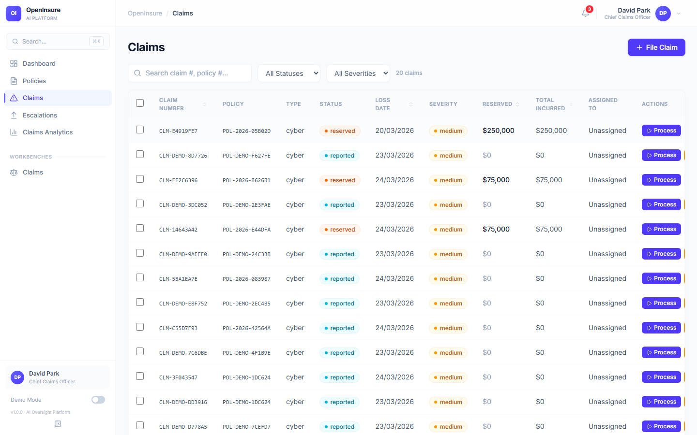

The standalone claim detail view shows full claim information with status tracking and action capabilities.

**Foundry Agent**: **ClaimsAgent** — FNOL processing, coverage verification, reserve setting, triage, investigation support, fraud detection.

**How to use (Portal)**:
1. Log in as **David Park** (CCO) or **Lisa Martinez** (Adjuster)
2. Navigate to **Workbenches → Claims** to see the queue
3. Click a claim row → review the Agent Assessment panel
4. Click **Update Reserve** to set/adjust reserves
5. Use **Approve Settlement** or **Escalate to CCO** for disposition

**API Endpoints**:

| Method | Endpoint | Description |
|--------|----------|-------------|
| `POST` | `/claims` | File a claim — FNOL (returns 201) |
| `GET` | `/claims` | List claims (paginated, filterable) |
| `GET` | `/claims/{id}` | Get claim detail |
| `POST` | `/claims/{id}/reserve` | Set reserve (requires `category`, `amount`) |
| `POST` | `/claims/{id}/payment` | Record claim payment |
| `POST` | `/claims/{id}/process` | Trigger claims processing workflow |
| `POST` | `/claims/{id}/close` | Close claim |
| `POST` | `/claims/{id}/reopen` | Reopen closed claim |
| `POST` | `/claims/{id}/subrogation` | Initiate subrogation recovery |
| `GET` | `/claims/{id}/subrogation` | Get subrogation records |
| `GET` | `/claims/queue` | Get claims processing queue |
| `GET` | `/claims/subrogation/queue` | Get subrogation queue |

**Example — File Claim & Set Reserve**:
```bash
# File FNOL
curl -X POST "$API/claims" \
  -H "X-API-Key: dev-key-change-me" \
  -H "Content-Type: application/json" \
  -d '{
    "policy_id": "<policy_id>",
    "claim_type": "data_breach",
    "description": "Data breach affecting 1000 records",
    "date_of_loss": "2026-03-20",
    "reported_by": "Thomas Anderson",
    "severity": "complex",
    "cause_of_loss": "data_breach"
  }'

# Set reserve (note: "category" field is required, not "reserve_type")
curl -X POST "$API/claims/{claim_id}/reserve" \
  -H "X-API-Key: dev-key-change-me" \
  -H "Content-Type: application/json" \
  -d '{
    "category": "indemnity",
    "amount": 250000,
    "notes": "Initial reserve based on breach scope"
  }'
```

**Status**: ✅ Working — FNOL returns 201, reserve (with `category` field) returns 201, subrogation returns 200.

---

## 5. Renewals

**What it does**: The renewals module tracks policies approaching expiration and automates the renewal process. The system identifies upcoming renewals, generates renewal terms (adjusting for claims experience), and processes renewals into new policy periods.

### Renewals View

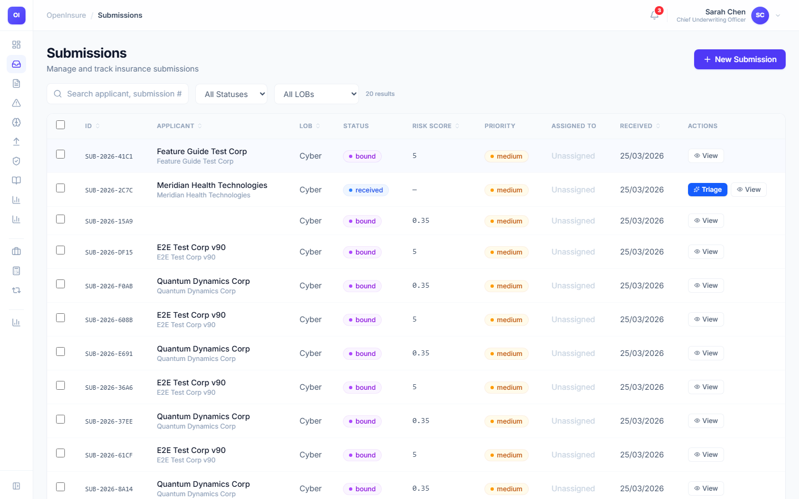

Renewals are managed through the Submissions page, where renewal-type submissions appear in the queue. The API provides dedicated renewal endpoints.

**Foundry Agent**: **PolicyAgent** — handles renewal workflow including rate adjustment and terms generation.

**How to use**:
1. Log in as **Sarah Chen** (CUO)
2. Check upcoming renewals via the API
3. Generate renewal terms for a policy
4. Process the renewal to create a new policy period

**API Endpoints**:

| Method | Endpoint | Description |
|--------|----------|-------------|
| `GET` | `/renewals/upcoming` | Get upcoming renewals (within 30/60/90 days) |
| `GET` | `/renewals/queue` | Get renewal processing queue |
| `POST` | `/renewals/{policy_id}/terms` | Generate renewal terms |
| `POST` | `/renewals/{policy_id}/generate` | Generate renewal quote |
| `POST` | `/renewals/{policy_id}/process` | Process renewal |
| `GET` | `/renewals/records` | Get renewal history records |
| `POST` | `/renewals/scheduler/run` | Run renewal scheduler |

**Example — Renewal Workflow**:
```bash
# Check upcoming renewals
curl "$API/renewals/upcoming" -H "X-API-Key: dev-key-change-me"
# Returns: { "total": 214, "within_30_days": 173, "within_60_days": 192, ... }

# Generate renewal terms
curl -X POST "$API/renewals/{policy_id}/terms" \
  -H "X-API-Key: dev-key-change-me"

# Generate renewal quote
curl -X POST "$API/renewals/{policy_id}/generate" \
  -H "X-API-Key: dev-key-change-me"
```

**Status**: ✅ Working — All renewal endpoints return 200. 214 upcoming renewals detected.

---

## 6. Billing & Finance

**What it does**: The Finance Dashboard provides complete financial oversight — premium tracking (written/earned/unearned), claims metrics (paid/reserved/incurred), 12-month cash flow, broker commissions, and loss/combined ratios. When a policy is bound, a billing account is automatically created.

### Finance Dashboard

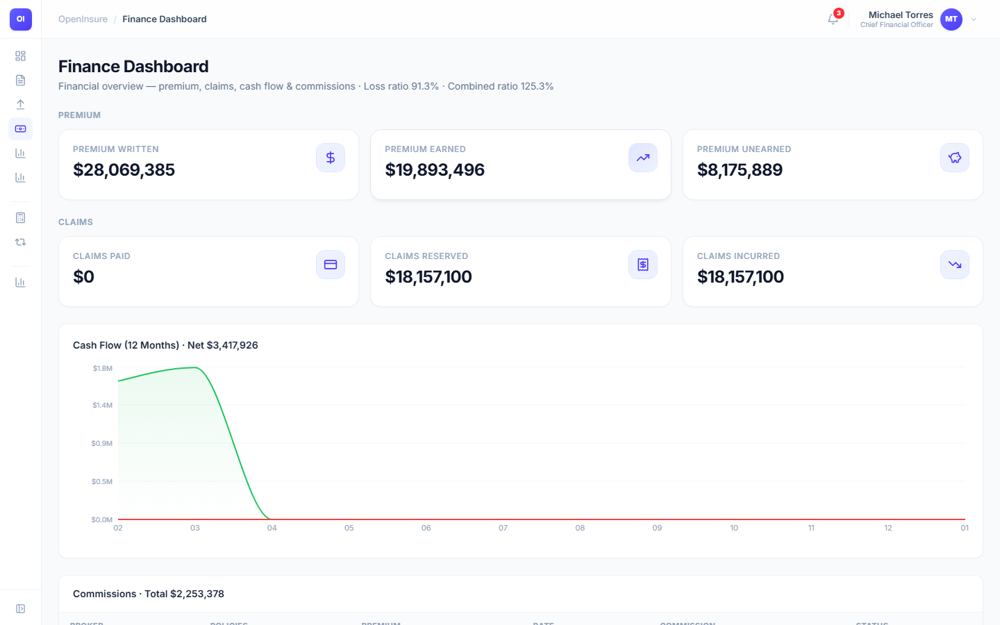

Logged in as **Michael Torres** (CFO), the Finance Dashboard shows:

- **Premium Written**: $28,069,385 · **Premium Earned**: $19,893,496 · **Premium Unearned**: $8,175,889
- **Claims Paid**: $0 · **Claims Reserved**: $18,157,100 · **Claims Incurred**: $18,157,100
- **Loss ratio**: 91.3% · **Combined ratio**: 125.3%
- **Cash Flow (12 Months)**: Net $3,417,926 — collections concentrated in Feb–Mar 2026
- **Commissions**: Total $2,253,378 — tracked by broker, policy count, premium, and status

**Foundry Agent**: **BillingAgent** (`openinsure-billing`) — Assesses payment default probability, recommends billing plans, sets collection priority. Returns `default_probability`, `risk_tier`, `recommended_billing_plan`, `collection_priority`, `grace_period_days`.

**How to use (Portal)**:
1. Log in as **Michael Torres** (CFO) or **Emily Davis** (Operations Lead)
2. Navigate to **Finance** in the sidebar
3. View premium/claims KPIs, cash flow chart, and commission breakdown
4. Use the billing API to manage individual accounts

**API Endpoints — Finance**:

| Method | Endpoint | Description |
|--------|----------|-------------|
| `GET` | `/finance/summary` | Financial summary (premium, loss ratio, combined ratio) |
| `GET` | `/finance/cashflow` | Monthly cash flow (collections, disbursements) |
| `GET` | `/finance/commissions` | Commission tracking by channel |
| `GET` | `/finance/reconciliation` | Financial reconciliation items |
| `POST` | `/finance/bordereaux/generate` | Generate bordereaux report |

**API Endpoints — Billing**:

| Method | Endpoint | Description |
|--------|----------|-------------|
| `POST` | `/billing/accounts` | Create billing account for a policy |
| `GET` | `/billing/accounts/{id}` | Get billing account details |
| `POST` | `/billing/accounts/{id}/payments` | Record a payment |
| `GET` | `/billing/accounts/{id}/invoices` | List invoices |
| `POST` | `/billing/accounts/{id}/invoices` | Generate invoice (requires `amount`, `due_date`) |
| `GET` | `/billing/accounts/{id}/ledger` | Get transaction ledger |

**Example — Billing Workflow**:
```bash
# Create billing account (auto-created on bind, or manually)
curl -X POST "$API/billing/accounts" \
  -H "X-API-Key: dev-key-change-me" \
  -H "Content-Type: application/json" \
  -d '{"policy_id": "<id>", "policyholder_name": "Acme Corp", "total_premium": 50000, "installments": 4}'

# Generate invoice
curl -X POST "$API/billing/accounts/{id}/invoices" \
  -H "X-API-Key: dev-key-change-me" \
  -H "Content-Type: application/json" \
  -d '{"amount": 12500, "due_date": "2026-04-15", "description": "Q1 Premium Installment"}'
```

> **Note**: `GET /billing/accounts` (list all accounts) returns 405 Method Not Allowed — listing billing accounts is not supported. Access accounts by ID after creation.

**Status**: ✅ Working — All finance endpoints return 200. Billing account CRUD works. Invoice generation requires `amount` + `due_date`.

---

## 7. Reinsurance

**What it does**: The Reinsurance Dashboard provides treaty management, cession tracking, and recovery monitoring for carrier deployments. It shows active treaty count, total capacity, ceded premium (YTD), and recoveries.

### Reinsurance Dashboard

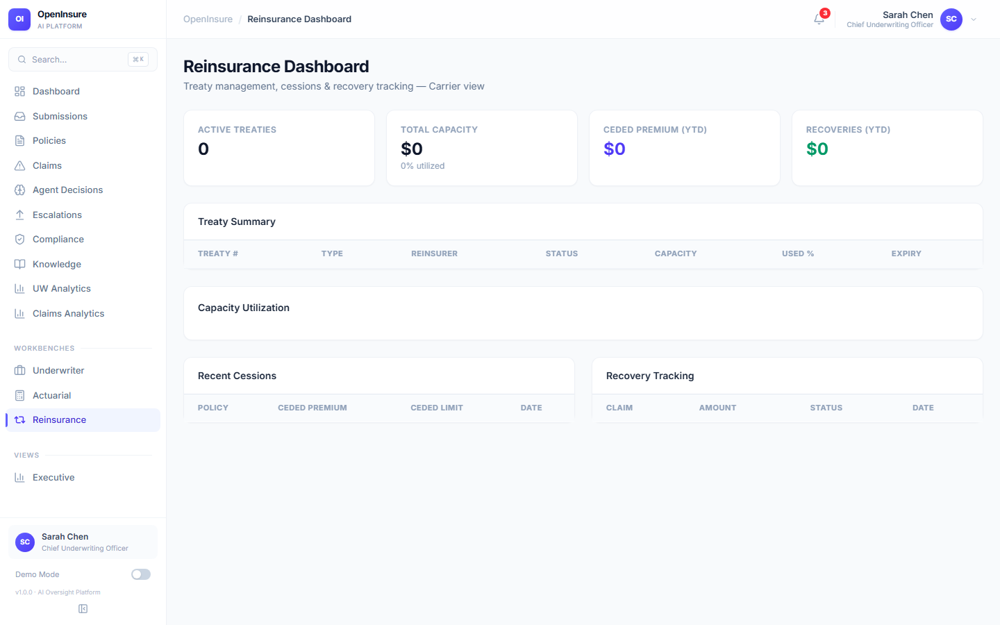

The dashboard displays:
- **Active Treaties**: Treaty summary with treaty number, type, reinsurer, status, capacity, utilization %, and expiry
- **Capacity Utilization**: Visual capacity tracking
- **Recent Cessions**: Policy-level cessions with ceded premium, ceded limit, and date
- **Recovery Tracking**: Claim-level recoveries with amount, status, and date

> **Note**: Currently shows 0 active treaties / $0 capacity — treaty data needs to be seeded via API.

**How to use (Portal)**:
1. Log in as **Sarah Chen** (CUO) or **Alexandra Reed** (CEO)
2. Navigate to **Workbenches → Reinsurance**
3. View treaty summary, capacity utilization, cessions, and recoveries

**API Endpoints**:

| Method | Endpoint | Description |
|--------|----------|-------------|
| `POST` | `/reinsurance/treaties` | Create reinsurance treaty |
| `GET` | `/reinsurance/treaties` | List treaties |
| `GET` | `/reinsurance/treaties/{id}` | Get treaty details |
| `GET` | `/reinsurance/treaties/{id}/utilization` | Treaty utilization |
| `GET` | `/reinsurance/treaties/{id}/capacity` | Treaty capacity |
| `POST` | `/reinsurance/cessions` | Create cession |
| `GET` | `/reinsurance/cessions` | List cessions |
| `POST` | `/reinsurance/recoveries` | Record recovery |
| `GET` | `/reinsurance/recoveries` | List recoveries |
| `GET` | `/reinsurance/bordereaux/{treaty_id}` | Treaty bordereaux |

**Example**:
```bash
curl "$API/reinsurance/treaties" -H "X-API-Key: dev-key-change-me"
# Returns: list of treaty objects
```

**Status**: ✅ Working — All reinsurance endpoints return 200. Dashboard renders correctly. Treaty data is empty in demo mode (Carrier-only feature).

---

## 8. Compliance & EU AI Act

**What it does**: OpenInsure is compliance-by-design for the EU AI Act. Every AI agent decision produces a `DecisionRecord` with full audit trail. The compliance module provides decision oversight, bias monitoring, system inventory (Art. 49), and audit trail.

### Agent Decisions Page

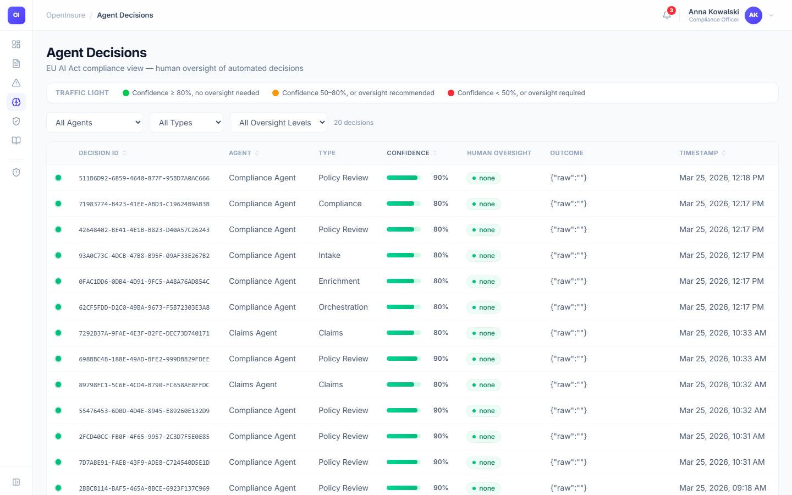

Logged in as **Anna Kowalski** (Compliance Officer), the Agent Decisions page shows:
- **Traffic Light System**: 🟢 ≥80% confidence (no oversight) · 🟡 50-80% (oversight recommended) · 🔴 <50% (oversight required)
- Filters by Agent, Type, Oversight Level
- Decision table: ID, Agent, Type, Confidence bar, Human Oversight status, Outcome, Timestamp
- 20 decisions displayed with agents: Compliance Agent, Claims Agent
- Decision types: Policy Review, Compliance, Intake, Enrichment, Orchestration, Claims

### Compliance Dashboard

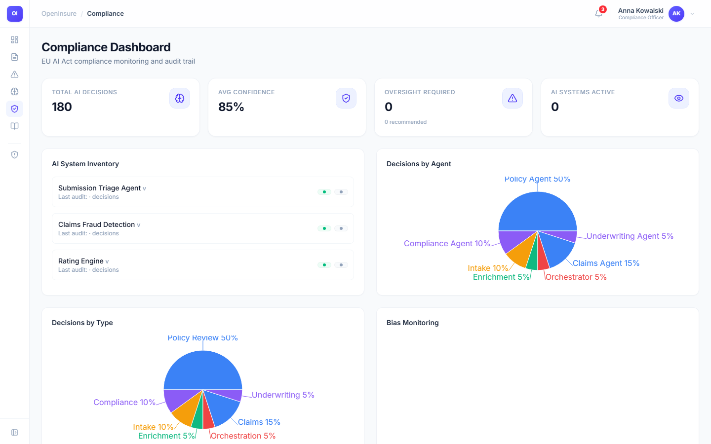

The Compliance Dashboard shows:
- **Total AI Decisions**: 180 · **Avg Confidence**: 85%
- **Oversight Required**: 0 · **AI Systems Active**: 0 (display-only)
- **AI System Inventory**: Submission Triage Agent, Claims Fraud Detection, Rating Engine — each with status indicators
- **Decisions by Agent**: Pie chart — Policy Agent 50%, Claims Agent 15%, Compliance Agent 10%, Intake 10%, Enrichment 5%, Orchestrator 5%, Underwriting Agent 5%
- **Decisions by Type**: Pie chart — Policy Review 50%, Claims 15%, Compliance 10%, Intake 10%, Enrichment 5%, Orchestration 5%, Underwriting 5%
- **Bias Monitoring**: Section for fairness metrics

### Compliance Workbench

> ⚠️ **Bug**: The Compliance Workbench at `/workbench/compliance` renders as a blank white screen.
> Filed as [Issue #89](https://github.com/urosstojkic/openinsure/issues/89).

**Foundry Agent**: **ComplianceAgent** — EU AI Act compliance checking, bias monitoring, decision record auditing.

**DecisionRecord Structure** (EU AI Act Art. 12, 13, 14):
Every AI decision records: `decision_id`, `timestamp`, `agent_id`, `agent_version`, `model_used`, `model_version`, `decision_type`, `input_summary`, `data_sources_used`, `knowledge_graph_queries`, `output`, `reasoning`, `confidence` (0–1.0), `fairness_metrics`, `human_oversight`, `execution_time_ms`.

**How to use (Portal)**:
1. Log in as **Anna Kowalski** (Compliance Officer)
2. Navigate to **Agent Decisions** for the traffic-light oversight view
3. Navigate to **Compliance** for the dashboard with bias monitoring and system inventory

**API Endpoints**:

| Method | Endpoint | Description |
|--------|----------|-------------|
| `GET` | `/compliance/decisions` | List AI decision records |
| `GET` | `/compliance/decisions/{id}` | Get single decision record |
| `GET` | `/compliance/audit-trail` | Complete audit trail |
| `POST` | `/compliance/bias-report` | Generate bias report (requires `decision_type`, `date_from`, `date_to`) |
| `GET` | `/compliance/system-inventory` | AI system inventory (EU AI Act Art. 49) |

**Example — Bias Report**:
```bash
curl -X POST "$API/compliance/bias-report" \
  -H "X-API-Key: dev-key-change-me" \
  -H "Content-Type: application/json" \
  -d '{"decision_type": "underwriting", "date_from": "2026-01-01", "date_to": "2026-03-25"}'
# Returns: approval rates by industry, revenue band, employee count
```

**Status**: ⚠️ Partial — Agent Decisions page and Compliance Dashboard work. Compliance Workbench renders blank ([#89](https://github.com/urosstojkic/openinsure/issues/89)). All API endpoints work (bias report requires `decision_type` + `date_from` + `date_to`).

---

## 9. Knowledge Base

**What it does**: The Knowledge Base is powered by Cosmos DB (Gremlin graph) with Azure AI Search for agent queries. It stores underwriting guidelines, rating factors, coverage options, claims precedents, compliance rules, industry profiles, and jurisdiction rules across all lines of business.

### Knowledge Base Page

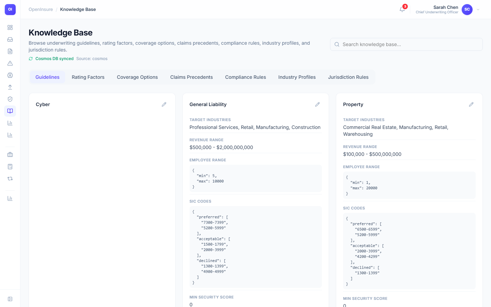

The Knowledge Base page shows:
- **Cosmos DB synced** indicator (Source: cosmos)
- **Search bar** for full-text search across all categories
- **7 tabs**: Guidelines, Rating Factors, Coverage Options, Claims Precedents, Compliance Rules, Industry Profiles, Jurisdiction Rules
- Each tab shows cards per LOB (Cyber, General Liability, Property) with detailed data

### Knowledge Tabs

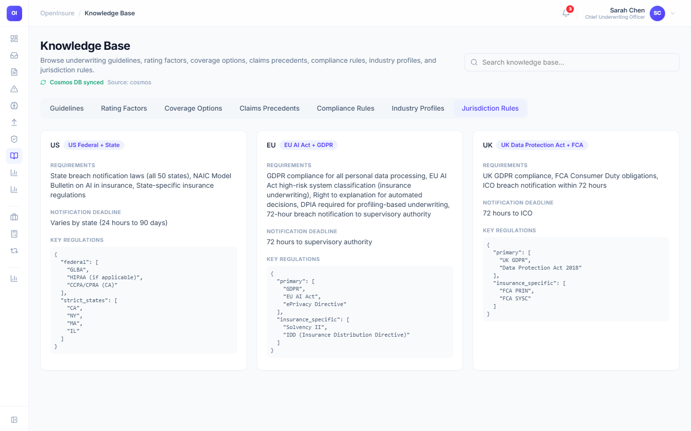

The Guidelines tab shows per-LOB cards with: Target Industries, Revenue Range, Employee Range, SIC Codes (preferred/acceptable/declined), and Min Security Score.

**Foundry Agent**: **KnowledgeAgent** — Knowledge graph queries, guideline retrieval, precedent lookup. Used by all other agents for context.

**How to use (Portal)**:
1. Log in as **Sarah Chen** (CUO) or any role with Knowledge access
2. Navigate to **Knowledge** in the sidebar
3. Browse tabs or use the search bar
4. Click the edit icon on any card to update guidelines

**API Endpoints**:

| Method | Endpoint | Description |
|--------|----------|-------------|
| `GET` | `/knowledge/guidelines/{lob}` | UW guidelines by LOB (cyber, general_liability, etc.) |
| `PUT` | `/knowledge/guidelines/{lob}` | Update guidelines |
| `GET` | `/knowledge/rating-factors/{lob}` | Rating factor tables |
| `GET` | `/knowledge/coverage-options/{lob}` | Coverage options |
| `GET` | `/knowledge/products` | Product definitions |
| `GET` | `/knowledge/claims-precedents` | All claims precedents |
| `GET` | `/knowledge/claims-precedents/{type}` | Precedents by claim type |
| `GET` | `/knowledge/compliance-rules` | All compliance rules |
| `GET` | `/knowledge/compliance-rules/{framework}` | Rules by framework (eu_ai_act) |
| `GET` | `/knowledge/industry-profiles` | All industry profiles |
| `GET` | `/knowledge/industry-profiles/{industry}` | Profile by industry |
| `GET` | `/knowledge/jurisdiction-rules` | All jurisdiction rules |
| `GET` | `/knowledge/jurisdiction-rules/{territory}` | Rules by territory |
| `GET` | `/knowledge/search?q={query}` | Full-text search |
| `GET` | `/knowledge/sync-status` | Cosmos DB sync status |

**Example**:
```bash
curl "$API/knowledge/guidelines/cyber" -H "X-API-Key: dev-key-change-me"
# Returns: target_industries, revenue_range, employee_range, sic_codes, min_security_score, ...

curl "$API/knowledge/search?q=cyber+liability" -H "X-API-Key: dev-key-change-me"
# Returns: search results across all knowledge categories
```

**Status**: ✅ Working — All 14 knowledge endpoints return 200. Cosmos DB sync confirmed. Full-text search operational.

---

## 10. Analytics & Executive Dashboard

**What it does**: OpenInsure provides three analytics dashboards: Executive Dashboard (C-suite strategic view), UW Analytics (underwriting performance), and Claims Analytics (claims frequency/severity/trends). An AI Insights endpoint provides AI-generated portfolio analysis.

### Executive Dashboard

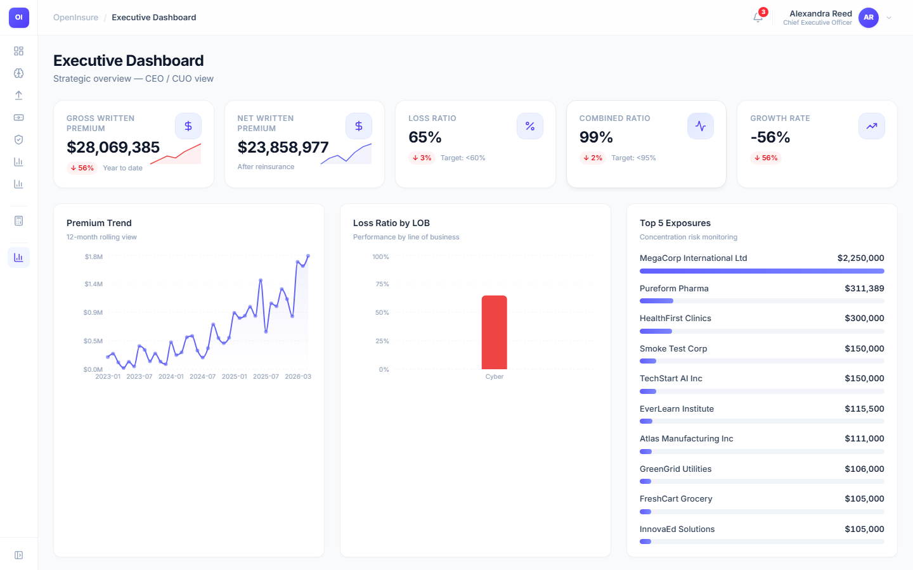

Logged in as **Alexandra Reed** (CEO), the Executive Dashboard shows:
- **Gross Written Premium**: $28,069,385
- **Net Written Premium**: $23,858,977 (after reinsurance)
- **Loss Ratio**: 65% (Target: <60%) · **Combined Ratio**: 99% (Target: <95%)
- **Growth Rate**: -56% (year to date)
- **Premium Trend**: 12-month rolling chart showing growth from ~$200K to ~$1.8M
- **Loss Ratio by LOB**: Bar chart showing Cyber at ~53%
- **Top 5 Exposures**: Concentration risk monitoring — MegaCorp International Ltd ($2,250,000) leads

### UW Analytics

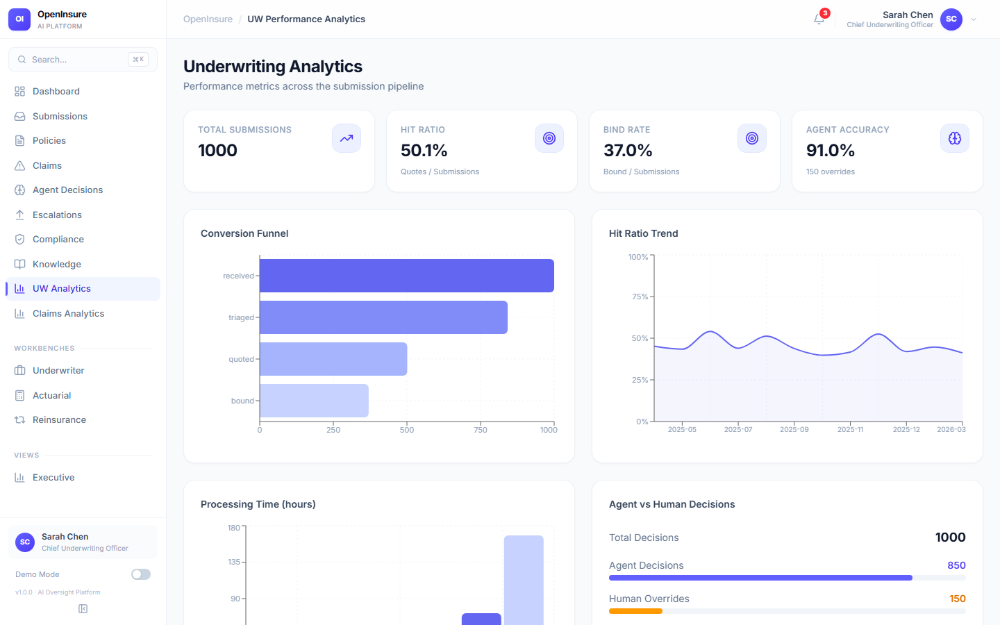

Underwriting analytics showing conversion rates, approval/decline percentages, average premium, and submission pipeline breakdown.

### Claims Analytics

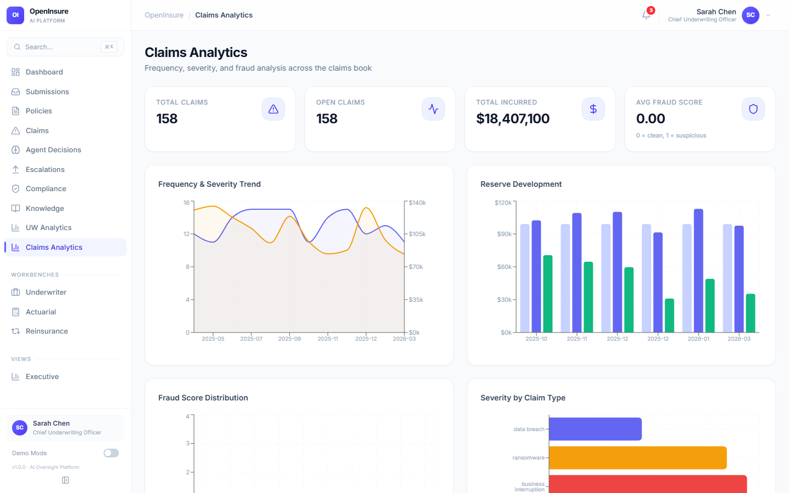

Claims analytics showing frequency, severity, FNOL-to-close duration, and trend analysis.

**How to use (Portal)**:
1. **Executive Dashboard**: Log in as **Alexandra Reed** (CEO) or **Sarah Chen** (CUO) → **Views → Executive**
2. **UW Analytics**: Navigate to **UW Analytics** in the sidebar
3. **Claims Analytics**: Navigate to **Claims Analytics** in the sidebar

**API Endpoints**:

| Method | Endpoint | Description |
|--------|----------|-------------|
| `GET` | `/analytics/underwriting` | UW performance (conversion, approval rate, avg premium) |
| `GET` | `/analytics/claims` | Claims analytics (frequency, severity, FNOL-to-close) |
| `GET` | `/analytics/ai-insights` | AI-generated executive insights |
| `GET` | `/analytics/decision-accuracy` | Decision accuracy metrics for AI agents |
| `POST` | `/analytics/decision-outcome` | Record actual outcome of AI decision |
| `GET` | `/metrics/executive` | Executive summary dashboard |
| `GET` | `/metrics/summary` | Key metrics snapshot |
| `GET` | `/metrics/pipeline` | Submission pipeline metrics |
| `GET` | `/metrics/agents` | Agent performance metrics |
| `GET` | `/metrics/premium-trend` | Premium trend analysis |

**Example**:
```bash
curl "$API/analytics/underwriting" -H "X-API-Key: dev-key-change-me"
# Returns: { "total_submissions": ..., "approval_rate": ..., "average_premium": ... }

curl "$API/analytics/ai-insights" -H "X-API-Key: dev-key-change-me"
# Returns: AI-generated insights on portfolio performance
```

**Status**: ✅ Working — All analytics endpoints return 200. Executive Dashboard, UW Analytics, and Claims Analytics pages render correctly.

---

## 11. Escalations

**What it does**: The Escalation Queue surfaces actions that exceed agent authority limits or require human approval. Each agent has an `authority_limit` (maximum value it can authorize) and an `escalation_threshold` (minimum confidence required). When thresholds are breached, items are escalated to authorized human reviewers.

### Escalation Queue

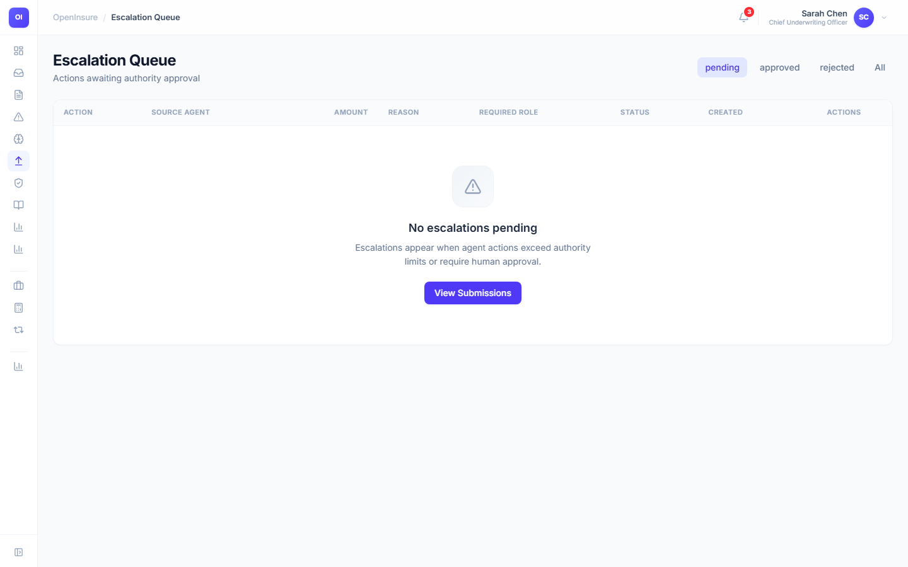

The Escalation Queue shows:
- Filter tabs: **pending**, **approved**, **rejected**, **All**
- Table columns: Action, Source Agent, Amount, Reason, Required Role, Status, Created, Actions
- Empty state: "No escalations pending — Escalations appear when agent actions exceed authority limits or require human approval"

### Escalation Detail


When escalations exist, clicking a row shows details with Approve/Reject buttons.

**How to use (Portal)**:
1. Log in as **Sarah Chen** (CUO) — has authority to approve underwriting escalations
2. Navigate to **Escalations** in the sidebar
3. Review pending items → click **Approve** or **Reject**

**API Endpoints**:

| Method | Endpoint | Description |
|--------|----------|-------------|
| `GET` | `/escalations` | List escalations (in-memory queue) |
| `GET` | `/escalations/count` | Get escalation count (used for sidebar badge) |
| `GET` | `/escalations/{id}` | Get escalation details |
| `POST` | `/escalations` | Create escalation |
| `POST` | `/escalations/{id}/approve` | Approve escalation |
| `POST` | `/escalations/{id}/reject` | Reject escalation |

**Example**:
```bash
curl "$API/escalations" -H "X-API-Key: dev-key-change-me"
# Returns: { "items": [...], "total": 0 }

curl "$API/escalations/count" -H "X-API-Key: dev-key-change-me"
# Returns: { "count": 0 }
```

**Status**: ✅ Working — Escalation endpoints return 200. Queue is empty in demo mode (escalations are generated during agent processing when authority limits are exceeded).

---

## 12. Data Enrichment

**What it does**: The enrichment service augments submissions with external data — firmographic data, financial information, cyber threat intelligence, claims history, and industry benchmarks. The Enrich Now button on the submission detail page triggers enrichment.

### Enrichment on Submission Detail

The submission detail page (see [Section 1](#1-new-business-submission)) includes a **Data Enrichment** section with an **Enrich Now** button. Clicking it queries external data providers and adds enrichment results to the submission.

**How to use (Portal)**:
1. Log in as **Sarah Chen** (CUO)
2. Navigate to **Submissions** → click a submission
3. Scroll to **Data Enrichment** section → click **Enrich Now**

**API Endpoints**:

| Method | Endpoint | Description |
|--------|----------|-------------|
| `POST` | `/submissions/{id}/enrich` | Enrich submission with external data |
| `GET` | `/submissions/{id}/comparables` | Get comparable accounts benchmarks |

**Example**:
```bash
curl -X POST "$API/submissions/{id}/enrich" \
  -H "X-API-Key: dev-key-change-me"
# Returns: enrichment results with firmographic, financial, cyber intel data
```

**Status**: ✅ Working — Enrichment returns 200.

---

## 13. Document Processing

**What it does**: The document processing module handles document uploads (PDF, images), ACORD XML ingestion (125/126 forms), and AI-powered document classification and text extraction. The DocumentAgent classifies documents and extracts structured data.

**Foundry Agent**: **DocumentAgent** — Document classification, text extraction, content analysis.

**How to use**:
1. Upload documents to a submission via multipart form upload
2. Ingest ACORD XML applications via the ingestion endpoint
3. Upload general documents to blob storage

**API Endpoints**:

| Method | Endpoint | Description |
|--------|----------|-------------|
| `POST` | `/submissions/{id}/documents` | Upload documents to submission (multipart: `files` field) |
| `POST` | `/submissions/acord-ingest` | Ingest ACORD 125/126 XML (multipart: `file` field) |
| `POST` | `/documents/upload` | Upload document to blob storage |
| `GET` | `/documents/list` | List uploaded documents |
| `GET` | `/documents/download/{blob_name}` | Download document |

**Example — ACORD Ingestion**:
```bash
# Ingest ACORD XML (multipart form upload)
curl -X POST "$API/submissions/acord-ingest" \
  -H "X-API-Key: dev-key-change-me" \
  -F "file=@application.xml;type=application/xml"
# Returns: new submission created from ACORD data (201)

# Upload documents to existing submission
curl -X POST "$API/submissions/{id}/documents" \
  -H "X-API-Key: dev-key-change-me" \
  -F "files=@financial_statement.pdf;type=application/pdf"
# Returns: { "submission_id": "...", "document_ids": ["..."] }
```

> **Important**: Both endpoints use **multipart form upload**, not JSON. The `acord-ingest` endpoint expects a `file` field; the `documents` endpoint expects a `files` field.

**Status**: ✅ Working — ACORD ingestion returns 201 (creates submission). Document upload returns 200 with document IDs.

---

## 14. MCP Server

**What it does**: OpenInsure exposes a Model Context Protocol (MCP) server with 32 tools and 5 resources, allowing AI assistants (GitHub Copilot, Claude, etc.) to interact with the full insurance platform programmatically.

### Connection

```bash
# stdio transport (default — for local development)
python -m openinsure.mcp

# SSE transport (port 8001 — for remote connections)
python -m openinsure.mcp --sse

# Custom backend URL
python -m openinsure.mcp --api-url https://<your-backend-url>
```

**Environment Variables**:
| Variable | Purpose | Default |
|----------|---------|---------|
| `OPENINSURE_API_BASE_URL` | Backend API base URL | Resolved at runtime |
| `OPENINSURE_PORT` | Local dev fallback port | `8000` |

**MCP Client Configuration** (e.g., for GitHub Copilot, Claude Desktop):
```json
{
  "mcpServers": {
    "openinsure": {
      "command": "python",
      "args": ["-m", "openinsure.mcp"],
      "env": {
        "OPENINSURE_API_BASE_URL": "https://<your-backend-url>"
      }
    }
  }
}
```

### 32 MCP Tools

| Category | Tool | Description |
|----------|------|-------------|
| **Submission** | `create_submission` | Create a new insurance submission |
| | `get_submission` | Retrieve submission by ID |
| | `list_submissions` | List submissions with optional filtering |
| | `triage_submission` | Run AI triage (appetite check, risk scoring, priority) |
| | `quote_submission` | Generate underwriting quote via rating engine |
| | `bind_submission` | Bind quoted submission into active policy |
| | `enrich_submission` | Run data enrichment with external providers |
| **Claims** | `file_claim` | File FNOL claim |
| | `get_claim` | Retrieve claim by ID |
| | `list_claims` | List claims with optional status filter |
| | `set_reserve` | Set or update reserves on a claim |
| | `detect_subrogation` | Analyze claim for subrogation potential |
| **Policy** | `get_policy` | Retrieve policy by ID |
| | `list_policies` | List policies with optional status filter |
| **Billing** | `create_invoice` | Generate invoice on billing account |
| | `record_payment` | Record payment against billing account |
| | `get_billing_status` | Get billing account balance and history |
| **Documents** | `generate_declaration` | Generate declarations page for a policy |
| | `generate_certificate` | Generate Certificate of Insurance |
| **Analytics** | `get_uw_analytics` | Underwriting performance analytics |
| | `get_claims_analytics` | Claims frequency, severity, and fraud trends |
| | `get_ai_insights` | AI-generated executive portfolio insights |
| **Knowledge** | `search_knowledge` | Full-text search across knowledge base |
| | `get_guidelines` | Underwriting guidelines by LOB |
| | `get_rating_factors` | Rating factor tables by LOB |
| **Query/Insights** | `get_metrics` | Portfolio-level dashboard KPIs |
| | `get_agent_decisions` | AI decision records (audit trail) |
| | `get_upcoming_renewals` | Policies approaching expiry |
| **Workflow** | `run_compliance_check` | EU AI Act compliance audit |
| | `run_full_workflow` | End-to-end new-business workflow |
| **Accuracy** | `get_decision_accuracy` | Decision accuracy metrics for AI agents |
| | `get_comparable_accounts` | Industry benchmarks for a submission |

### 5 MCP Resources

| Resource URI | Description |
|-------------|-------------|
| `insurance://submissions/{submission_id}` | Submission details |
| `insurance://policies/{policy_id}` | Policy with coverages, limits, status |
| `insurance://claims/{claim_id}` | Claim details, status, reserves |
| `insurance://metrics/summary` | Portfolio-level business KPIs |
| `insurance://products/{product_id}` | Product definition with coverages and rating factors |

**Example Usage** (via MCP-enabled assistant):
> "Create a cyber liability submission for Acme Corp, $5M revenue, 150 employees in tech. Then triage and quote it."

The assistant calls `create_submission` → `triage_submission` → `quote_submission` sequentially.

**Status**: ✅ Working — Server starts, all tools mapped to backend API endpoints.

---

## 15. Actuarial Workbench

**What it does**: The Actuarial Workbench provides reserve analysis, loss development triangles, IBNR (Incurred But Not Reported) estimates, and rate adequacy analysis. Carrier-only feature.

### Actuarial Workbench

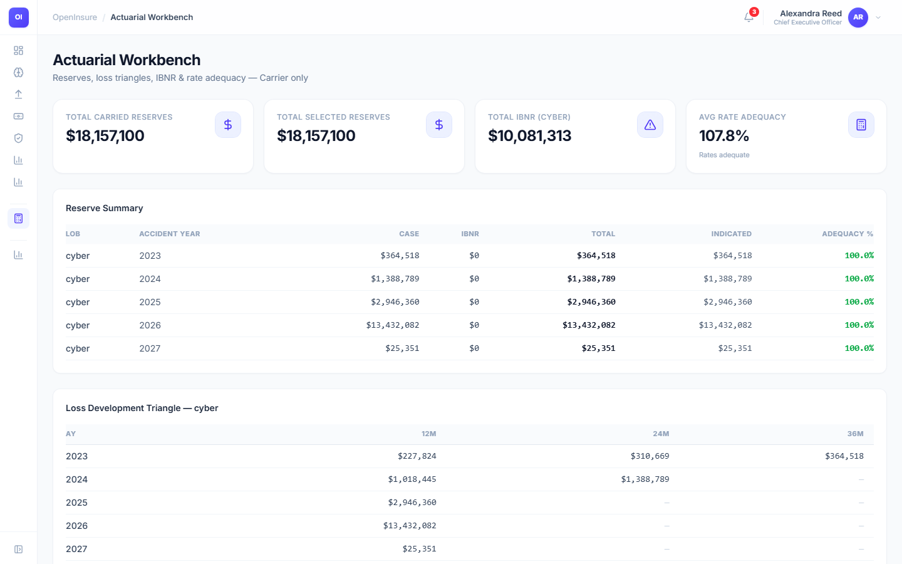

The workbench displays:
- **Total Carried Reserves**: $18,157,100 · **Total Selected Reserves**: $18,157,100
- **Total IBNR (Cyber)**: $10,081,313
- **Avg Rate Adequacy**: 107.8% — "Rates adequate"
- **Reserve Summary**: By LOB and accident year (2023–2027) — Case, IBNR, Total, Indicated, Adequacy %
- **Loss Development Triangle — Cyber**: Accident years 2023–2027 at 12M, 24M, 36M development periods

**How to use (Portal)**:
1. Log in as **Alexandra Reed** (CEO) or roles with actuarial access
2. Navigate to **Workbenches → Actuarial**
3. Review reserve adequacy, IBNR estimates, and loss triangles

**API Endpoints**:

| Method | Endpoint | Description |
|--------|----------|-------------|
| `GET` | `/actuarial/reserves` | List claim reserves |
| `POST` | `/actuarial/reserves` | Create reserve |
| `GET` | `/actuarial/triangles/{lob}` | Loss development triangle |
| `POST` | `/actuarial/triangles/{lob}/generate` | Generate triangle from claims |
| `GET` | `/actuarial/rate-adequacy` | Rate adequacy analysis |
| `GET` | `/actuarial/ibnr/{lob}` | IBNR estimates by LOB |

**Status**: ✅ Working — All actuarial endpoints return 200. Dashboard renders with full data.

---

## 16. Broker Portal

**What it does**: The Broker Portal is the external-facing view for broker partners. It provides a simplified interface with tabs for submissions, policies, claims, and documents — with internal fields stripped for data security.

### Broker Portal

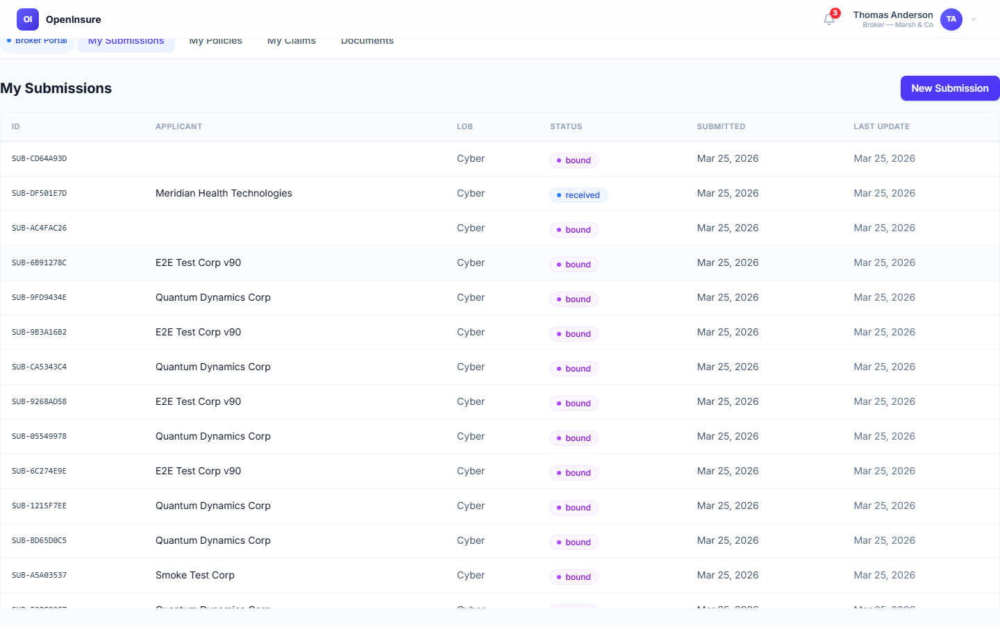

Logged in as **Thomas Anderson** (Broker — Marsh & Co), the portal shows:
- **My Submissions** tab — Submission list with ID, applicant, LOB, status, submitted date, last update
- **My Policies** tab — Policies linked to the broker
- **My Claims** tab — Claims filed through the broker
- **Documents** tab — Shared documents

**API Endpoints (broker-scoped)**:

| Method | Endpoint | Description |
|--------|----------|-------------|
| `GET` | `/broker/submissions` | Broker's submissions (internal fields stripped) |
| `GET` | `/broker/policies` | Broker's policies |
| `GET` | `/broker/claims` | Broker's claims |

**Status**: ✅ Working — All broker endpoints return 200. Portal renders with correct data scoping.

---

## 17. Product Management

**What it does**: Product Management is the insurance product lifecycle module — creating, configuring, versioning, publishing, and monitoring insurance product definitions. Products are SQL-persisted entities with structured data for coverages, rating factors, appetite rules, authority limits, and territories. This replaces the earlier in-memory/YAML approach with a production-grade relational data model.

### Product Lifecycle

Products follow a defined lifecycle: **Draft → Active → Sunset → Retired**.

- **Draft** — Product is being configured. Coverages, rating factors, appetite rules, and territories can be freely edited. Rating is disabled.
- **Active** — Product is published and available for quoting. The rating engine processes submissions against this product's factor tables. Changes require creating a new version.
- **Sunset** — Product is being phased out. Existing policies continue; new quotes are discouraged.
- **Retired** — Product is fully decommissioned. No updates allowed.

### Data Model

Each product is defined in Azure SQL with a **hybrid storage model** (v106, #164):

**Core product table** (`products`):

| Field | Type | Description |
|-------|------|-------------|
| `id` | UUID | Unique product identifier |
| `code` | NVARCHAR(50) | Product code — auto-generated as `{LOB_PREFIX}-{UUID}` when not provided (e.g., `CYBER-a1b2c3d4`), or set explicitly (e.g., `CYBER-SMB-001`) — unique |
| `product_name` | NVARCHAR | Display name |
| `line_of_business` | NVARCHAR | LOB category: `cyber`, `professional_indemnity`, `directors_officers`, `tech_eo`, `mpl` |
| `description` | NVARCHAR | Product description |
| `status` | NVARCHAR | Lifecycle status: `draft`, `active`, `sunset`, `retired` |
| `version` | INT | Version counter (coerced to INT on creation; bumped on new version) |
| `coverages` | JSON | ⚠️ DEPRECATED — use `product_coverages` table |
| `rating_factors` | JSON | ⚠️ DEPRECATED — use `rating_factor_tables` table |
| `appetite_rules` | JSON | ⚠️ DEPRECATED — use `product_appetite_rules` table |
| `authority_limits` | JSON | ⚠️ DEPRECATED — use `product_authority_limits` table |
| `territories` | JSON | ⚠️ DEPRECATED — use `product_territories` table |
| `forms` | JSON | ⚠️ DEPRECATED — use `product_forms` table |
| `metadata` | JSON | Flexible key-value metadata (min/max premium, base rates) |
| `effective_date` | DATETIME2 | When product takes effect (defaults to today if not provided) |
| `published_at` | DATETIME2 | When product was last published |
| `created_by` | NVARCHAR | Creator identity |

**Normalised relational tables** (v106):

| Table | Purpose | Key Columns |
|-------|---------|-------------|
| `product_coverages` | Coverage definitions per product | `coverage_code`, `coverage_name`, `default_limit`, `max_limit`, `default_deductible`, `is_optional` |
| `rating_factor_tables` | Rating factor lookup entries | `factor_category` (e.g., "industry"), `factor_key` (e.g., "technology"), `factor_value` (multiplier) |
| `product_appetite_rules` | Underwriting appetite constraints | `field_name`, `operator` (>=, <=, between, in, not_in, eq), `numeric_value`, `string_value` |
| `product_authority_limits` | Auto-bind thresholds | `auto_bind_premium_max`, `auto_bind_limit_max`, `requires_senior_review_above` |
| `product_territories` | Jurisdiction availability | `territory_code`, `approval_status`, `filing_reference` |
| `product_forms` | Required application forms | `form_code`, `form_name`, `form_type`, `required` |
| `product_pricing` | Base pricing parameters | `min_premium`, `max_premium`, `base_rate_per_1000`, `currency` |

> **Migration pattern:** writes go to both JSON columns and relational tables (dual-write via `ProductRelationsRepository.sync_from_product()`). Reads prefer relational data and fall back to JSON. The JSON columns will be dropped after the migration period.

### Seed Products

The platform ships with 4 pre-configured products:

| Code | Product | LOB | Status | Coverages |
|------|---------|-----|--------|-----------|
| `CYBER-SMB-001` | Cyber Liability — Small & Medium Business | cyber | active | 5 (Breach Response, BI, Ransomware, TPL, Media) |
| `PI-PROF-001` | Professional Indemnity | professional_indemnity | active | 2 (Claims, Defense Costs) |
| `DO-CORP-001` | Directors & Officers | directors_officers | active | 2 (Side A, Side B) |
| `TECH-EO-001` | Technology Errors & Omissions | tech_eo | draft | 2 (E&O, Media) |

### API Endpoints

| Method | Endpoint | Description |
|--------|----------|-------------|
| `POST` | `/api/v1/products` | Create a new product (starts in `draft`) |
| `GET` | `/api/v1/products` | List products with filtering (`?status=active&product_line=cyber`) and pagination |
| `GET` | `/api/v1/products/{id}` | Get product by ID (full definition) |
| `PUT` | `/api/v1/products/{id}` | Update product (blocked if `retired`) |
| `POST` | `/api/v1/products/{id}/publish` | Publish a draft product → `active` (records version snapshot) |
| `POST` | `/api/v1/products/{id}/versions` | Create a new version (bumps version, resets to `draft`) |
| `POST` | `/api/v1/products/{id}/rate` | Calculate premium for given risk data against product's rating factors |
| `GET` | `/api/v1/products/{id}/coverages` | List available coverages for a product |
| `GET` | `/api/v1/products/{id}/performance` | Aggregated performance metrics (GWP, loss ratio, bind rate, trend) |

### Rating Engine

The rating endpoint (`/rate`) uses a two-tier approach:

1. **Structured factor tables** — When `rating_factor_tables` are configured, the engine looks up the risk value in the table and applies the entry's multiplier. Supports industry, revenue band, security maturity, and custom factors.
2. **Flat factor fallback** — When no structured tables match, applies `industry_factor × revenue_factor` from the risk data.

**v106 relational factor loading (#164):**

The `RatingEngine` class now loads factors from the normalised `rating_factor_tables` SQL table when a `product_id` is provided:

```python
engine = RatingEngine()
result = await engine.calculate(product_id="...", rating_input=rating_input)
# Loads industry/revenue_band factors from DB, falls back to hardcoded dicts
```

The `CyberRatingEngine` accepts DB-loaded factors via `set_db_factors()`:
- `"industry"` category overrides `INDUSTRY_RISK_FACTORS` dict
- `"revenue_band"` category overrides `REVENUE_BANDS` list
- Hardcoded values remain as fallback when no relational data exists

Example rate request:
```json
POST /api/v1/products/{id}/rate
{
  "risk_data": {
    "industry": "technology",
    "annual_revenue": 5000000,
    "security_maturity": 7
  },
  "coverages_requested": ["First-Party Breach Response", "Business Interruption"]
}
```

### Version Management

Products support full version history:
- **Publish** records a snapshot of the current product state in `version_history`
- **New Version** saves a snapshot, bumps the version number, and resets status to `draft`
- Each snapshot includes the full product configuration at that point in time

### Dashboard UI

The Product Management dashboard (accessible to Head of Product role) provides:
- **Product Catalog** — Filterable list of all products with status badges
- **Product Detail** — Full configuration view with tabs for coverages, rating factors, appetite rules, territories
- **Performance Tab** — GWP, loss ratio, bind rate, premium trend chart
- **Version History** — Timeline of all published versions with diff view
- **Publish / New Version** — One-click lifecycle transitions

### Foundry Integration

Products feed into the AI agent workflow:
- **Triage Agent** — Uses appetite rules to auto-accept/decline/refer submissions
- **Underwriting Agent** — Retrieves product's rating factors and authority limits for risk assessment
- **Rating Engine** — Uses product's factor tables for premium calculation (3-tier cascade: Foundry → CyberRatingEngine → LOB minimum)
- **Knowledge Base** — Product definitions are indexed in AI Search for agent retrieval

### Product Sync Pipeline (v95, updated v106)

All product mutations trigger an async knowledge sync:

```
Product API (SQL) ──dual-write──▸ Relational Tables ──sync──▸ Cosmos DB ──sync──▸ AI Search ──tool──▸ Foundry Agents
```

- `ProductKnowledgeSyncService` converts SQL product records into structured knowledge documents
- **v106:** sync now loads data from normalised relational tables (`product_coverages`, `rating_factor_tables`, `product_appetite_rules`) when available, falling back to JSON blobs
- Retired products are removed from the search index so agents no longer reference them
- The pipeline is **fail-open** — product CRUD still works if Cosmos or AI Search is unavailable
- Sync is fire-and-forget; product API responses are not delayed by downstream sync

**Status**: ✅ Working — 6 products in SQL (normalised to 7 relational tables since v106), full CRUD API, rating engine with DB factor loading, versioning, publish workflow, knowledge sync pipeline.

---

## Appendix A: Foundry Agent Architecture

OpenInsure uses a multi-agent architecture powered by Microsoft Foundry (GPT-5.1/5.2). All agents inherit from an `InsuranceAgent` base class.

| Agent | Responsibilities | Model |
|-------|-----------------|-------|
| **Orchestrator** | Coordinates multi-agent workflows (new-business, claims) | GPT-5.1 |
| **SubmissionAgent** | Intake, document classification, data extraction, validation, triage | GPT-5.1 |
| **UnderwritingAgent** | Risk assessment, pricing/rating, quote generation | GPT-5.1 |
| **PolicyAgent** | Policy binding, endorsement, renewal, cancellation | GPT-5.1 |
| **ClaimsAgent** | FNOL, coverage verification, reserve setting, triage, investigation | GPT-5.1 |
| **DocumentAgent** | Document classification, text extraction, content analysis | GPT-5.1 |
| **KnowledgeAgent** | Knowledge graph queries, guideline retrieval, precedent lookup | GPT-5.1 |
| **ComplianceAgent** | EU AI Act compliance, bias monitoring, decision audit | GPT-5.1 |

**Agent Configuration**:
- `authority_limit` — Maximum value the agent can authorize autonomously
- `auto_execute` — Whether the agent can execute without human approval
- `escalation_threshold` — Minimum confidence before escalation (default 0.7)
- `temperature` — LLM temperature (default 0.1 for deterministic behavior)

**Orchestrated Workflows**:
1. **New Business**: Submission → Document → Knowledge → Underwriting → Policy → Compliance
2. **Claims**: FNOL → Coverage Check → Reserve → Triage → Investigation → Compliance

---

## Appendix B: Complete API Endpoint Reference

All endpoints are under `/api/v1/` and require authentication.

### Submissions (15 endpoints)
| Method | Endpoint | Description |
|--------|----------|-------------|
| `POST` | `/submissions` | Create submission |
| `GET` | `/submissions` | List submissions |
| `GET` | `/submissions/{id}` | Get submission |
| `PUT` | `/submissions/{id}` | Update submission |
| `POST` | `/submissions/{id}/triage` | AI triage |
| `POST` | `/submissions/{id}/quote` | Generate quote |
| `POST` | `/submissions/{id}/bind` | Bind to policy |
| `POST` | `/submissions/{id}/documents` | Upload documents (multipart) |
| `POST` | `/submissions/{id}/refer` | Refer for manual review |
| `POST` | `/submissions/{id}/decline` | Decline |
| `POST` | `/submissions/{id}/subjectivities` | Add subjectivities |
| `POST` | `/submissions/{id}/enrich` | Enrich with external data |
| `GET` | `/submissions/{id}/comparables` | Comparable accounts |
| `POST` | `/submissions/{id}/process` | Full submission processing |
| `POST` | `/submissions/acord-ingest` | ACORD XML ingestion (multipart) |

### Policies (11 endpoints)
| Method | Endpoint | Description |
|--------|----------|-------------|
| `POST` | `/policies` | Create policy |
| `GET` | `/policies` | List policies |
| `GET` | `/policies/{id}` | Get policy |
| `PUT` | `/policies/{id}` | Update policy |
| `POST` | `/policies/{id}/endorse` | Endorse policy |
| `POST` | `/policies/{id}/renew` | Renew policy |
| `POST` | `/policies/{id}/cancel` | Cancel policy |
| `POST` | `/policies/{id}/reinstate` | Reinstate policy |
| `GET` | `/policies/{id}/documents/declaration` | Generate declaration |
| `GET` | `/policies/{id}/documents/certificate` | Generate certificate |
| `GET` | `/policies/{id}/documents/schedule` | Generate schedule |

### Claims (14 endpoints)
| Method | Endpoint | Description |
|--------|----------|-------------|
| `POST` | `/claims` | File claim (FNOL) |
| `GET` | `/claims` | List claims |
| `GET` | `/claims/{id}` | Get claim |
| `PUT` | `/claims/{id}` | Update claim |
| `POST` | `/claims/{id}/reserve` | Set reserve |
| `POST` | `/claims/{id}/payment` | Record payment |
| `POST` | `/claims/{id}/close` | Close claim |
| `POST` | `/claims/{id}/reopen` | Reopen claim |
| `POST` | `/claims/{id}/notify` | Send notification |
| `POST` | `/claims/{id}/process` | Process claim workflow |
| `POST` | `/claims/{id}/subrogation` | Initiate subrogation |
| `GET` | `/claims/{id}/subrogation` | Get subrogation records |
| `GET` | `/claims/queue` | Claims queue |
| `GET` | `/claims/subrogation/queue` | Subrogation queue |

### Billing (6 endpoints)
| Method | Endpoint | Description |
|--------|----------|-------------|
| `POST` | `/billing/accounts` | Create billing account |
| `GET` | `/billing/accounts/{id}` | Get account |
| `POST` | `/billing/accounts/{id}/payments` | Record payment |
| `GET` | `/billing/accounts/{id}/invoices` | List invoices |
| `POST` | `/billing/accounts/{id}/invoices` | Generate invoice |
| `GET` | `/billing/accounts/{id}/ledger` | Transaction ledger |

### Finance (5 endpoints)
| Method | Endpoint | Description |
|--------|----------|-------------|
| `GET` | `/finance/summary` | Financial summary |
| `GET` | `/finance/cashflow` | Cash flow analysis |
| `GET` | `/finance/commissions` | Commission summary |
| `GET` | `/finance/reconciliation` | Reconciliation items |
| `POST` | `/finance/bordereaux/generate` | Generate bordereaux |

### Renewals (7 endpoints)
| Method | Endpoint | Description |
|--------|----------|-------------|
| `GET` | `/renewals/upcoming` | Upcoming renewals |
| `GET` | `/renewals/queue` | Renewal queue |
| `POST` | `/renewals/{policy_id}/terms` | Generate terms |
| `POST` | `/renewals/{policy_id}/generate` | Generate renewal quote |
| `POST` | `/renewals/{policy_id}/process` | Process renewal |
| `GET` | `/renewals/records` | Renewal history |
| `POST` | `/renewals/scheduler/run` | Run scheduler |

### Reinsurance (9 endpoints)
| Method | Endpoint | Description |
|--------|----------|-------------|
| `POST` | `/reinsurance/treaties` | Create treaty |
| `GET` | `/reinsurance/treaties` | List treaties |
| `GET` | `/reinsurance/treaties/{id}` | Get treaty |
| `GET` | `/reinsurance/treaties/{id}/utilization` | Treaty utilization |
| `GET` | `/reinsurance/treaties/{id}/capacity` | Treaty capacity |
| `POST` | `/reinsurance/cessions` | Create cession |
| `GET` | `/reinsurance/cessions` | List cessions |
| `POST` | `/reinsurance/recoveries` | Record recovery |
| `GET` | `/reinsurance/recoveries` | List recoveries |

### Compliance (5 endpoints)
| Method | Endpoint | Description |
|--------|----------|-------------|
| `GET` | `/compliance/decisions` | List decisions |
| `GET` | `/compliance/decisions/{id}` | Get decision |
| `GET` | `/compliance/audit-trail` | Audit trail |
| `POST` | `/compliance/bias-report` | Bias report |
| `GET` | `/compliance/system-inventory` | System inventory |

### Knowledge (14 endpoints)
| Method | Endpoint | Description |
|--------|----------|-------------|
| `GET` | `/knowledge/guidelines/{lob}` | UW guidelines |
| `PUT` | `/knowledge/guidelines/{lob}` | Update guidelines |
| `GET` | `/knowledge/rating-factors/{lob}` | Rating factors |
| `GET` | `/knowledge/coverage-options/{lob}` | Coverage options |
| `GET` | `/knowledge/products` | Products |
| `GET` | `/knowledge/claims-precedents` | All precedents |
| `GET` | `/knowledge/claims-precedents/{type}` | Precedents by type |
| `PUT` | `/knowledge/claims-precedents/{type}` | Update precedents |
| `GET` | `/knowledge/compliance-rules` | All rules |
| `GET` | `/knowledge/compliance-rules/{framework}` | Rules by framework |
| `GET` | `/knowledge/industry-profiles` | All profiles |
| `GET` | `/knowledge/industry-profiles/{industry}` | Profile by industry |
| `GET` | `/knowledge/jurisdiction-rules` | All jurisdiction rules |
| `GET` | `/knowledge/search?q={query}` | Full-text search |

### Analytics & Metrics (10 endpoints)
| Method | Endpoint | Description |
|--------|----------|-------------|
| `GET` | `/analytics/underwriting` | UW analytics |
| `GET` | `/analytics/claims` | Claims analytics |
| `GET` | `/analytics/ai-insights` | AI insights |
| `GET` | `/analytics/decision-accuracy` | Decision accuracy |
| `POST` | `/analytics/decision-outcome` | Record outcome |
| `GET` | `/metrics/summary` | Key metrics |
| `GET` | `/metrics/pipeline` | Pipeline metrics |
| `GET` | `/metrics/agents` | Agent metrics |
| `GET` | `/metrics/premium-trend` | Premium trend |
| `GET` | `/metrics/executive` | Executive summary |

### Actuarial (6 endpoints)
| Method | Endpoint | Description |
|--------|----------|-------------|
| `GET` | `/actuarial/reserves` | List reserves |
| `POST` | `/actuarial/reserves` | Create reserve |
| `GET` | `/actuarial/triangles/{lob}` | Loss triangle |
| `POST` | `/actuarial/triangles/{lob}/generate` | Generate triangle |
| `GET` | `/actuarial/rate-adequacy` | Rate adequacy |
| `GET` | `/actuarial/ibnr/{lob}` | IBNR estimates |

### Escalations (6 endpoints)
| Method | Endpoint | Description |
|--------|----------|-------------|
| `GET` | `/escalations` | List escalations |
| `GET` | `/escalations/count` | Escalation count |
| `GET` | `/escalations/{id}` | Get escalation |
| `POST` | `/escalations` | Create escalation |
| `POST` | `/escalations/{id}/approve` | Approve |
| `POST` | `/escalations/{id}/reject` | Reject |

### Other Endpoints
| Method | Endpoint | Description |
|--------|----------|-------------|
| `GET` | `/broker/submissions` | Broker's submissions |
| `GET` | `/broker/policies` | Broker's policies |
| `GET` | `/broker/claims` | Broker's claims |
| `GET` | `/underwriter/queue` | UW queue |
| `POST` | `/workflows/new-business/{id}` | Full new-business workflow |
| `POST` | `/workflows/claims/{id}` | Claims workflow |
| `POST` | `/workflows/renewal/{id}` | Renewal workflow |
| `GET` | `/workflows/history` | Workflow history |
| `GET` | `/events/recent` | Recent domain events |
| `GET` | `/documents/upload` | Upload document |
| `GET` | `/documents/list` | List documents |
| `GET` | `/health` | Health check |
| `GET` | `/ready` | Readiness probe |

---

## Appendix C: Known Issues

| # | Issue | Status | Severity |
|---|-------|--------|----------|
| [#89](https://github.com/urosstojkic/openinsure/issues/89) | Compliance Workbench renders blank white screen | Open | Medium |

---

## Appendix D: Verification Summary

**Test Date**: 2026-03-25

| Category | Tested | Passing | Status |
|----------|--------|---------|--------|
| Screenshots | 30 | 29 | 1 blank (Compliance Workbench) |
| API Endpoints | 53 | 53 | All working with correct parameters |
| Dashboard Pages | 18 | 17 | 1 blank (Compliance Workbench) |

**Screenshots captured** (`test-screenshots/feature-guide/`):

| File | Description |
|------|-------------|
| `00-login-page.png` | Login page with persona selector |
| `01-broker-portal.png` | Broker portal — My Submissions |
| `01-new-submission-form.png` | New submission form |
| `01-submission-detail.png` | Submission detail with pipeline & enrichment |
| `01-uw-workbench-queue.png` | UW workbench queue (20 submissions) |
| `02-uw-detail-panel.png` | UW workbench detail panel |
| `02-ai-processing-modal.png` | Foundry AI Pipeline modal (5 agents) |
| `02-submissions-list.png` | Submissions list with statuses |
| `03-policies-list.png` | Policies list with actions |
| `03-policy-detail.png` | Policy detail with document buttons |
| `03-policy-declaration.png` | Declaration page rendered inline |
| `04-claims-list.png` | Claims list |
| `04-claims-workbench.png` | Claims workbench queue |
| `04-claims-workbench-detail.png` | Claims workbench with detail panel |
| `04-claim-detail.png` | Claim detail view |
| `05-renewals.png` | Renewals view |
| `06-finance-dashboard.png` | Finance dashboard (full page) |
| `07-reinsurance-dashboard.png` | Reinsurance dashboard |
| `08-agent-decisions.png` | Agent Decisions with traffic lights |
| `08-compliance-page.png` | Compliance dashboard with bias monitoring |
| `08-compliance-workbench.png` | Compliance workbench (BLANK — bug #89) |
| `09-knowledge-base.png` | Knowledge base with 7 tabs |
| `09-knowledge-tabs.png` | Knowledge tabs explored |
| `10-executive-dashboard.png` | Executive dashboard (CEO view) |
| `10-uw-analytics.png` | UW analytics |
| `10-claims-analytics.png` | Claims analytics |
| `11-escalations.png` | Escalation queue |
| `11-escalation-detail.png` | Escalation detail |
| `extra-actuarial-workbench.png` | Actuarial workbench |
| `extra-broker-portal.png` | Broker portal |
| `extra-dashboard-home.png` | Dashboard home (CUO) |
